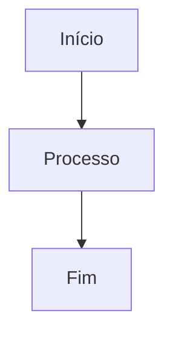

# Daxgo Feeds • Documentação Técnica

Documentação técnica do **Daxgo Feeds** para o time de desenvolvimento, construída com [Docusaurus](https://docusaurus.io/).

## Conteúdo

Esta documentação cobre:

- **Arquitetura**: Visão geral do sistema e dependências
- **Backend (Yii2)**: Estrutura, modelos, pipeline de feeds e API
- **Front-end (Vue.js 2)**: Módulo "Customizar Feeds" e padrões UI/UX
- **Infraestrutura**: Docker, S3/MinIO, DynamoDB, Lambda, variáveis de ambiente
- **Integrações**: Google Merchant Center, TikTok Shop
- **Features**: Catálogo Inteligente (IA), Analytics, Product Studio
- **Runbooks**: Troubleshooting e procedimentos operacionais

## Requisitos

- Node.js 20+
- npm, yarn ou pnpm

## Instalação

```bash
npm install
# ou
yarn
# ou
pnpm install
```

## Desenvolvimento local

```bash
npm start
# ou
yarn start
# ou
pnpm start
```

Inicia o servidor de desenvolvimento em http://localhost:3000 com hot reload.

## Build

```bash
npm run build
# ou
yarn build
# ou
pnpm build
```

Gera o conteúdo estático em `build/`.

## Deploy

```bash
npm run serve
```

Serve o build localmente para validação antes do deploy.

## Estrutura principal

```
daxgo-feeds-docs-tech/
├── docs/                           # Documentação atual (versão "current")
│   ├── intro.md                    # Página inicial
│   ├── arquitetura/                # Arquitetura do sistema
│   ├── backend/                    # Backend (Yii2)
│   ├── frontend/                   # Front-end (Vue.js 2)
│   ├── infra/                      # Infraestrutura
│   ├── integ/                      # Integrações
│   ├── features/                   # Features específicas
│   └── runbooks/                   # Troubleshooting
├── versioned_docs/                 # Documentação por versão
├── versioned_sidebars/             # Sidebars por versão
├── versions.json                   # Lista de versões publicadas
├── sidebars.ts                     # Definição da sidebar
├── docusaurus.config.ts            # Configuração do site
├── package.json                    # Dependências
└── README.md                       # Este arquivo
```

## Guia de contribuição

### Estrutura de páginas

Cada página markdown deve ter front matter YAML:

```md
---
title: Título da Página
sidebar_position: 1
---

# Conteúdo da página...
```

**Importante:**
- Use `title` no front matter OU `#` no corpo, não ambos
- Front matter deve ser YAML válido e fechado com `---`

### Diagramas Mermaid

Suporte completo a diagramas Mermaid:

````md

````

### Referências de código

Para código do repositório existente, use links ou mencione o arquivo:

```md
**Arquivo:** `components/FeedImporter.php`
```

## Versionamento

### Lançar nova versão (Docusaurus)

1. Garanta que tudo está atualizado:

```bash
git pull
npm install
npm run build
```

2. Gere uma nova versão (exemplo `1.1`):

```bash
npm run docusaurus docs:version 1.1
```

3. Revise os arquivos gerados:
   - `versioned_docs/version-1.1/`
   - `versioned_sidebars/version-1.1-sidebars.json`
   - `versions.json`

4. Atualize `docs/` para a próxima versão (será "current")

### Lançar nova versão (Git)

1. Atualize a versão no `package.json` (se necessário)

2. Commit e crie tag:

```bash
git add .
git commit -m "release: v1.1.0"
git tag -a v1.1.0 -m "Release v1.1.0"
```

3. Publique:

```bash
git push origin main
git push origin v1.1.0
```

## Workflow de branches

### Padrão de nomenclatura

- `feature/<descricao>` - Novas páginas ou seções
- `fix/<descricao>` - Correções de conteúdo
- `docs/<descricao>` - Melhorias na documentação
- `chore/<descricao>` - Atualizações de dependências

**Exemplo:**

```bash
git checkout -b feature/adiciona-lambda-docs
```

### Processo de Pull Request

1. Crie branch a partir de `main`
2. Faça commits pequenos e descritivos
3. Teste localmente com `npm start`
4. Valide build com `npm run build`
5. Abra Pull Request com descrição clara

## Repositórios relacionados

- **Backend**: `feeds-upgrade` (Yii2 + PHP 8.2)
- **Front-end**: `feeds-front-vue` (Vue.js 2)
- **Docs de Produto**: `daxgo-feeds-docs`
- **Docs Técnicas**: `daxgo-feeds-docs-tech` (este repositório)

## Troubleshooting

### Build falha

```bash
npm run clear
npm install
npm run build
```

### Port 3000 em uso

```bash
npm start -- --port 3001
```

### Hot reload não funciona

Reinicie o servidor:

```bash
# Ctrl+C para parar
npm start
```

## Suporte

Para dúvidas sobre:
- **Conteúdo técnico**: Time de desenvolvimento
- **Docusaurus**: [Documentação oficial](https://docusaurus.io/)
- **Sistema Daxgo Feeds**: Consulte a [documentação de produto](https://docs.daxgo.io)

## Licença

Copyright © 2026 Daxgo. Todos os direitos reservados.

---

**Versão atual**: 1.0  
**Última atualização**: Janeiro 2026
