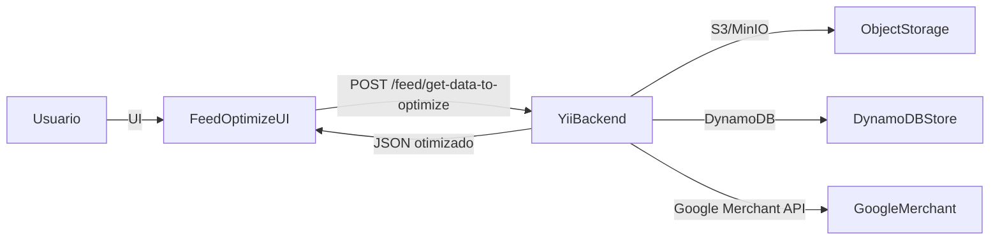

# Visão geral da arquitetura

O Daxgo Feeds é composto por um backend em Yii2 com integrações externas e um
módulo front-end de customização de feeds (Vue 2) distribuído como assets estáticos.

## Componentes principais

- **Backend (Yii2)**: regras de negócio, feed management, endpoints de otimização,
  integrações e persistência.
- **Front-end “Customizar Feeds” (Vue 2)**: interface rica para editar, filtrar
  e publicar o feed.
- **S3/MinIO**: armazenamento de JSONs de otimização e arquivos de feed.
- **DynamoDB**: armazenamento de dados de promoções e tokens OAuth (Google Merchant).
- **MySQL**: dados transacionais do backend.

## Fluxo de alto nível

## Pontos de integração

- **Customização do feed**: o front-end envia regras/filtros e recebe o JSON
  processado via `POST /feed/get-data-to-optimize` (Yii2).
- **Armazenamento de mídia**: os arquivos de otimização são versionados em S3/MinIO,
  com arquivos `_temp.json` antes da publicação.
- **Google Merchant**: integra via OAuth2, usando serviços em `services/`.

