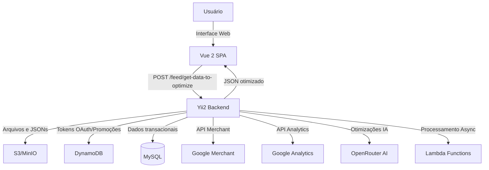

# Visão geral da arquitetura

O Daxgo Feeds é uma plataforma completa de gerenciamento e otimização de feeds de produtos,
composta por um backend em Yii2 (PHP 8.1+) com múltiplas integrações externas e módulos
front-end (Vue 2) distribuídos como assets estáticos.

:::info Stack Principal
**Backend**: Yii2 + PHP 8.1+ | **Frontend**: Vue 2 + Webpack 3 | **Infra**: Docker + AWS
:::

## Componentes principais

### Backend
- **Yii2 Framework (~2.0.5)**: regras de negócio, feed management, endpoints de otimização,
  integrações e persistência. Roda em PHP 8.1+.
- **Serviços**: Google Merchant, Promoções, Analytics, IA, Taxonomias.
- **Commands/Jobs**: processamento assíncrono, cron jobs, importação de feeds.

### Frontend
- **"Customizar Feeds" (Vue 2)**: SPA para editar, filtrar e publicar feeds.
  Servido como assets estáticos em `/web/feed-optimize/`. Build com Webpack 3.
  Libs: Axios, VueMultiselect, Vuetable-2.
- **Interface principal**: Views tradicionais do Yii2 com HTML, CSS e JavaScript.
  Gerenciamento de feeds, clientes, produtos, usuários e configurações.

### Infraestrutura
- **S3/MinIO**: armazenamento distribuído em múltiplos buckets:
  - `daxgo`: JSONs de otimização (`json-to-optimize/`), feeds processados
  - `product-studio`: templates e modelos do Product Studio
  - `product-studio-cdn`: imagens geradas pelo Product Studio
- **DynamoDB Local**: armazenamento de tokens OAuth2 (Google Merchant) e dados de promoções.
- **MySQL 5.7**: dados transacionais (produtos, clientes, feeds, usuários, permissões).
- **Lambda Functions**: processamento assíncrono para otimização, IA, TikTok, Product Studio.

### Integrações Externas
- **Google Merchant Center**: sincronização de produtos e promoções via OAuth2.
- **Google Analytics/Analytics Data**: métricas e relatórios de performance.
- **Google Sheets**: importação de dados de planilhas para enriquecimento.
- **TikTok Shop**: integração completa com TikTok via Lambda (produtos, pedidos, estoque, preços).
- **LIA (Magazine Luiza)**: integração VTEX para geração de XML e sincronização de estoque.
- **IA (OpenRouter)**: otimização automática de títulos, descrições e categorização de produtos.
- **Product Studio**: geração de imagens personalizadas para campanhas de marketing.

## Fluxo de alto nível



## Fluxo de otimização de feed (detalhado)

:::tip Versionamento Inteligente
O sistema utiliza um mecanismo de versionamento baseado em **arquivos temporários** no S3,
garantindo que alterações não publicadas não afetem o feed em produção.
:::

### 1. Preparação para customização

```http title="Endpoint de inicialização"
GET /feed/optimize?client={hash}&feed={hash}&media={hash}
```

**Processo**:
1. Backend copia: `{hash}.json` → `{hash}_temp.json` (S3)
2. Redireciona para interface Vue 2

:::warning Importante
Se o arquivo `{hash}.json` não existir, um arquivo vazio é criado com estrutura inicial.
:::

### 2. Carregamento dos dados

```http title="Endpoint de leitura"
POST /feed/get-data-to-optimize
```

**Processo**:
1. Carrega `{hash}_temp.json` do S3
2. Retorna JSON com produtos para edição
3. CSRF desabilitado para esta rota

### 3. Edição no frontend

<details>
<summary>Operações disponíveis no editor</summary>

- Aplicar filtros por categoria, preço, estoque
- Editar títulos e descrições em massa
- Otimizar com IA (OpenRouter)
- Adicionar/remover produtos
- Configurar regras de transformação
- Preview em tempo real

</details>

:::note Segurança
Alterações ficam apenas no arquivo `_temp.json` e **não afetam o feed publicado** até a confirmação.
:::

### 4. Publicação das alterações

```php title="FeedSaveProductsPublished.php"
// Valida existência do arquivo temporário
if ($this->S3->doesObjectExist($bucket, $sSourceKey)) {
    // Copia: {hash}_temp.json → {hash}.json
    $this->S3->copyObject([...]);
    // Salva metadados no MySQL
    $oProductPublish->saveBatch($products);
}
```

**Processo**:
1. Valida `{hash}_temp.json` existe
2. Copia: `{hash}_temp.json` → `{hash}.json` (S3)
3. Salva metadados no MySQL (ProductPublish)
4. Feed publicado é atualizado

:::tip Rollback
Se algo der errado, o arquivo `_background.json` permite reverter para a versão anterior.
:::

## Funções Lambda (AWS)

O sistema utiliza AWS Lambda para processamento assíncrono e escalável de diversas operações.

### Otimização de Feeds

```php title="FeedRunOptimizeOnLambda.php"
'FunctionName' => 'ssxml_product_optimize_PRODUCAO'
```

**Responsabilidade**: Processamento e otimização de produtos em lote com aplicação de regras e filtros.

### Product Studio

| Função Lambda | Responsabilidade |
|--------------|------------------|
| `ssxml_product_studio-STEP5-generate-img-front` | Geração de imagens personalizadas |
| `ssxml_product_studio-STEP6-filter-campaing-products` | Filtro de produtos para campanhas |

### Inteligência Artificial

```php title="LambdaIA.php"
'FunctionName' => 'feeds-dados-IA-CATEGORIA-orquestrador'
```

**Responsabilidade**: Orquestração de categorização automática de produtos usando IA.

### Integração TikTok Shop

<details>
<summary>11 funções Lambda para integração completa</summary>

| Função Lambda | Responsabilidade |
|--------------|------------------|
| `integracao-tik-tok-PRODUTOS-lista-produtos` | Lista e sincroniza produtos |
| `integracao-tik-tok-PEDIDOS-novo-pedido-TTK` | Processa novos pedidos |
| `integracao-tik-tok-VTEX-PRODUTO-ADDITIONAL-IMAGES-XML` | Sincroniza imagens adicionais |
| `integracao-tik-tok-SHIPPING-PACKAGE` | Gerencia pacotes de envio |
| `integracao-tik-tok-BUSCA-PEDIDOS-TESTE` | Busca pedidos (ambiente de teste) |
| `integracao-tik-tok-ORDERHOOK-MANAGEMENT` | Gerencia webhooks de pedidos |
| `integracao-tik-tok-ESTOQUE-VTEX-atualizacao-estoque` | Atualiza estoque VTEX |
| `integracao-tik-tok-PRECO-VTEX-monta-lista-sku` | Sincroniza preços VTEX |
| `integracao-tik-tok-PRODUTOS-compara-xml` | Compara XMLs para atualização |
| `integracao-tik-tok-BRANDS-VTEX` | Sincroniza marcas VTEX |

</details>

### Integração LIA (Magazine Luiza)

| Função Lambda | Responsabilidade |
|--------------|------------------|
| `integracao_LIA_VTEX_generate_XML` | Gera XML para LIA a partir de dados VTEX |
| `integracao_LIA_VTEX_create_inventory` | Cria e sincroniza inventário VTEX |

:::info Configuração Lambda
As funções Lambda são invocadas via AWS SDK usando credenciais configuradas em `DAXGO_ENV_KEY` e `DAXGO_ENV_SECRET`.

**Ambiente local**: LocalStack ou emulador Lambda rodando em `http://host.docker.internal:9555`
:::

### 5. Backup automático

```php title="FeedFileToOptimize.php" {2-7}
// Após criar {hash}.json
if ($this->S3->doesObjectExist($bucket, $sSourceKey)) {
    $this->S3->copyObject([
        'Key' => $sFileName . '_background.json',
        'CopySource' => $bucket . '/' . $sFileName . '.json'
    ]);
}
```

**Benefícios**:
- Permite rollback rápido
- Histórico de versões
- Segurança contra perdas

## Estrutura de armazenamento (S3/MinIO)

### Bucket: daxgo

```plaintext title="Bucket principal"
daxgo/
├── json-to-optimize/
│   ├── {client}_{feed}_{media}.json           # Feed publicado (produção)
│   ├── {client}_{feed}_{media}_temp.json      # Em edição (rascunho)
│   └── {client}_{feed}_{media}_background.json # Backup (rollback)
├── feeds/
│   └── {client}_{feed}_processed.xml          # Feeds processados
└── temp/
    └── {arquivos_temporarios}                 # Processamento temporário
```

### Bucket: product-studio

```plaintext title="Product Studio (templates e dados)"
product-studio/
├── models-product-studio/
│   └── {clientHash}/
│       ├── img/                               # Imagens de template
│       └── {campaing_hash}.json               # Configurações de campanha
└── feed-files/
    └── {clientHash}/
        └── {campaing_hash}_stats.json         # Estatísticas de processamento
```

### Bucket: product-studio-cdn

```plaintext title="Product Studio CDN (imagens geradas)"
product-studio-cdn/
└── {clientHash}/
    └── {campaing_hash}/
        └── {image_files}.png                  # Imagens geradas para campanha
```

<details>
<summary>Convenção de nomenclatura</summary>

**Formato**: `{clientHash}_{feedHash}_{mediaHash}.json`

**Exemplo**: `abc123_def456_ghi789.json`

- `clientHash`: Identificador único do cliente
- `feedHash`: Identificador único do feed
- `mediaHash`: Identificador único da mídia/canal

</details>

## Pontos de integração

### Customização do feed

```http title="Endpoint principal"
POST /feed/get-data-to-optimize
```

**Características**:
- **Autenticação**: Session-based (cookies do Yii2)
- **CSRF**: Desabilitado para esta rota específica
- **Formato**: JSON com array de produtos
- **Timeout**: Ilimitado (`set_time_limit(-1)`)

<details>
<summary>Ver exemplo de resposta</summary>

```json
{
  "products": [
    {
      "id": "123",
      "title": "Produto Exemplo",
      "price": 99.90,
      "availability": "in stock",
      ...
    }
  ]
}
```
</details>

### Google Merchant Center

:::info OAuth 2.0
Tokens armazenados no **DynamoDB** com renovação automática antes da expiração.
:::

**Services**:
- `GoogleMerchantTokenService.php` - Gerenciamento de tokens OAuth
- `GoogleMerchantPromotionService.php` - Sincronização de promoções

**Funcionalidades**:
- Sincronização automática de promoções
- Renovação de tokens expirados
- Log de operações no DynamoDB
- Tratamento de erros e retry logic

### Google Analytics

**Services**:
- `ProductsAnalytics.php` - Coleta de métricas
- `ProductsDataAnalytics.php` - Análise de dados
- `ProductsDataAnalyticsReport.php` - Geração de relatórios

:::tip API Version
Google Analytics Data API **v0.11+** (nova API de dados)
:::

### Inteligência Artificial (IA)

```http title="OpenRouter API"
POST https://openrouter.ai/api/v1/chat/completions
```

**Provider**: [OpenRouter](https://openrouter.ai/)  
**Service**: `IaData.php`

**Casos de uso**:
- Otimização automática de títulos
- Geração de descrições otimizadas para SEO
- Sugestão de categorias e tags
- Enriquecimento de conteúdo

:::warning Custo
OpenRouter é pago por uso. Configure limites de budget nas variáveis de ambiente.
:::

### Google Sheets

**Funcionalidade**: Importação de dados complementares de planilhas

```bash title="Validação de planilha"
php yii valid-google-sheets {url} {tab-name}
```

**Campos obrigatórios**:
- `google_sheets_url`: URL completa da planilha
- `google_sheets_tab`: Nome da aba (sheet)

:::note Permissões
A planilha deve estar compartilhada com a conta de serviço do Google.
:::

## Ambientes

import Tabs from '@theme/Tabs';
import TabItem from '@theme/TabItem';

<Tabs groupId="environment">
  <TabItem value="local" label="Local (Docker)" default>

### Serviços disponíveis

| Serviço | URL | Credenciais |
|---------|-----|-------------|
| **Backend (Yii2)** | http://localhost:9000 | Usuário do sistema |
| **MinIO Console** | http://localhost:9090 | admin / password |
| **PHPMyAdmin** | http://localhost:9001 | admin / admin |
| **DynamoDB Local** | http://localhost:8000 | - |
| **S3 Console (OpenS3)** | http://localhost:9092 | - |

### Iniciar ambiente

```bash title="Terminal"
docker-compose up -d
```

### Ver logs

```bash
# Todos os serviços
docker-compose logs -f

# Apenas PHP
docker-compose logs -f php
```

:::tip Xdebug
O Xdebug está configurado e pode ser ativado/desativado com o script `./xdebug on|off`.
Veja a [documentação completa](../runbooks/xdebug).
:::

  </TabItem>
  <TabItem value="prod" label="Produção (AWS)">

### Serviços AWS

| Serviço | Tipo | Descrição |
|---------|------|-----------|
| **S3** | AWS S3 | Armazenamento de feeds e JSONs |
| **DynamoDB** | AWS DynamoDB | Tokens OAuth e promoções |
| **Lambda** | AWS Lambda | Processamento assíncrono (opcional) |
| **MySQL** | RDS / EC2 | Banco de dados principal |
| **CloudWatch** | AWS CloudWatch | Logs e monitoramento |

### Variáveis de ambiente

Todas as variáveis devem ter o prefixo `DAXGO_ENV_`. Configuradas em `config/env-local.php` (local) ou variáveis de ambiente (produção).

<details>
<summary>Lista completa de variáveis</summary>

```php title="config/env-local.php"
// AWS Credentials
DAXGO_ENV_KEY=admin
DAXGO_ENV_SECRET=password

// Endpoints locais (apenas desenvolvimento)
DAXGO_ENV_ENV_LOCAL_DYNAMO_ENDPOINT=http://dynamodb-local:8000
DAXGO_ENV_ENV_LOCAL_LAMBDA_ENDPOINT=http://host.docker.internal:9555
DAXGO_ENV_ENV_LOCAL_S3_ENDPOINT=http://host.docker.internal:9666

// S3 Configuration
DAXGO_ENV_FEEDS_S3_BUCKET=daxgo
DAXGO_ENV_FEEDS_S3_URL_PUBLISHED=http://localhost:9666/minio/daxgo

// SQS Configuration
DAXGO_ENV_SQS_QUEUE_URL=

// Email (SES)
DAXGO_ENV_FEEDS_SES_HOST=
DAXGO_ENV_FEEDS_SES_KEY=
DAXGO_ENV_FEEDS_SES_USER=

// MySQL Configuration
DAXGO_ENV_FEEDS_MYSQL_HOST=mysql
DAXGO_ENV_FEEDS_MYSQL_PORT=3306
DAXGO_ENV_FEEDS_MYSQL_DB=feeds
DAXGO_ENV_FEEDS_MYSQL_USER=admin
DAXGO_ENV_FEEDS_MYSQL_PASS=admin

// IA Configuration (OpenRouter)
DAXGO_ENV_FEEDS_IA_API_KEY=
DAXGO_ENV_FEEDS_IA_API_HOST=

// Google OAuth2
DAXGO_ENV_GOOGLE_OAUTH2_CLIENT_ID=
DAXGO_ENV_GOOGLE_OAUTH2_CLIENT_SECRET=
DAXGO_ENV_GOOGLE_OAUTH2_REDIRECT_URI=http://localhost:9000/oauth2/google/callback
```

</details>

:::danger Segurança
Nunca commite credenciais de produção no repositório. Use secrets management (AWS Secrets Manager).
:::

  </TabItem>
</Tabs>

