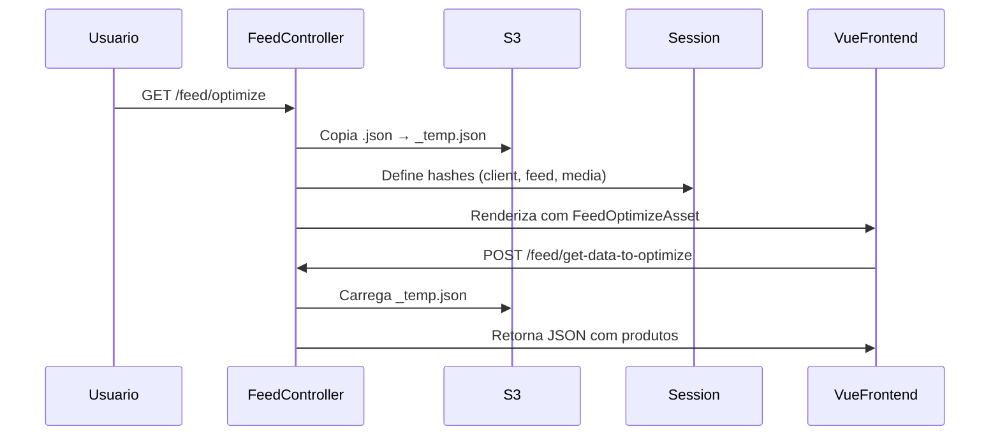

# Estrutura do backend (Yii2)

O backend principal está no repositório `feeds-upgrade`, baseado em **Yii2** e **PHP 8.2**.

:::info Padrão MVC
O Daxgo Feeds segue o padrão MVC (Model-View-Controller) do framework Yii2, com camadas adicionais de Services e Components.
:::

## Organização de pastas

```plaintext title="Estrutura do projeto"
feeds-upgrade/
├── controllers/      # Endpoints e ações principais (HTTP handlers)
├── models/          # Entidades e models de domínio (Active Record)
├── services/        # Serviços de integração (Google, IA, Analytics)
├── components/      # Componentes utilitários (S3, Feed Processing)
├── commands/        # Console commands (Cron jobs, CLI)
├── views/           # Templates Yii2 (layouts e páginas)
├── web/             # Assets públicos, bundles e entry points
├── config/          # Configurações (db, params, rotas)
├── runtime/         # Cache e logs temporários
└── vendor/          # Dependências Composer
```

### Descrição dos diretórios

| Diretório | Responsabilidade | Exemplos |
|-----------|------------------|----------|
| `controllers/` | Lógica de requisições HTTP | `FeedController`, `PromotionController` |
| `models/` | Entidades de banco e validação | `Feed`, `Product`, `Client` |
| `services/` | Integrações externas | `GoogleMerchantService`, `IaData` |
| `components/` | Funcionalidades reutilizáveis | `S3`, `FeedImporter` |
| `commands/` | Tarefas agendadas e CLI | `FeedDownloadController` |

## Controllers relevantes

### FeedController

Principal controller para operações de feed.

<details>
<summary>Actions principais</summary>

**`actionOptimize()`**
- Inicializa o módulo de otimização
- Define cookies e sessão (`client_hash`, `feed_hash`, `media_hash`)
- Copia arquivo `.json` para `_temp.json` no S3
- Carrega layout com bundle Vue 2

**`actionGetDataToOptimize()`**
- Recebe regras e filtros do frontend
- Processa JSON do S3
- Retorna dados otimizados
- CSRF desabilitado nesta rota

**`actionIndex()`**
- Lista feeds do cliente
- Interface principal de gerenciamento

</details>

```php title="controllers/FeedController.php" {3-5}
public function actionOptimize($client, $feed, $media)
{
    // Copia feed para arquivo temporário
    $oS3->copyObject([
        'Key' => "{$client}_{$feed}_{$media}_temp.json",
        'CopySource' => "{$client}_{$feed}_{$media}.json"
    ]);
    
    // Define sessão para o frontend
    Yii::$app->session->set('client_hash', $client);
    
    return $this->render('optimize', $data);
}
```

### PromotionController

Gerenciamento de promoções do Google Merchant.

- **Sincronização**: Importa promoções do Google
- **Criação**: Cria novas promoções
- **Validação**: Valida dados antes de enviar

### OAuth2GoogleController

Autenticação OAuth2 para Google APIs.

- **Callback**: Recebe código de autorização
- **Token Management**: Armazena tokens no DynamoDB
- **Refresh**: Renova tokens expirados automaticamente

## Fluxo de otimização (backend)

:::tip Fluxo completo
O fluxo de otimização envolve múltiplos controllers, services e o frontend Vue 2.
:::



**Etapas detalhadas**:

1. **Inicialização**: `actionOptimize()` recebe parâmetros (`client_hash`, `feed_hash`, `media_hash`)
2. **Preparação**: Copia arquivo de produção para temporário no S3
3. **Sessão**: Define cookies e sessão para o frontend acessar
4. **Asset Bundle**: Registra `FeedOptimizeAsset` que injeta Vue 2 SPA
5. **Processamento**: `actionGetDataToOptimize()` processa regras e retorna JSON

## Assets do front-end

O sistema utiliza **Asset Bundles** do Yii2 para gerenciar dependências do frontend.

```php title="assets/FeedOptimizeAsset.php"
class FeedOptimizeAsset extends AssetBundle
{
    public $basePath = '@webroot';
    public $baseUrl = '@web';
    public $sourcePath = '@webroot/feed-optimize/static';
    
    public $js = [
        'js/manifest.js',
        'js/vendor.js',
        'js/app.js',
    ];
}
```

:::note Localização
Os arquivos compilados do Vue 2 estão em `web/feed-optimize/static/js/` e são injetados no layout `views/layouts/feed-optimize.php`.
:::

## Cron Jobs

O sistema utiliza cron para tarefas agendadas.

```yaml title="cron.yaml"
cron:
  - description: "Feed processing and updates"
    url: /cron.php
    schedule: every 5 minutes
```

**Tarefas executadas**:
- Importação de feeds
- Sincronização com Google Merchant
- Processamento de filas
- Limpeza de cache

:::warning Performance
Jobs de longa duração devem ser executados via Commands (CLI) em vez de HTTP requests para evitar timeouts.

