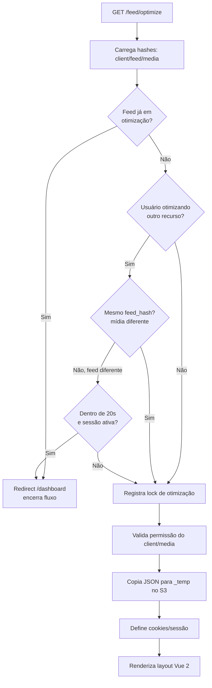

# Estrutura

O backend principal está no repositório `feeds-upgrade`, baseado em **Yii2** e **PHP 8.2**.

:::info Padrão MVC
O Daxgo Feeds segue o padrão MVC (Model-View-Controller) do framework Yii2, com camadas adicionais de Services e Components.
:::

## Organização de pastas

```plaintext title="Estrutura do projeto"
feeds-upgrade/
├── controllers/      # Endpoints e ações principais
├── models/           # Entidades e models de domínio
├── services/         # Serviços de integração
├── components/       # Componentes utilitários
├── commands/         # Console commands
├── views/            # Templates Yii2
├── web/              # Assets públicos, bundles e entry points
├── config/           # Configurações
├── runtime/          # Cache e logs temporários
└── vendor/           # Dependências Composer
```

### Descrição dos diretórios

| Diretório | Responsabilidade | Exemplos |
|-----------|------------------|----------|
| `controllers/` | Lógica de requisições HTTP | `FeedController`, `PromotionController` |
| `models/` | Entidades de banco e validação | `Feed`, `Product`, `Client` |
| `services/` | Integrações externas | `GoogleMerchantService`, `IaData` |
| `components/` | Funcionalidades reutilizáveis | `S3`, `FeedImporter` |
| `commands/` | Tarefas agendadas e CLI | `FeedDownloadController` |

## Controllers relevantes

### FeedController

Principal controller para operações de feed.

<details>
<summary>Actions principais</summary>

**`actionOptimize()`**
- Inicializa o módulo de otimização
- Define cookies e sessão (`client_hash`, `feed_hash`, `media_hash`)
- Copia arquivo `.json` para `_temp.json` no S3
- Carrega layout com bundle Vue 2
- **Controle de concorrência (ponto crítico)**: antes de qualquer processamento, verifica se o mesmo feed/mídia já está em otimização ou se o usuário já está otimizando aquele par. Se estiver, **redireciona para `/dashboard` e encerra o fluxo**, evitando concorrência, corrupção do arquivo temporário e conflitos de sessão.

:::info Evolução do bloqueio (PR #30)
A partir da [PR #30](https://github.com/daxgocommerce/feeds-upgrade/pull/30), o bloqueio foi refinado: agora o usuário **pode trocar de mídia no mesmo feed** sem ser bloqueado (ex: passar de Facebook para Google no mesmo feed). O bloqueio só acontece se o usuário tentar acessar um **feed diferente** dentro do timeout de 20s e se a sessão anterior ainda existir no servidor.

**Lógica**:
- Se `feed_hash` for o mesmo (independente da mídia) → não bloqueia
- Se `feed_hash` for diferente e dentro de 20s → bloqueia
:::


<div style={{textAlign: 'center'}}>



</div>

**`actionGetDataToOptimize()`**

Endpoint AJAX crítico do módulo de otimização. Chamado pelo frontend Vue 2 para carregar, processar e retornar produtos otimizados.

**Características**:
- **Sem CSRF**: desabilitado para permitir chamadas do SPA
- **Sem limites**: memória e tempo de execução ilimitados (`memory_limit=-1`, `set_time_limit=-1`)
- **CORS aberto**: `Access-Control-Allow-Origin: *`
- **Sem layout**: retorna JSON puro (`$this->layout = false`)

**Fluxo de processamento**:

1. **Carregamento de contexto**
   - Hashes vêm da sessão (primeira request) ou do POST (requests subsequentes)
   - Valida permissão do `ClientMedia`

2. **Normalização de regras/filtros**
   - **Se `is_first_request=1`**: carrega regras/filtros do `ClientMedia` (banco)
   - **Senão**: usa regras/filtros vindos do POST (editados pelo usuário)
   - Ordena regras via `orderRules()` (garante precedência correta)

3. **Catálogo Inteligente (opcional)**
   - Se `client.catalogo_inteligente='S'` e feed tiver otimizações IA:
     - Carrega `media_ia` e `feed_ia` para enviar à Lambda
     - Lambda aplica otimizações de IA nos produtos

4. **Invocação da Lambda**
   - Instancia [`FeedRunOptimizeOnLambda`](./componentes#feedrunoptimizeonlambda) com todos os parâmetros
   - Lambda processa: aplica regras, filtros, paginação, busca e ordenação
   - Retorna produtos otimizados + metadados (totalPages, titles, etc.)

5. **Publicação (se `publish_products=1`)**
   - Salva regras/filtros/colunas via `saveOptimize()`
   - Atualiza timestamp de otimização (`feed_optimization_date_update`)
   - Retorna URL do feed publicado

6. **Resposta JSON**
   - `produtos_default`: array de produtos processados
   - `regras`, `filtros`, `regrasFeed`: configurações aplicadas
   - `titles`, `titles_created`: colunas disponíveis e customizadas
   - `totalPages`, `page`: metadados de paginação
   - `feed_url`: (apenas se publicado) URL do feed final

:::warning Ponto de atenção
Esta action **não valida se o feed está em otimização por outro usuário**. Essa verificação acontece apenas no `actionOptimize()`. Aqui assume-se que o usuário já passou pelo gate de concorrência.
:::

<div style={{textAlign: 'center'}}>



</div>

```mermaid
sequenceDiagram
    participant Vue as Frontend Vue 2
    participant Action as actionGetDataToOptimize()
    participant Session as Sessão/POST
    participant DB as ClientMedia (DB)
    participant Lambda as FeedRunOptimizeOnLambda
    participant S3
    
    Vue->>Action: POST /feed/get-data-to-optimize<br/>(regras, filtros, página, busca)
    Action->>Session: Carrega hashes (client/feed/media)
    Action->>DB: Valida permissão ClientMedia
    
    alt Primeira requisição (is_first_request=1)
        Action->>DB: Carrega regras/filtros salvos
    else Requisições subsequentes
        Action->>Action: Usa regras/filtros do POST
    end
    
    Action->>Action: Ordena regras (precedência)
    
    opt Catálogo Inteligente ativo
        Action->>DB: Carrega media_ia e feed_ia
        Action->>Lambda: Envia flags de IA
    end
    
    Action->>Lambda: Invoca otimização<br/>(produtos, regras, filtros, paginação)
    Lambda->>S3: Lê {hash}_temp.json
    Lambda->>Lambda: Aplica regras, filtros,<br/>busca, ordenação
    Lambda-->>Action: Retorna produtos otimizados<br/>+ metadados
    
    opt Publicação (publish_products=1)
        Action->>Action: saveOptimize()<br/>(persiste regras/filtros)
        Action->>DB: Atualiza timestamp
        Action->>S3: Copia _temp → final
    end
    
    Action-->>Vue: JSON (produtos, regras,<br/>filtros, paginação, URL)
```

**`actionIndex()`**
- Lista feeds do cliente
- Interface principal de gerenciamento

</details>

### PromotionController

Gerenciamento de promoções do Google Merchant.

- **Sincronização**: Importa promoções do Google
- **Criação**: Cria novas promoções
- **Validação**: Valida dados antes de enviar

### OAuth2GoogleController

Autenticação OAuth2 para Google APIs.

- **Callback**: Recebe código de autorização
- **Token Management**: Armazena tokens no DynamoDB
- **Refresh**: Renova tokens expirados automaticamente

## Fluxo de otimização (backend)

:::tip Fluxo completo
O fluxo de otimização envolve múltiplos controllers, services e o frontend Vue 2.
:::


**Etapas detalhadas**:

1. **Inicialização**: `actionOptimize()` recebe parâmetros (`client_hash`, `feed_hash`, `media_hash`)
2. **Preparação**: Copia arquivo de produção para temporário no S3
3. **Sessão**: Define cookies e sessão para o frontend acessar
4. **Asset Bundle**: Registra `FeedOptimizeAsset` que injeta Vue 2 SPA
5. **Processamento**: `actionGetDataToOptimize()` processa regras e retorna JSON

## Assets do front-end

O sistema utiliza **Asset Bundles** do Yii2 para gerenciar dependências do frontend.

```php title="assets/FeedOptimizeAsset.php"
class FeedOptimizeAsset extends AssetBundle
{
    public $basePath = '@webroot';
    public $baseUrl = '@web';
    public $sourcePath = '@webroot/feed-optimize/static';
    
    public $js = [
        'js/manifest.js',
        'js/vendor.js',
        'js/app.js',
    ];
}
```

:::note Localização
Os arquivos compilados do Vue 2 estão em `web/feed-optimize/static/js/` e são injetados no layout `views/layouts/feed-optimize.php`.
:::

## Cron Jobs

O sistema utiliza cron para tarefas agendadas.

```yaml title="cron.yaml"
cron:
  - description: "Feed processing and updates"
    url: /cron.php
    schedule: every 5 minutes
```

**Tarefas executadas**:
- Importação de feeds
- Sincronização com Google Merchant
- Processamento de filas
- Limpeza de cache

:::warning Performance
Jobs de longa duração devem ser executados via Commands (CLI) em vez de HTTP requests para evitar timeouts.

