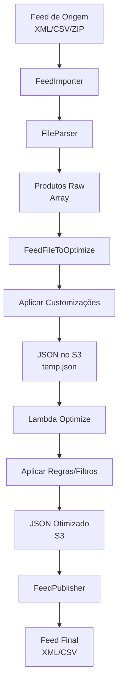

# Pipeline de Processamento de Feeds

Fluxo completo de importação, processamento, otimização e publicação de feeds de produtos.

:::tip Arquitetura em camadas
O pipeline é dividido em componentes independentes e reutilizáveis, facilitando manutenção e testes.
:::

## Visão geral do pipeline



## Componentes principais

### 1. FeedImporter

**Arquivo:** `components/FeedImporter.php`

**Responsabilidades:**
- Baixar feed de origem (HTTP, FTP, arquivo local)
- Detectar tipo de arquivo (XML, CSV, ZIP, TAR)
- Descompactar se necessário
- Validar estrutura básica

**Métodos principais:**
```php
public function import($sFeedUrl, $sFileType)
public function downloadFile($sUrl)
public function validateFeedStructure()
```

**Tipos suportados:**
- XML (padrão)
- CSV
- ZIP (extrai e processa primeiro arquivo)
- TAR (extrai e processa primeiro arquivo)

### 2. FileParser

**Arquivo:** `components/FileParser.php`

**Responsabilidades:**
- Parsear XML/CSV para array PHP
- Mapear campos do feed para campos internos
- Normalizar dados
- Lidar com encodings variados

**Métodos principais:**
```php
public function parseXml($sFilePath)
public function parseCsv($sFilePath)
public function mapFields($aProduct, $aFieldMapping)
```

**Características:**
- Streaming para arquivos grandes (SXmlReader)
- Suporte a múltiplos encodings (UTF-8, ISO-8859-1)
- Validação de campos obrigatórios

### 3. FeedFileToOptimize

**Arquivo:** `components/FeedFileToOptimize.php`

**Responsabilidades:**
- Preparar produtos para otimização
- Aplicar customizações manuais (`ssxml_manual_set`)
- Aplicar unpublish (`ssxml_unpublish`)
- Integrar Google Sheets
- Aplicar Custom Labels
- Aplicar taxonomia do Google
- Gerenciar tags de URL

**Fluxo:**
```php
public function createFile($createExtraFile = false)
{
    $this->setDataPublished();      // Carrega customizações
    $this->setTagAndTaxonomy();     // Aplica taxonomia
    $this->saveFileS3($createExtraFile); // Salva no S3
}
```

**Customizações aplicadas:**

1. **Manual Set** (`ssxml_manual_set`):
   - Valores editados manualmente na UI
   - Sobrescreve valores originais do feed
   - Armazenado como objeto JSON

2. **Unpublish** (`ssxml_unpublish`):
   - Campos marcados para não publicar
   - Array de nomes de campos
   - Remove campos do feed final

3. **Google Sheets**:
   - Integra dados de planilhas externas
   - Sobrescreve campos por SKU
   - Processado via `FeedPublisher::getDataProductsByGoogleSheets()`

4. **Custom Labels**:
   - `custom_label1` a `custom_label4`
   - Armazenado em `ProductsLabel`
   - Usado para segmentação no Google Ads

5. **Taxonomia do Google**:
   - Mapeia categorias do cliente para categorias Google
   - Configurável por cliente (`google_taxonomy`)
   - Armazena categoria original em `client_category`

6. **Tags de URL**:
   - Remove/adiciona parâmetros UTM
   - Configurado em `ClientMedia::url_tag`

### 4. FeedRunOptimizeOnLambda

**Arquivo:** `components/FeedRunOptimizeOnLambda.php`

**Responsabilidades:**
- Invocar Lambda AWS para processamento assíncrono
- Aplicar regras de transformação
- Aplicar filtros
- Processar grandes volumes

**Payload enviado:**
```json
{
  "client_hash": "...",
  "feed_hash": "...",
  "media_hash": "...",
  "rules": [...],
  "filters": [...],
  "products": [...]
}
```

**Lambda retorna:**
- Produtos processados
- Estatísticas de aplicação
- Logs de erro

### 5. FeedSaveProductsPublished

**Arquivo:** `components/FeedSaveProductsPublished.php`

**Responsabilidades:**
- Salvar estado publicado dos produtos
- Copiar arquivo temporário para definitivo
- Persistir customizações no banco
- Gerenciar versionamento

**Métodos principais:**
```php
public function save($aProducts)
public function copyTempFile()
public function updateProductsPublished()
```

**Fluxo de publicação:**
1. Valida produtos
2. Copia `{hash}_temp.json` → `{hash}.json` no S3
3. Persiste customizações em `ProductPublish`
4. Atualiza timestamps

### 6. FeedPublisher

**Arquivo:** `models/FeedPublisher.php`

**Responsabilidades:**
- Gerar feed final (XML/CSV)
- Aplicar template de mídia
- Publicar no S3
- Atualizar URLs

**Métodos principais:**
```php
public function publishFeed()
public function generateXml($aProducts)
public function generateCsv($aProducts)
public function uploadToS3($sFilePath)
```

**Formatos de saída:**
- XML (padrão Google Shopping)
- CSV (configurável)
- Templates customizáveis por mídia

## Fluxo de customização (UI → Backend)

### 1. Usuário acessa "Customizar Feeds"

```
FeedController::actionOptimize()
├─ Verifica se feed já está em otimização
├─ Cria registro em FeedsInOptimization
├─ Define cookies (client_hash, feed_hash, media_hash)
├─ Copia arquivo S3: {hash}.json → {hash}_temp.json
└─ Renderiza view com front-end Vue
```

### 2. Front-end carrega dados

```
POST /feed/get-data-to-optimize
├─ FeedController::actionGetDataToOptimize()
├─ Carrega produtos do S3 (_temp.json)
├─ Carrega regras salvas (ClientMedia::rule)
├─ Carrega filtros salvos (ClientMedia::filter)
├─ Carrega fields mapping (ClientMedia::fields)
├─ Aplica regras via Lambda (opcional)
└─ Retorna JSON com produtos otimizados
```

**Payload da requisição:**
```json
{
  "client_hash": "...",
  "feed_hash": "...",
  "media_hash": "...",
  "qtd_per_page": 30,
  "page": 0,
  "search_by": "",
  "search_value": "",
  "order_by": "",
  "order_type": "asc",
  "products": [...],
  "rules": [...],
  "filters": [...],
  "regrasFeed": {...},
  "titles_created": [...],
  "publish_products": 0,
  "is_first_request": 1
}
```

**Resposta:**
```json
{
  "produtos_default": [...],
  "regras": [...],
  "filtros": [...],
  "regrasFeed": {...},
  "default_fields": {...},
  "page": 0,
  "titles": [...],
  "titles_created": [...],
  "totalPages": 100,
  "totalProducts": 3000,
  "media_name": "Facebook Ads"
}
```

### 3. Usuário edita e publica

```
POST /feed/get-data-to-optimize (com publish_products=1)
├─ Valida campos do feed (regrasFeed)
├─ FeedSaveProductsPublished::save()
├─ Copia S3: {hash}_temp.json → {hash}.json
├─ Persiste customizações em ProductPublish
├─ FeedPublisher::publishFeed()
├─ Gera XML/CSV final
├─ Upload para S3
└─ Retorna feed_url
```

## Estrutura de dados

### Produto no pipeline

```php
[
  'sku' => '123456',
  'name' => 'Produto Exemplo',
  'description' => 'Descrição...',
  'price' => '99.90',
  'sale_price' => '79.90',
  'url' => 'https://...',
  'image_url' => 'https://...',
  'category' => 'Eletrônicos > Celulares',
  'brand' => 'Marca',
  'availability' => 'in stock',
  
  // Campos internos do sistema
  'ssxml_id' => 'abc123...',
  'ssxml_status' => 'active',
  'ssxml_manual_set' => (object)[...],
  'ssxml_unpublish' => ['field1', 'field2'],
  
  // Google Taxonomy
  'client_category' => 'Categoria Original',
  
  // Custom Labels
  'custom_label1' => 'promo_black_friday',
  'custom_label2' => 'estoque_baixo',
  'custom_label3' => 'novo',
  'custom_label4' => '',
  
  // Campos customizados
  'custom_field_0' => 'valor_custom',
]
```

### Regras aplicadas

Estrutura de regra:
```php
[
  'id' => 0,
  'coluna' => 'name',
  'regra' => 'substituir_texto',
  'texto1' => 'iPhone',
  'texto2' => 'iPhone 15 Pro',
  'ativo' => true,
  'condicoes' => [
    [
      'coluna' => 'brand',
      'condicao' => 'igual',
      'texto' => 'Apple'
    ]
  ]
]
```

Tipos de regra:
- `substituir_texto`: Replace
- `remover_texto`: Remove substring
- `cortar`: Truncate
- `adicionar_texto`: Prepend/append
- `adicionar_coluna`: Copiar valor de outra coluna
- `remover_tags_html`: Strip HTML
- `aplicar_desconto`: Aplicar % de desconto
- `mascara_moeda`: Formatar como moeda
- `primeira_letra_maiuscula`: Capitalize
- `todas_letras_maiusculas`: Uppercase
- `todas_letras_minusculas`: Lowercase

### Filtros aplicados

Estrutura de filtro:
```php
[
  'id' => 0,
  'coluna' => 'price',
  'condicao' => 'maior_que',
  'texto' => '100',
  'exclude_empty' => true,
  'active' => true,
  'condicoes' => [...]
]
```

Tipos de condição:
- `igual`: Equals
- `diferente`: Not equals
- `contem`: Contains
- `nao_contem`: Not contains
- `inicia_com`: Starts with
- `termina_com`: Ends with
- `maior_que`: Greater than
- `menor_que`: Less than
- `vazio`: Is empty
- `nao_vazio`: Is not empty

## S3/MinIO (Armazenamento)

### Estrutura de arquivos

```
bucket: daxgo/
├── json-to-optimize/
│   ├── {client_hash}_{feed_hash}_{media_hash}.json
│   ├── {client_hash}_{feed_hash}_{media_hash}_temp.json
│   └── {client_hash}_{feed_hash}_{media_hash}_background.json
├── feeds/
│   ├── {client_hash}_{feed_hash}_{media_hash}_{timestamp}.xml
│   └── {client_hash}_{feed_hash}_{media_hash}_{timestamp}.csv
└── temp/
    └── (arquivos temporários)
```

### Versões dos arquivos

- **`.json`**: Versão publicada (leitura)
- **`_temp.json`**: Versão em edição (escrita)
- **`_background.json`**: Backup para processos em background

## Cron e agendamento

**Arquivo:** `cron.yaml`

```yaml
version: 1
cron:
 - name: "feed-schedule"
   url: "/cron.php"
   schedule: "*/5 * * * *"
```

**Processamento:**
1. Verifica feeds agendados (`SchedulesToProcess`)
2. Executa importação/atualização
3. Marca como processado (`SchedulesProcesseds`)
4. Registra logs em `FeedImportHistory`

## Troubleshooting

### Feed não importa

**Possíveis causas:**
- URL inacessível
- Timeout de download
- Formato inválido
- Encoding não suportado

**Diagnóstico:**
```php
// Verificar logs
tail -f runtime/logs/app.log | grep FeedImporter

// Testar URL manualmente
php yii feed-download/test-url <feed_url>
```

### Customizações não aplicam

**Possíveis causas:**
- Arquivo `_temp.json` não copiado
- Erro ao salvar `ProductPublish`
- Cache do S3

**Diagnóstico:**
```bash
# Verificar arquivos no S3
docker exec -it minio_feeds_s3 mc ls local/daxgo/json-to-optimize/

# Verificar registros no banco
SELECT * FROM product_publish WHERE client_hash='...' AND feed_hash='...';
```

### Lambda timeout

**Possíveis causas:**
- Muitos produtos (> 10k)
- Regras complexas
- Timeout configurado baixo

**Solução:**
- Aumentar timeout do Lambda
- Processar em lotes menores
- Otimizar regras

## Variáveis de ambiente relevantes

```php
// S3/MinIO
'AWS_ACCESS_KEY_ID' => 'admin',
'AWS_SECRET_ACCESS_KEY' => 'password',
'AWS_S3_ENDPOINT' => 'http://host.docker.internal:9666',
'AWS_S3_BUCKET' => 'daxgo',
'AWS_S3_REGION' => 'us-east-1',

// Lambda
'AWS_LAMBDA_FUNCTION_NAME' => 'feed-optimize',
'AWS_LAMBDA_REGION' => 'us-east-1',
```


