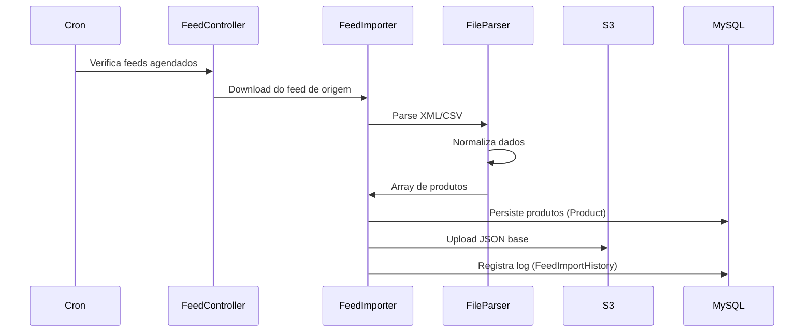
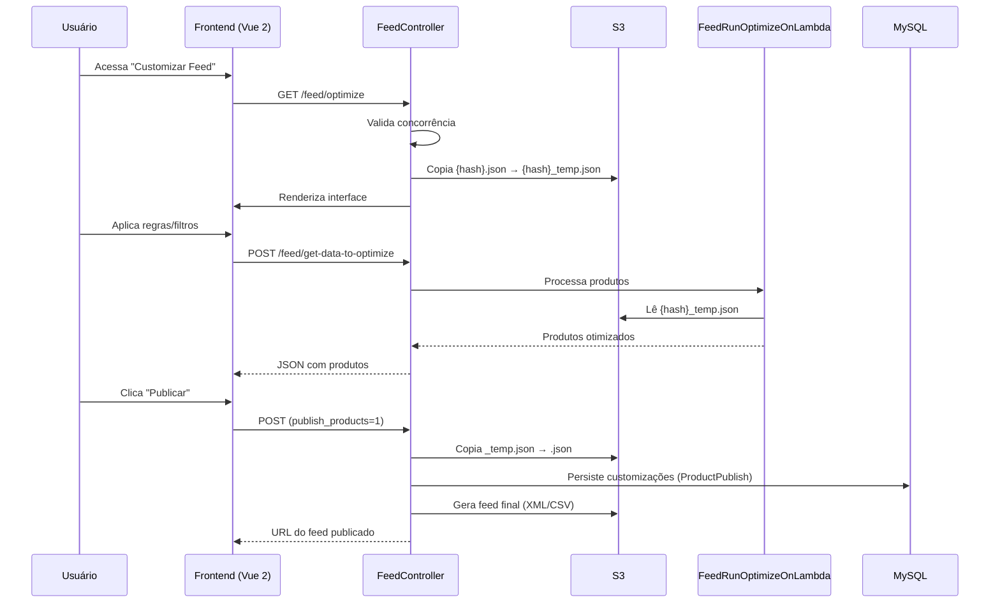
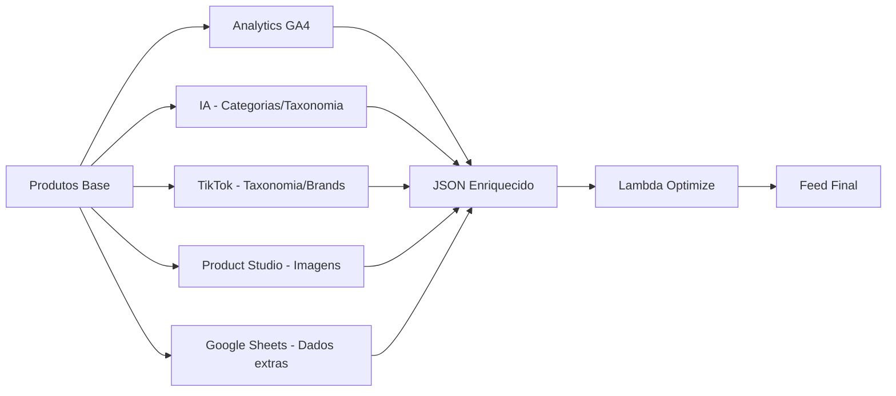

# Pipeline de Processamento de Feeds

Fluxo completo de importação, processamento, otimização e publicação de feeds de produtos.

:::tip Arquitetura em camadas
O pipeline é dividido em componentes independentes e reutilizáveis, facilitando manutenção e testes.
:::

## Visão geral do pipeline

<div style={{textAlign: 'center'}}>


</div>

## Etapas da Pipeline

:::info Componentes detalhados
Para detalhes sobre cada componente, consulte a [documentação de componentes](./componentes.md).
:::

### 1. Importação (FeedImporter + FileParser)

**Entrada**: URL do feed de origem (XML/CSV/ZIP)  
**Saída**: Array de produtos normalizados

**Processos**:
1. Download do arquivo de origem
2. Detecção automática de formato e encoding
3. Descompactação (se necessário)
4. Parsing (streaming para arquivos grandes)
5. Validação de estrutura básica
6. Mapeamento de campos para padrão interno

**Formatos suportados**: XML, CSV, ZIP, TAR, XZ

### 2. Preparação (FeedFileToOptimize)

**Entrada**: Produtos normalizados  
**Saída**: JSON no S3 (`{hash}.json`)

**Customizações aplicadas**:
- **Manual Set**: Valores editados na UI sobrescrevem valores do feed
- **Unpublish**: Campos marcados para não publicar
- **Google Sheets**: Integra dados de planilhas externas (por SKU)
- **Custom Labels**: `custom_label1` a `custom_label4` para segmentação
- **Taxonomia Google**: Mapeia categorias do cliente para categorias Google
- **Tags de URL**: Adiciona/remove parâmetros UTM

### 3. Otimização (FeedRunOptimizeOnLambda)

**Entrada**: JSON do S3 + Regras + Filtros  
**Saída**: JSON otimizado com produtos processados

**Operações na Lambda**:
- Aplicação de regras de transformação (replace, truncate, format, etc.)
- Aplicação de filtros (remove produtos que não atendem critérios)
- Busca e ordenação
- Paginação
- Enriquecimento com dados de Analytics, IA, TikTok, Product Studio

### 4. Publicação (FeedSaveProductsPublished + FeedPublisher)

**Entrada**: JSON otimizado  
**Saída**: Feed final (XML/CSV) publicado no S3

**Processos**:
1. Copia `{hash}_temp.json` → `{hash}.json` no S3
2. Persiste customizações no MySQL (`ProductPublish`)
3. Gera feed final no formato da mídia (XML/CSV)
4. Aplica template de mídia
5. Upload para S3 com URL pública
6. Atualiza timestamps de publicação

## Fluxos principais

### Fluxo 1: Importação agendada (Cron)

<div style={{textAlign: 'center'}}>



</div>

**Frequência**: A cada 5 minutos (configurável em `cron.yaml`)  
**Tabelas envolvidas**: `SchedulesToProcess`, `SchedulesProcesseds`, `FeedImportHistory`

### Fluxo 2: Customização manual (UI)

<div style={{textAlign: 'center'}}>



</div>

### Fluxo 3: Enriquecimento de dados

<div style={{textAlign: 'center'}}>



</div>

**Fontes de enriquecimento**:
- **GA4**: Métricas de conversão, visualizações, receita
- **IA**: Categorias, taxonomia Google, otimização de títulos
- **TikTok**: Taxonomia TikTok, IDs de marcas
- **Product Studio**: URLs de imagens personalizadas
- **Google Sheets**: Dados customizados por SKU

## Regras e Filtros

### Tipos de Regras de Transformação

| Tipo | Descrição | Exemplo |
|------|-----------|---------|
| `substituir_texto` | Substitui texto | "iPhone" → "iPhone 15 Pro" |
| `remover_texto` | Remove substring | Remove "Promoção:" dos títulos |
| `cortar` | Trunca texto | Limita título a 150 caracteres |
| `adicionar_texto` | Prefixo/sufixo | Adiciona "Novo - " no início |
| `adicionar_coluna` | Copia valor de outra coluna | Copia `brand` para `custom_label1` |
| `remover_tags_html` | Remove HTML | `<b>Produto</b>` → "Produto" |
| `aplicar_desconto` | Desconto percentual | Reduz preço em 10% |
| `mascara_moeda` | Formata moeda | `9990` → "R$ 99,90" |
| `primeira_letra_maiuscula` | Capitalize | "produto" → "Produto" |
| `todas_letras_maiusculas` | Uppercase | "produto" → "PRODUTO" |
| `todas_letras_minusculas` | Lowercase | "PRODUTO" → "produto" |

**Condições**: Regras podem ter condições (ex: aplicar apenas se `brand = Apple`)

### Tipos de Filtros

| Condição | Descrição | Exemplo |
|----------|-----------|---------|
| `igual` | Igualdade exata | `category = "Eletrônicos"` |
| `diferente` | Diferente de | `brand ≠ "Nike"` |
| `contem` | Contém texto | `title contém "iPhone"` |
| `nao_contem` | Não contém | `description não contém "usado"` |
| `inicia_com` | Começa com | `sku inicia com "PRD-"` |
| `termina_com` | Termina com | `sku termina com "-XL"` |
| `maior_que` | Maior que | `price > 100` |
| `menor_que` | Menor que | `stock < 10` |
| `vazio` | Campo vazio | `description é vazio` |
| `nao_vazio` | Campo preenchido | `image_url não é vazio` |

**Comportamento**: Produtos que não passam nos filtros são marcados como `ssxml_unpublish`

## Armazenamento (S3/MinIO)

### Estrutura de arquivos

```
bucket: daxgo/
├── json-to-optimize/           # Arquivos JSON para otimização
│   ├── {hash}.json             # Versão publicada (leitura)
│   ├── {hash}_temp.json        # Versão em edição (escrita)
│   └── {hash}_background.json  # Backup para processos em background
├── feeds/                      # Feeds finais publicados
│   ├── {hash}.xml              # Feed XML
│   └── {hash}.csv              # Feed CSV
└── temp/                       # Arquivos temporários de download
```

:::tip Versões dos arquivos
- **`.json`**: Versão publicada (usada em downloads agendados)
- **`_temp.json`**: Versão em edição (usada durante customização na UI)
- **`_background.json`**: Backup para processos assíncronos
:::

## Agendamento (Cron Jobs)

**Frequência**: A cada 5 minutos (configurável em `cron.yaml`)

**Fluxo**:
1. Cron dispara `/cron.php`
2. Verifica tabela `SchedulesToProcess` (feeds agendados)
3. Para cada feed agendado: download → importação → processamento
4. Marca como processado em `SchedulesProcesseds`
5. Registra logs em `FeedImportHistory`

:::info Tabelas envolvidas
- `SchedulesToProcess`: Feeds que devem ser processados
- `SchedulesProcesseds`: Histórico de processamentos
- `FeedImportHistory`: Logs detalhados de cada importação
:::

## Troubleshooting

| Problema | Possíveis causas | Como investigar |
|----------|------------------|-----------------|
| **Feed não importa** | URL inacessível, timeout, formato inválido, encoding não suportado | Verificar `FeedImportHistory`, testar URL manualmente, validar estrutura XML/CSV |
| **Customizações não aplicam** | Arquivo `_temp.json` não copiado, erro ao salvar `ProductPublish`, cache S3 | Verificar arquivos no S3, consultar tabela `product_publish` |
| **Lambda timeout** | Muitos produtos (> 10k), regras complexas, timeout baixo | Aumentar timeout da Lambda, processar em lotes menores, otimizar regras |
| **Produtos não aparecem no feed** | Filtros muito restritivos, `ssxml_unpublish` ativo | Revisar filtros aplicados, verificar campo `ssxml_unpublish` |
| **Feed vazio após publicação** | Erro na geração XML/CSV, template de mídia inválido | Verificar logs do `FeedPublisher`, validar template da mídia |

:::tip Logs úteis
```bash
# Backend (Yii2)
tail -f runtime/logs/app.log | grep -E "FeedImporter|FeedController"

# Lambda (CloudWatch)
aws logs tail /aws/lambda/ssxml_product_optimize_PRODUCAO --follow
```
:::

---

:::info Documentação relacionada
- [Componentes](./componentes.md) - Detalhes de cada componente da pipeline
- [Estrutura Yii2](./estrutura-yii2.md) - Controllers e actions
- [Lambda Functions](/docs/infra/lambda-functions) - Funções AWS Lambda
:::


