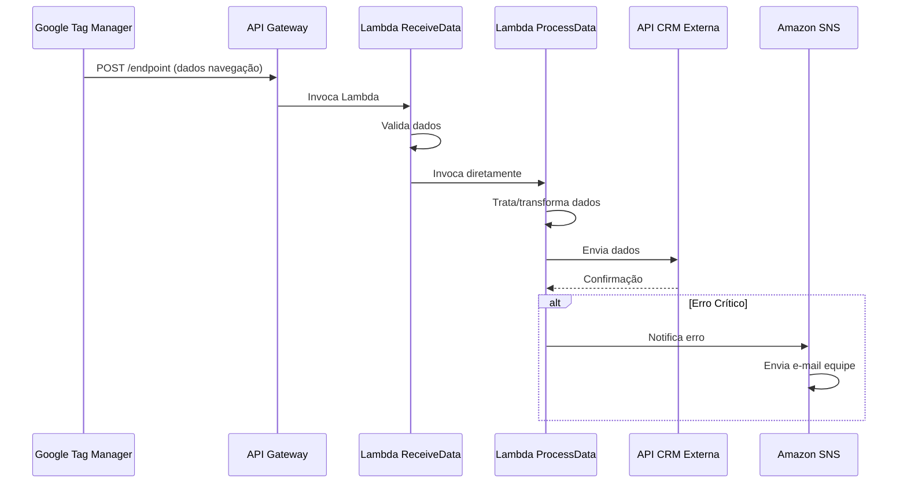
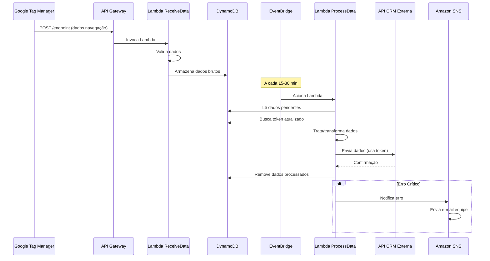
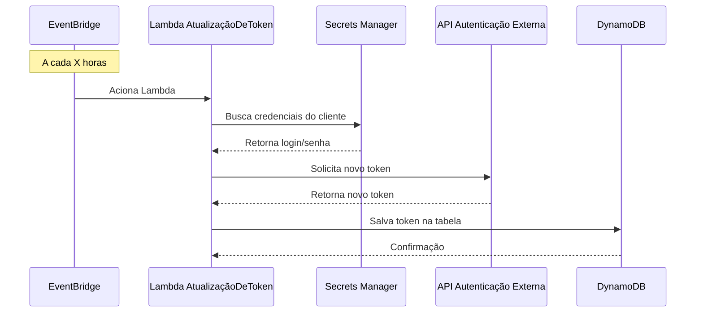

# Arquitetura do DaxGO Connect

## 2.1. Visão Geral da Arquitetura

O DaxGO Connect utiliza uma arquitetura **100% serverless** na AWS, com lógica de aplicação predominantemente em **Node.js**.

### Modelo de Arquitetura

- **Paradigma**: Event-driven serverless
- **Cloud Provider**: AWS (Amazon Web Services)
- **Runtime Principal**: Node.js (versões 18.x a 22.x)
- **Padrão de Integração**: API Gateway + Lambda + DynamoDB

### Serviços AWS Principais

| Serviço | Função |
|---------|--------|
| **API Gateway** | Ponto de entrada para dados do GTM |
| **Lambda (Node.js)** | Processamento de dados (ingestão, tratamento, envio) |
| **DynamoDB** | Buffer temporário e armazenamento de configurações |
| **SNS** | Notificações de erros críticos |
| **EventBridge** | Agendamento de tarefas assíncronas |
| **Secrets Manager** | Gerenciamento seguro de credenciais |
| **CloudWatch** | Logs, métricas e monitoramento |
| **WAF** | Proteção do API Gateway |

### Origem dos Dados

- **Google Tag Manager (GTM)**: Instalado nos sites dos clientes, captura eventos de navegação e os envia para o Connect

## 2.2. Padrão de Processamento

O Connect utiliza um padrão modular de processamento com três tipos principais de Lambdas:

### 1. **ReceiveData Lambdas**

Responsáveis pela **ingestão inicial** dos dados:

- Recebem dados do API Gateway (originados do GTM)
- Validam e normalizam os dados recebidos
- Podem processar sincronamente ou armazenar no DynamoDB para processamento assíncrono
- **Dedicadas por cliente** para Responsys e Salesforce
- **Compartilhada** para RD Station (identifica cliente via `tid` do GA4)

### 2. **ProcessData Lambdas**

Responsáveis pelo **tratamento, enriquecimento e envio**:

- Podem ser acionadas diretamente pelas ReceiveData Lambdas (fluxo síncrono)
- Ou acionadas via EventBridge (fluxo assíncrono) após ReceiveData armazenar no DynamoDB
- Transformam dados de navegação (e-mail, produto, valor, imagem, URL)
- Enviam dados para APIs das ferramentas externas (CRM/Marketing)
- **Dedicadas por cliente** para Responsys e Salesforce
- **Compartilhada** para RD Station

### 3. **Lambdas de Atualização de Token**

Responsáveis pela **gestão de autenticação**:

- Acionadas periodicamente via EventBridge (ex: a cada X horas)
- Buscam credenciais no AWS Secrets Manager
- Solicitam novos tokens às APIs de autenticação das ferramentas
- Armazenam tokens atualizados em tabelas DynamoDB específicas
- Exemplos: `Responsys-RefreshToken`, `Salesforce-AuthToken`

## 2.3. Componentes Principais e Suas Interações

### Google Tag Manager (GTM)

- **Função**: Ponto de coleta dos dados de navegação no site do cliente
- **Implementação**: Tag JavaScript instalada no site
- **Eventos Capturados**: Pageviews, cliques, visualização de produtos, adições ao carrinho, conversões

### API Gateway

**Função**: Recebe os dados do GTM e aciona as Lambdas ReceiveData

**Estrutura de Endpoints**:
- ✅ Um endpoint compartilhado para **todos os clientes Responsys**
- ✅ Um endpoint compartilhado para **todos os clientes Salesforce**
- ✅ Um endpoint único para **todos os clientes RD Station**

**Segurança**:
- Protegido por **AWS WAF** (proteção contra ataques XSS, SQLi, etc.)
- Sem autenticação adicional nos endpoints do GTM (proteção via WAF)

### AWS Lambda (Node.js)

#### ReceiveData Lambdas

**Características**:
- Recebem dados do API Gateway
- Para **Responsys e Salesforce**: Lambdas **dedicadas por cliente**
- Para **RD Station**: Lambda **compartilhada** (identifica cliente via `tid` para buscar configurações)
- Podem enviar diretamente para ProcessData ou armazenar no DynamoDB

#### ProcessData Lambdas

**Características**:
- Recebem dados das ReceiveData ou leem do DynamoDB (via EventBridge)
- Tratam/transformam dados (e-mail, produto, valor, imagem, URL)
- Enviam para APIs das ferramentas de CRM externas
- Para **Responsys e Salesforce**: Lambdas **dedicadas por cliente**
- Para **RD Station**: Lambda **compartilhada**

#### Lambdas de Atualização de Token

**Exemplos**: `Responsys-RefreshToken`, `Salesforce-AuthToken`

**Características**:
- Acionadas por EventBridge periodicamente
- Usam AWS Secrets Manager para credenciais
- Solicitam novos tokens às APIs de autenticação
- Armazenam tokens atualizados em DynamoDB

**Configuração de Rede**:
- Todas as Lambdas operam usando a **rede pública da AWS** (não estão em VPC)

**Runtimes**:
- Node.js versões 18.x a 22.x

**Permissões IAM**:
- Políticas granulares para acesso a DynamoDB, SNS, Secrets Manager, CloudWatch Logs
- Permissões para invocar outras Lambdas quando necessário

### Amazon DynamoDB

#### Armazenamento de Dados de Fluxo

- **Função**: Buffer temporário para dados de navegação capturados pelas ReceiveData Lambdas
- **Ciclo de Vida**: Dados são excluídos após envio para ferramenta externa
- **Modo de Capacidade**: On-demand

#### Armazenamento de Tokens e Configurações

- **Função**: Tabelas específicas por ferramenta para tokens e endpoints
- **Para RD Station**: Tabela de configuração com endpoint e token por cliente (identificável pelo `tid`)
- **Modo de Capacidade**: On-demand
- **Acesso**: Controlado por políticas IAM nas Lambdas

### Amazon SNS (Simple Notification Service)

- **Função**: Notificação de erros críticos das Lambdas
- **Tópicos**: Um ou mais tópicos para agregar erros
- **Assinantes**: 
  - E-mail da equipe de desenvolvimento
  - app@daxgo.io

### Amazon EventBridge (Scheduler)

#### Processamento de Dados

- Aciona **ProcessData Lambdas** em intervalos regulares (15-30 min)
- Permite processamento em lote de dados armazenados no DynamoDB

#### Atualização de Tokens

- Aciona **Lambdas de Atualização de Token** em intervalos definidos
- Garante que tokens de API estejam sempre válidos

### AWS Secrets Manager

- **Função**: Armazenamento seguro de credenciais (login/senha)
- **Uso**: Lambdas de Atualização de Token buscam credenciais para autenticar com APIs externas
- **Acesso**: Controlado por políticas IAM específicas

## 2.4. Fluxo de Dados Principal

### Fluxo Síncrono/Direto

:::tip Quando usar fluxo síncrono?
Ideal para integrações que exigem processamento em tempo real ou volumes baixos de dados.
:::

### Fluxo Assíncrono via DynamoDB

:::tip Quando usar fluxo assíncrono?
Ideal para processamento em lote, volumes altos de dados, ou quando não há necessidade de resposta imediata.
:::

### Fluxo de Atualização de Token

:::info Validade dos Tokens
Cada ferramenta externa tem sua própria política de validade de tokens. O EventBridge é configurado para renovar tokens antes da expiração.
:::

## 2.5. Diagramas de Arquitetura

### Fluxo Principal de Dados

:::info Diagrama Original
**Insira aqui o diagrama do Mermaid Chart:**  
https://www.mermaidchart.com/app/projects/7919e021-498b-4691-be7f-146dcc1a9eaa/diagrams/623f10e5-7918-4b93-8035-51cf98909800/version/v0.1/edit
:::

<!-- TODO: Cole a imagem ou diagrama original do PDF aqui -->

### Fluxo de Atualização de Token

:::info Diagrama Original
**Insira aqui o diagrama do Mermaid Chart:**  
https://www.mermaidchart.com/app/projects/7919e021-498b-4691-be7f-146dcc1a9eaa/diagrams/727a9c96-ad0b-4c72-988b-916272fab20f/version/v0.1/edit
:::

<!-- TODO: Cole a imagem ou diagrama original do PDF aqui -->

## 2.6. Padrões de Integração por Ferramenta

### Responsys

- **Endpoints**: Dedicado por cliente
- **Lambda ReceiveData**: Dedicada por cliente
- **Lambda ProcessData**: Dedicada por cliente
- **Autenticação**: OAuth2 com refresh token
- **Token Storage**: DynamoDB
- **Atualização de Token**: Lambda `Responsys-RefreshToken` via EventBridge

### Salesforce

- **Endpoints**: Dedicado por cliente
- **Lambda ReceiveData**: Dedicada por cliente
- **Lambda ProcessData**: Dedicada por cliente
- **Autenticação**: OAuth2
- **Token Storage**: DynamoDB
- **Atualização de Token**: Lambda `Salesforce-AuthToken` via EventBridge

### RD Station

- **Endpoints**: Único compartilhado
- **Lambda ReceiveData**: Compartilhada (identifica cliente via `tid` GA4)
- **Lambda ProcessData**: Compartilhada
- **Autenticação**: API Key/Token por cliente
- **Configuração Storage**: DynamoDB (endpoint e token por `tid`)
- **Atualização de Token**: Não requer (tokens de longa duração)

## 2.7. Considerações de Design

### Escalabilidade

- **Auto-scaling**: Lambdas escalam automaticamente conforme demanda
- **DynamoDB On-demand**: Capacidade ajustada automaticamente
- **Sem limite de requisições**: API Gateway + Lambda suportam milhões de requests

### Resiliência

- **Retry automático**: Lambdas têm retry nativo em caso de falha
- **Dead Letter Queues**: Podem ser configuradas para eventos que falham
- **Notificações SNS**: Alertas imediatos em caso de erros críticos

### Segurança

- **Credenciais**: Armazenadas exclusivamente no Secrets Manager
- **Tokens**: Renovados automaticamente antes da expiração
- **WAF**: Proteção contra ataques comuns
- **IAM**: Políticas granulares com princípio do menor privilégio

### Custo

- **Pay-per-use**: Paga apenas pelos recursos utilizados
- **Sem servidor ocioso**: Não há custos de infraestrutura quando não há tráfego
- **DynamoDB On-demand**: Custos proporcionais ao uso real

