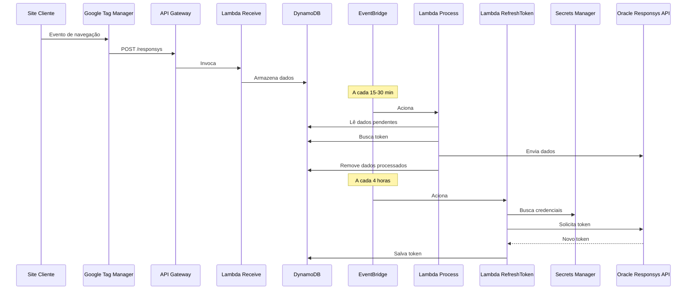
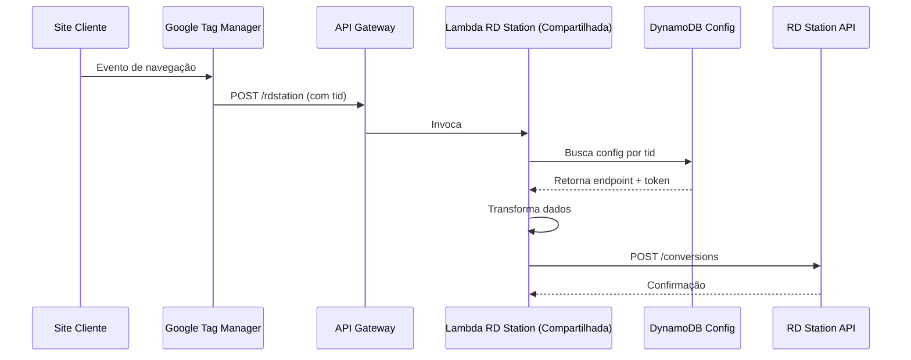
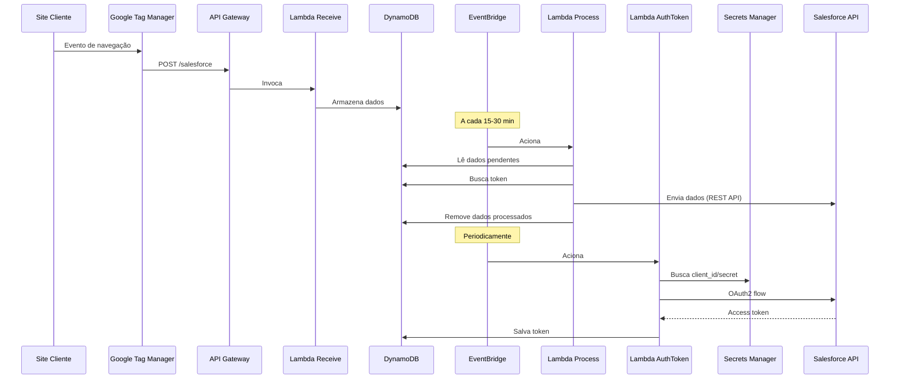

# Funcionalidades e Integrações

## 5.1. Visão Geral

O DaxGO Connect oferece integrações especializadas com as principais plataformas de marketing e CRM do mercado. Cada integração é documentada com detalhes técnicos, fluxos de dados e configurações específicas.

### Integrações Disponíveis

| Ferramenta | Tipo | Status | Documentação |
|-----------|------|--------|--------------|
| **Oracle Responsys** | E-mail Marketing | ✅ Ativo | [Acessar](#52-oracle-responsys) |
| **RD Station** | Marketing Automation | ✅ Ativo | [Acessar](#53-rd-station) |
| **Salesforce** | CRM | ✅ Ativo | [Acessar](#54-salesforce) |
| **Outras Ferramentas** | Diversos | 🔄 Planejado | [Acessar](#55-futuras-integraç ões) |

:::info Links para Documentação Detalhada
As documentações completas de cada integração estão disponíveis no Google Drive, conforme links abaixo. Esta página fornece um resumo técnico de cada integração.
:::

## 5.2. Oracle Responsys

### 5.2.1. Visão Geral

**Oracle Responsys** é uma plataforma de marketing cross-channel que permite gerenciar campanhas de e-mail, SMS, push notifications e mais.

**Objetivo da Integração**: Capturar eventos de navegação (visualização de produtos, carrinho abandonado, etc.) e enviá-los para o Responsys em tempo real ou lote, permitindo campanhas personalizadas.

### 5.2.2. Arquitetura



### 5.2.3. Componentes

| Componente | Nome | Função |
|------------|------|--------|
| **API Endpoint** | `/responsys` | Compartilhado entre clientes |
| **Lambda Receive** | `connect-responsys-{client}-receive` | Dedicada por cliente |
| **Lambda Process** | `connect-responsys-{client}-process` | Dedicada por cliente |
| **Lambda RefreshToken** | `connect-responsys-refresh-token` | Compartilhada (atualiza tokens) |
| **DynamoDB (Dados)** | `connect-responsys-navigation-data` | Buffer de dados |
| **DynamoDB (Tokens)** | `connect-responsys-tokens` | Armazenamento de tokens |
| **Secrets Manager** | `/connect/responsys/{client}/creds` | Credenciais de autenticação |

### 5.2.4. Autenticação

**Tipo**: OAuth 2.0 com refresh token

**Fluxo**:
1. Lambda RefreshToken busca `username` e `password` do Secrets Manager
2. Faz POST para `https://login2.responsys.net/rest/api/v1.3/auth/token`
3. Recebe `access_token` e `refresh_token`
4. Armazena tokens no DynamoDB com `expiresAt`

**Renovação**: A cada 4 horas via EventBridge

### 5.2.5. Payload de Dados

**Exemplo de dados capturados pelo GTM**:

```json
{
  "email": "user@example.com",
  "eventType": "product_view",
  "product": {
    "id": "PROD-12345",
    "name": "Smartphone XYZ",
    "price": 1299.90,
    "image": "https://example.com/image.jpg",
    "url": "https://example.com/product/xyz"
  },
  "timestamp": "2026-01-28T10:30:45.123Z",
  "sessionId": "abc123-session",
  "clientId": "client-abc"
}
```

**Formato enviado para Responsys**:

```json
{
  "recipientData": [
    {
      "recipient": {
        "emailAddress": "user@example.com",
        "emailFormat": "HTML"
      },
      "optionalData": [
        {
          "name": "PRODUCT_ID",
          "value": "PROD-12345"
        },
        {
          "name": "PRODUCT_NAME",
          "value": "Smartphone XYZ"
        },
        {
          "name": "PRODUCT_PRICE",
          "value": "1299.90"
        },
        {
          "name": "PRODUCT_IMAGE",
          "value": "https://example.com/image.jpg"
        },
        {
          "name": "PRODUCT_URL",
          "value": "https://example.com/product/xyz"
        },
        {
          "name": "EVENT_TYPE",
          "value": "product_view"
        }
      ]
    }
  ]
}
```

### 5.2.6. Configuração

**Variáveis de Ambiente (Lambda Process)**:

```javascript
{
  "RESPONSYS_API_ENDPOINT": "https://api2-012.responsys.net/rest/api/v1.3",
  "DYNAMODB_TABLE_DATA": "connect-responsys-navigation-data",
  "DYNAMODB_TABLE_TOKENS": "connect-responsys-tokens",
  "SNS_TOPIC_ARN": "arn:aws:sns:us-east-1:xxx:connect-errors",
  "CLIENT_ID": "client-abc",
  "BATCH_SIZE": "100"
}
```

### 5.2.7. Monitoramento

**Métricas Específicas**:
- Taxa de sucesso de envio para Responsys
- Tempo de resposta da API Responsys
- Taxa de renovação de tokens bem-sucedida
- Volume de eventos processados por cliente

**Dashboard CloudWatch**: Dashboard customizado por cliente com métricas em tempo real.

### 5.2.8. Documentação Completa

:::tip Documentação Detalhada
Para informações completas sobre a integração Responsys, incluindo setup inicial, troubleshooting e casos de uso, acesse:

📂 **[Documentação Responsys no Google Drive](https://drive.google.com/drive/folders/1I73E10pQ53SRAHKFHpCrpH3InM93bxfP?usp=drive_link)**
:::

---

## 5.3. RD Station

### 5.3.1. Visão Geral

**RD Station** é uma plataforma brasileira de marketing automation e CRM que permite gerenciar leads, criar campanhas e automatizar fluxos de comunicação.

**Objetivo da Integração**: Capturar eventos de navegação e enviá-los como conversões para o RD Station, enriquecendo o perfil dos leads.

### 5.3.2. Arquitetura



### 5.3.3. Componentes

| Componente | Nome | Função |
|------------|------|--------|
| **API Endpoint** | `/rdstation` | Único para todos os clientes |
| **Lambda** | `connect-rdstation-shared` | Compartilhada (identifica por `tid`) |
| **DynamoDB (Config)** | `connect-rdstation-config` | Configurações por cliente (tid) |

:::tip Diferencial RD Station
Ao contrário de Responsys e Salesforce, a integração RD Station usa uma **Lambda compartilhada** que identifica o cliente pelo `tid` (Google Analytics 4 client ID) enviado no payload.
:::

### 5.3.4. Autenticação

**Tipo**: API Token (longa duração)

**Armazenamento**: Token armazenado no DynamoDB junto com as configurações do cliente

**Estrutura no DynamoDB**:

```json
{
  "tid": "GA4.123456789.987654321",
  "clientId": "client-xyz",
  "clientName": "Loja XYZ Ltda",
  "endpoint": "https://api.rd.services/platform/conversions",
  "token": "rdstation_api_token_here",
  "active": true,
  "createdAt": 1706457600000
}
```

### 5.3.5. Payload de Dados

**Exemplo de dados recebidos do GTM**:

```json
{
  "tid": "GA4.123456789.987654321",
  "email": "lead@example.com",
  "eventType": "product_view",
  "product": {
    "id": "PROD-789",
    "name": "Notebook ABC",
    "price": 2999.90,
    "url": "https://example.com/notebook-abc"
  },
  "timestamp": "2026-01-28T11:00:00Z"
}
```

**Formato enviado para RD Station**:

```json
{
  "event_type": "CONVERSION",
  "event_family": "CDP",
  "payload": {
    "conversion_identifier": "product_view",
    "email": "lead@example.com",
    "cf_product_id": "PROD-789",
    "cf_product_name": "Notebook ABC",
    "cf_product_price": "2999.90",
    "cf_product_url": "https://example.com/notebook-abc",
    "cf_timestamp": "2026-01-28T11:00:00Z"
  }
}
```

### 5.3.6. Configuração

**Variáveis de Ambiente (Lambda)**:

```javascript
{
  "DYNAMODB_TABLE_CONFIG": "connect-rdstation-config",
  "SNS_TOPIC_ARN": "arn:aws:sns:us-east-1:xxx:connect-errors",
  "DEFAULT_ENDPOINT": "https://api.rd.services/platform/conversions",
  "REQUEST_TIMEOUT": "10000"
}
```

### 5.3.7. Fluxo de Processamento

1. GTM envia dados com `tid` para API Gateway
2. Lambda recebe e extrai `tid`
3. Lambda busca configuração no DynamoDB usando `tid` como chave
4. Lambda valida `active: true` e existência de `token`
5. Lambda transforma dados para formato RD Station
6. Lambda envia POST para RD Station API usando token do cliente
7. Lambda retorna status de sucesso/erro

**Tratamento de Erros**:
- Se `tid` não encontrado → Retorna 400 (cliente não configurado)
- Se token inválido → Notifica SNS e retorna 401
- Se RD Station API falha → Retry 3x + notifica SNS

### 5.3.8. Monitoramento

**Métricas Específicas**:
- Conversões enviadas por cliente (identificado por `tid`)
- Taxa de sucesso por cliente
- Latência de resposta da API RD Station
- Erros de configuração (tid não encontrado)

### 5.3.9. Documentação Completa

:::tip Documentação Detalhada
Para informações completas sobre a integração RD Station, incluindo setup de `tid`, configuração de campos customizados e troubleshooting, acesse:

📂 **[Documentação RD Station no Google Drive](https://drive.google.com/drive/folders/1rqhG4vWliCkRroBYD5s-UBFBeovj6u-P?usp=drive_link)**
:::

---

## 5.4. Salesforce

### 5.4.1. Visão Geral

**Salesforce** é a plataforma de CRM líder mundial, oferecendo gestão de vendas, marketing, atendimento ao cliente e muito mais.

**Objetivo da Integração**: Capturar eventos de navegação e enviá-los como atividades ou campos customizados nos registros de Leads/Contacts no Salesforce.

### 5.4.2. Arquitetura



### 5.4.3. Componentes

| Componente | Nome | Função |
|------------|------|--------|
| **API Endpoint** | `/salesforce` | Compartilhado entre clientes |
| **Lambda Receive** | `connect-salesforce-{client}-receive` | Dedicada por cliente |
| **Lambda Process** | `connect-salesforce-{client}-process` | Dedicada por cliente |
| **Lambda AuthToken** | `connect-salesforce-auth-token` | Compartilhada (OAuth2) |
| **DynamoDB (Dados)** | `connect-salesforce-navigation-data` | Buffer de dados |
| **DynamoDB (Tokens)** | `connect-salesforce-tokens` | Armazenamento de tokens |
| **Secrets Manager** | `/connect/salesforce/{client}/creds` | Client ID e Secret |

### 5.4.4. Autenticação

**Tipo**: OAuth 2.0 (Client Credentials Flow)

**Fluxo**:
1. Lambda AuthToken busca `client_id` e `client_secret` do Secrets Manager
2. Faz POST para `https://login.salesforce.com/services/oauth2/token`
3. Recebe `access_token` e `instance_url`
4. Armazena no DynamoDB com `expiresAt`

**Payload de Autenticação**:

```javascript
{
  grant_type: 'client_credentials',
  client_id: 'SALESFORCE_CLIENT_ID',
  client_secret: 'SALESFORCE_CLIENT_SECRET'
}
```

### 5.4.5. Payload de Dados

**Exemplo de dados capturados**:

```json
{
  "email": "prospect@example.com",
  "eventType": "product_view",
  "product": {
    "id": "PROD-456",
    "name": "Câmera DSLR",
    "price": 3499.90,
    "category": "Eletrônicos",
    "url": "https://example.com/camera"
  },
  "timestamp": "2026-01-28T12:00:00Z",
  "clientId": "client-def"
}
```

**Formato enviado para Salesforce** (exemplo: criar Task):

```json
{
  "Subject": "Visualizou produto: Câmera DSLR",
  "Description": "Produto: Câmera DSLR (PROD-456)\nPreço: R$ 3.499,90\nURL: https://example.com/camera",
  "Status": "Completed",
  "Priority": "Normal",
  "WhoId": "LEAD_OR_CONTACT_ID",
  "ActivityDate": "2026-01-28",
  "Type": "Product View"
}
```

**Ou atualizar campos customizados no Lead/Contact**:

```json
{
  "Last_Product_Viewed__c": "PROD-456",
  "Last_Product_Name__c": "Câmera DSLR",
  "Last_Product_Price__c": 3499.90,
  "Last_Product_URL__c": "https://example.com/camera",
  "Last_Activity_Date__c": "2026-01-28T12:00:00.000Z"
}
```

### 5.4.6. Configuração

**Variáveis de Ambiente (Lambda Process)**:

```javascript
{
  "SALESFORCE_API_VERSION": "v59.0",
  "DYNAMODB_TABLE_DATA": "connect-salesforce-navigation-data",
  "DYNAMODB_TABLE_TOKENS": "connect-salesforce-tokens",
  "SNS_TOPIC_ARN": "arn:aws:sns:us-east-1:xxx:connect-errors",
  "CLIENT_ID": "client-def",
  "BATCH_SIZE": "200",
  "USE_BULK_API": "true"
}
```

### 5.4.7. API Endpoints Utilizados

| Endpoint | Método | Uso |
|----------|--------|-----|
| `/services/data/v59.0/sobjects/Task` | POST | Criar Task (atividade) |
| `/services/data/v59.0/sobjects/Lead/{id}` | PATCH | Atualizar Lead |
| `/services/data/v59.0/sobjects/Contact/{id}` | PATCH | Atualizar Contact |
| `/services/data/v59.0/composite/batch` | POST | Operações em lote |

### 5.4.8. Monitoramento

**Métricas Específicas**:
- Registros criados/atualizados no Salesforce
- Taxa de sucesso de autenticação OAuth2
- Latência de resposta da API Salesforce
- Erros de limite de API (rate limiting)

### 5.4.9. Documentação Completa

:::tip Documentação Detalhada
Para informações completas sobre a integração Salesforce, incluindo setup de Connected App, mapeamento de campos customizados e troubleshooting, acesse:

📂 **[Documentação Salesforce no Google Drive](https://drive.google.com/drive/folders/1K1DMZ8WboLmUTC2vmRQ4haDS5e0m7iyV?usp=drive_link)**
:::

---

## 5.5. Futuras Integrações

O DaxGO Connect foi projetado para ser extensível. Novas integrações podem ser adicionadas seguindo o mesmo padrão arquitetural.

### 5.5.1. Integrações Planejadas

| Ferramenta | Tipo | Status | Previsão |
|-----------|------|--------|----------|
| **HubSpot** | CRM/Marketing | 🔄 Em análise | Q2 2026 |
| **Mailchimp** | E-mail Marketing | 🔄 Em análise | Q2 2026 |
| **ActiveCampaign** | Marketing Automation | 🔄 Em análise | Q3 2026 |
| **Pipedrive** | CRM | 🔄 Em análise | Q3 2026 |

### 5.5.2. Requisitos para Novas Integrações

Para adicionar uma nova integração, é necessário:

1. **Definição de Requisitos**:
   - Eventos a serem capturados
   - Formato de dados esperado pela ferramenta
   - Tipo de autenticação (OAuth2, API Key, etc.)
   - Limites de rate limiting da API

2. **Implementação**:
   - Lambda ReceiveData (dedicada ou compartilhada)
   - Lambda ProcessData (dedicada ou compartilhada)
   - Lambda de Autenticação (se necessário)
   - Tabelas DynamoDB (dados, tokens, config)
   - Regras EventBridge (se processamento assíncrono)

3. **Configuração AWS**:
   - Endpoint no API Gateway
   - Políticas IAM para Lambdas
   - Secrets no Secrets Manager (se necessário)
   - Alarmes no CloudWatch
   - Dashboard de monitoramento

4. **Documentação**:
   - Fluxo de dados (diagrama Mermaid)
   - Estrutura de payload
   - Guia de configuração
   - Troubleshooting

5. **Testes**:
   - Testes unitários das Lambdas
   - Testes de integração com API da ferramenta
   - Testes de carga (volume esperado)
   - Validação de erros e notificações SNS

### 5.5.3. Template de Integração

Um repositório template está disponível para acelerar o desenvolvimento de novas integrações:

```bash
# Estrutura do template
connect-integration-template/
├── lambda/
│   ├── receive/
│   │   └── index.js
│   ├── process/
│   │   └── index.js
│   └── auth/
│       └── index.js
├── infrastructure/
│   ├── dynamodb-tables.json
│   ├── iam-policies.json
│   └── eventbridge-rules.json
├── tests/
│   ├── unit/
│   └── integration/
├── docs/
│   └── integration-guide.md
└── README.md
```

:::tip Contribuindo
Se você está desenvolvendo uma nova integração, siga o template e a documentação de padrões do DaxGO Connect para garantir consistência e manutenibilidade.
:::

## 5.6. Comparativo de Integrações

### Características Técnicas

| Característica | Responsys | RD Station | Salesforce |
|---------------|-----------|------------|------------|
| **Lambda Receive** | Dedicada | Compartilhada | Dedicada |
| **Lambda Process** | Dedicada | Compartilhada | Dedicada |
| **Autenticação** | OAuth2 (refresh) | API Token | OAuth2 (client creds) |
| **Processamento** | Assíncrono (lote) | Síncrono | Assíncrono (lote) |
| **EventBridge** | Sim (15-30 min) | Não | Sim (15-30 min) |
| **Identificação Cliente** | Lambda dedicada | tid (GA4) | Lambda dedicada |
| **Renovação de Token** | Sim (4h) | Não | Sim (variável) |
| **Secrets Manager** | Sim | Não | Sim |

### Capacidades

| Capacidade | Responsys | RD Station | Salesforce |
|-----------|-----------|------------|------------|
| **Volume/Dia** | Alto (milhões) | Médio (milhares) | Alto (milhões) |
| **Latência** | 15-30 min | < 1 min | 15-30 min |
| **Retry Automático** | Sim | Sim (3x) | Sim |
| **Batch Processing** | Sim | Não | Sim |
| **Rate Limiting** | Controlado | 120 req/min | API limits |
| **Suporte a Webhook** | Não | Possível | Possível |

## 5.7. Melhores Práticas

### Para Todas as Integrações

1. **Sempre valide dados na Lambda Receive**
   ```javascript
   if (!event.body || !JSON.parse(event.body).email) {
     return { statusCode: 400, body: 'Invalid payload' };
   }
   ```

2. **Use try-catch e notifique erros críticos**
   ```javascript
   try {
     await sendToCRM(data);
   } catch (error) {
     await notifySNS(error);
     throw error;
   }
   ```

3. **Implemente retry com backoff exponencial**
   ```javascript
   for (let attempt = 0; attempt < 3; attempt++) {
     try {
       return await apiCall();
     } catch (error) {
       if (attempt === 2) throw error;
       await sleep(Math.pow(2, attempt) * 1000);
     }
   }
   ```

4. **Monitore métricas específicas no CloudWatch**
   - Taxa de sucesso
   - Latência
   - Volume de dados
   - Erros de autenticação

5. **Documente payloads e formatos**
   - Mantenha documentação atualizada
   - Inclua exemplos de request/response
   - Documente códigos de erro

6. **Teste em ambiente isolado primeiro**
   - Use Lambda de teste
   - Valide com volumes reais
   - Confirme comportamento de erro

