# Funcionalidades e Integrações

## 5.1. Visão Geral

O DaxGO Connect oferece integrações especializadas com as principais plataformas de marketing e CRM do mercado. Cada integração é documentada com detalhes técnicos, fluxos de dados e configurações específicas.

### Integrações Disponíveis

| Ferramenta | Tipo | Status | Documentação |
|-----------|------|--------|--------------|
| **Oracle Responsys** | E-mail Marketing | ✅ Ativo | [Acessar](#52-oracle-responsys) |
| **RD Station** | Marketing Automation | ✅ Ativo | [Acessar](#53-rd-station) |
| **Salesforce** | CRM | ✅ Ativo | [Acessar](#54-salesforce) |
| **Outras Ferramentas** | Diversos | 🔄 Planejado | [Acessar](#55-futuras-integraç ões) |

:::info Links para Documentação Detalhada
As documentações completas de cada integração estão disponíveis no Google Drive, conforme links abaixo. Esta página fornece um resumo técnico de cada integração.
:::

## 5.2. Oracle Responsys

### 5.2.1. Visão Geral

**Oracle Responsys** é uma plataforma de marketing cross-channel que permite gerenciar campanhas de e-mail, SMS, push notifications e mais.

**Objetivo da Integração**: Capturar eventos de navegação (visualização de produtos, carrinho abandonado, etc.) e enviá-los para o Responsys em tempo real ou lote, permitindo campanhas personalizadas.

### 5.2.2. Arquitetura

```mermaid
sequenceDiagram
    participant Site as Site Cliente
    participant GTM as Google Tag Manager
    participant APIGW as API Gateway
    participant ReceiveLambda as Lambda Receive
    participant DDB as DynamoDB
    participant EB as EventBridge
    participant ProcessLambda as Lambda Process
    participant RefreshLambda as Lambda RefreshToken
    participant SM as Secrets Manager
    participant Responsys as Oracle Responsys API
    
    Site->>GTM: Evento de navegação
    GTM->>APIGW: POST /responsys
    APIGW->>ReceiveLambda: Invoca
    ReceiveLambda->>DDB: Armazena dados
    
    Note over EB: A cada 15-30 min
    EB->>ProcessLambda: Aciona
    ProcessLambda->>DDB: Lê dados pendentes
    ProcessLambda->>DDB: Busca token
    ProcessLambda->>Responsys: Envia dados
    ProcessLambda->>DDB: Remove dados processados
    
    Note over EB: A cada 4 horas
    EB->>RefreshLambda: Aciona
    RefreshLambda->>SM: Busca credenciais
    RefreshLambda->>Responsys: Solicita token
    Responsys-->>RefreshLambda: Novo token
    RefreshLambda->>DDB: Salva token
```



### 5.2.3. Componentes

| Componente | Nome | Função |
|------------|------|--------|
| **API Endpoint** | `/responsys` | Compartilhado entre clientes |
| **Lambda Receive** | `connect-responsys-{client}-receive` | Dedicada por cliente |
| **Lambda Process** | `connect-responsys-{client}-process` | Dedicada por cliente |
| **Lambda RefreshToken** | `connect-responsys-refresh-token` | Compartilhada (atualiza tokens) |
| **DynamoDB (Dados)** | `connect-responsys-navigation-data` | Buffer de dados |
| **DynamoDB (Tokens)** | `connect-responsys-tokens` | Armazenamento de tokens |
| **Secrets Manager** | `/connect/responsys/{client}/creds` | Credenciais de autenticação |

### 5.2.4. Autenticação

**Tipo**: OAuth 2.0 com refresh token

**Fluxo**:
1. Lambda RefreshToken busca `username` e `password` do Secrets Manager
2. Faz POST para `https://login2.responsys.net/rest/api/v1.3/auth/token`
3. Recebe `access_token` e `refresh_token`
4. Armazena tokens no DynamoDB com `expiresAt`

**Renovação**: A cada 4 horas via EventBridge

### 5.2.5. Payload de Dados

**Exemplo de dados capturados pelo GTM**:

```json
{
  "email": "user@example.com",
  "eventType": "product_view",
  "product": {
    "id": "PROD-12345",
    "name": "Smartphone XYZ",
    "price": 1299.90,
    "image": "https://example.com/image.jpg",
    "url": "https://example.com/product/xyz"
  },
  "timestamp": "2026-01-28T10:30:45.123Z",
  "sessionId": "abc123-session",
  "clientId": "client-abc"
}
```

**Formato enviado para Responsys**:

```json
{
  "recipientData": [
    {
      "recipient": {
        "emailAddress": "user@example.com",
        "emailFormat": "HTML"
      },
      "optionalData": [
        {
          "name": "PRODUCT_ID",
          "value": "PROD-12345"
        },
        {
          "name": "PRODUCT_NAME",
          "value": "Smartphone XYZ"
        },
        {
          "name": "PRODUCT_PRICE",
          "value": "1299.90"
        },
        {
          "name": "PRODUCT_IMAGE",
          "value": "https://example.com/image.jpg"
        },
        {
          "name": "PRODUCT_URL",
          "value": "https://example.com/product/xyz"
        },
        {
          "name": "EVENT_TYPE",
          "value": "product_view"
        }
      ]
    }
  ]
}
```

### 5.2.6. Configuração

**Variáveis de Ambiente (Lambda Process)**:

```javascript
{
  "RESPONSYS_API_ENDPOINT": "https://api2-012.responsys.net/rest/api/v1.3",
  "DYNAMODB_TABLE_DATA": "connect-responsys-navigation-data",
  "DYNAMODB_TABLE_TOKENS": "connect-responsys-tokens",
  "SNS_TOPIC_ARN": "arn:aws:sns:us-east-1:xxx:connect-errors",
  "CLIENT_ID": "client-abc",
  "BATCH_SIZE": "100"
}
```

### 5.2.7. Monitoramento

**Métricas Específicas**:
- Taxa de sucesso de envio para Responsys
- Tempo de resposta da API Responsys
- Taxa de renovação de tokens bem-sucedida
- Volume de eventos processados por cliente

**Dashboard CloudWatch**: Dashboard customizado por cliente com métricas em tempo real.

### 5.2.8. Documentação Completa

:::tip Documentação Detalhada
Para informações completas sobre a integração Responsys, incluindo setup inicial, troubleshooting e casos de uso, acesse:

📂 **[Documentação Responsys no Google Drive](https://drive.google.com/drive/folders/1I73E10pQ53SRAHKFHpCrpH3InM93bxfP?usp=drive_link)**
:::

---

## 5.3. RD Station

### 5.3.1. Visão Geral

**RD Station** é uma plataforma brasileira de marketing automation e CRM que permite gerenciar leads, criar campanhas e automatizar fluxos de comunicação.

**Objetivo da Integração**: Capturar eventos de navegação e enviá-los como conversões para o RD Station, enriquecendo o perfil dos leads.

### 5.3.2. Arquitetura

```mermaid
sequenceDiagram
    participant Site as Site Cliente
    participant GTM as Google Tag Manager
    participant APIGW as API Gateway
    participant Lambda as Lambda RD Station (Compartilhada)
    participant DDBConfig as DynamoDB Config
    participant RDAPI as RD Station API
    
    Site->>GTM: Evento de navegação
    GTM->>APIGW: POST /rdstation (com tid)
    APIGW->>Lambda: Invoca
    Lambda->>DDBConfig: Busca config por tid
    DDBConfig-->>Lambda: Retorna endpoint + token
    Lambda->>Lambda: Transforma dados
    Lambda->>RDAPI: POST /conversions
    RDAPI-->>Lambda: Confirmação
```



### 5.3.3. Componentes

| Componente | Nome | Função |
|------------|------|--------|
| **API Endpoint** | `/rdstation` | Único para todos os clientes |
| **Lambda** | `connect-rdstation-shared` | Compartilhada (identifica por `tid`) |
| **DynamoDB (Config)** | `connect-rdstation-config` | Configurações por cliente (tid) |

:::tip Diferencial RD Station
Ao contrário de Responsys e Salesforce, a integração RD Station usa uma **Lambda compartilhada** que identifica o cliente pelo `tid` (Google Analytics 4 client ID) enviado no payload.
:::

### 5.3.4. Autenticação

**Tipo**: API Token (longa duração)

**Armazenamento**: Token armazenado no DynamoDB junto com as configurações do cliente

**Estrutura no DynamoDB**:

```json
{
  "tid": "GA4.123456789.987654321",
  "clientId": "client-xyz",
  "clientName": "Loja XYZ Ltda",
  "endpoint": "https://api.rd.services/platform/conversions",
  "token": "rdstation_api_token_here",
  "active": true,
  "createdAt": 1706457600000
}
```

### 5.3.5. Payload de Dados

**Exemplo de dados recebidos do GTM**:

```json
{
  "tid": "GA4.123456789.987654321",
  "email": "lead@example.com",
  "eventType": "product_view",
  "product": {
    "id": "PROD-789",
    "name": "Notebook ABC",
    "price": 2999.90,
    "url": "https://example.com/notebook-abc"
  },
  "timestamp": "2026-01-28T11:00:00Z"
}
```

**Formato enviado para RD Station**:

```json
{
  "event_type": "CONVERSION",
  "event_family": "CDP",
  "payload": {
    "conversion_identifier": "product_view",
    "email": "lead@example.com",
    "cf_product_id": "PROD-789",
    "cf_product_name": "Notebook ABC",
    "cf_product_price": "2999.90",
    "cf_product_url": "https://example.com/notebook-abc",
    "cf_timestamp": "2026-01-28T11:00:00Z"
  }
}
```

### 5.3.6. Configuração

**Variáveis de Ambiente (Lambda)**:

```javascript
{
  "DYNAMODB_TABLE_CONFIG": "connect-rdstation-config",
  "SNS_TOPIC_ARN": "arn:aws:sns:us-east-1:xxx:connect-errors",
  "DEFAULT_ENDPOINT": "https://api.rd.services/platform/conversions",
  "REQUEST_TIMEOUT": "10000"
}
```

### 5.3.7. Fluxo de Processamento

1. GTM envia dados com `tid` para API Gateway
2. Lambda recebe e extrai `tid`
3. Lambda busca configuração no DynamoDB usando `tid` como chave
4. Lambda valida `active: true` e existência de `token`
5. Lambda transforma dados para formato RD Station
6. Lambda envia POST para RD Station API usando token do cliente
7. Lambda retorna status de sucesso/erro

**Tratamento de Erros**:
- Se `tid` não encontrado → Retorna 400 (cliente não configurado)
- Se token inválido → Notifica SNS e retorna 401
- Se RD Station API falha → Retry 3x + notifica SNS

### 5.3.8. Monitoramento

**Métricas Específicas**:
- Conversões enviadas por cliente (identificado por `tid`)
- Taxa de sucesso por cliente
- Latência de resposta da API RD Station
- Erros de configuração (tid não encontrado)

### 5.3.9. Documentação Completa

:::tip Documentação Detalhada
Para informações completas sobre a integração RD Station, incluindo setup de `tid`, configuração de campos customizados e troubleshooting, acesse:

📂 **[Documentação RD Station no Google Drive](https://drive.google.com/drive/folders/1rqhG4vWliCkRroBYD5s-UBFBeovj6u-P?usp=drive_link)**
:::

---

## 5.4. Salesforce

### 5.4.1. Visão Geral

**Salesforce** é a plataforma de CRM líder mundial, oferecendo gestão de vendas, marketing, atendimento ao cliente e muito mais.

**Objetivo da Integração**: Capturar eventos de navegação e enviá-los como atividades ou campos customizados nos registros de Leads/Contacts no Salesforce.

### 5.4.2. Arquitetura

```mermaid
sequenceDiagram
    participant Site as Site Cliente
    participant GTM as Google Tag Manager
    participant APIGW as API Gateway
    participant ReceiveLambda as Lambda Receive
    participant DDB as DynamoDB
    participant EB as EventBridge
    participant ProcessLambda as Lambda Process
    participant AuthLambda as Lambda AuthToken
    participant SM as Secrets Manager
    participant SFAPI as Salesforce API
    
    Site->>GTM: Evento de navegação
    GTM->>APIGW: POST /salesforce
    APIGW->>ReceiveLambda: Invoca
    ReceiveLambda->>DDB: Armazena dados
    
    Note over EB: A cada 15-30 min
    EB->>ProcessLambda: Aciona
    ProcessLambda->>DDB: Lê dados pendentes
    ProcessLambda->>DDB: Busca token
    ProcessLambda->>SFAPI: Envia dados (REST API)
    ProcessLambda->>DDB: Remove dados processados
    
    Note over EB: Periodicamente
    EB->>AuthLambda: Aciona
    AuthLambda->>SM: Busca client_id/secret
    AuthLambda->>SFAPI: OAuth2 flow
    SFAPI-->>AuthLambda: Access token
    AuthLambda->>DDB: Salva token
```



### 5.4.3. Componentes

| Componente | Nome | Função |
|------------|------|--------|
| **API Endpoint** | `/salesforce` | Compartilhado entre clientes |
| **Lambda Receive** | `connect-salesforce-{client}-receive` | Dedicada por cliente |
| **Lambda Process** | `connect-salesforce-{client}-process` | Dedicada por cliente |
| **Lambda AuthToken** | `connect-salesforce-auth-token` | Compartilhada (OAuth2) |
| **DynamoDB (Dados)** | `connect-salesforce-navigation-data` | Buffer de dados |
| **DynamoDB (Tokens)** | `connect-salesforce-tokens` | Armazenamento de tokens |
| **Secrets Manager** | `/connect/salesforce/{client}/creds` | Client ID e Secret |

### 5.4.4. Autenticação

**Tipo**: OAuth 2.0 (Client Credentials Flow)

**Fluxo**:
1. Lambda AuthToken busca `client_id` e `client_secret` do Secrets Manager
2. Faz POST para `https://login.salesforce.com/services/oauth2/token`
3. Recebe `access_token` e `instance_url`
4. Armazena no DynamoDB com `expiresAt`

**Payload de Autenticação**:

```javascript
{
  grant_type: 'client_credentials',
  client_id: 'SALESFORCE_CLIENT_ID',
  client_secret: 'SALESFORCE_CLIENT_SECRET'
}
```

### 5.4.5. Payload de Dados

**Exemplo de dados capturados**:

```json
{
  "email": "prospect@example.com",
  "eventType": "product_view",
  "product": {
    "id": "PROD-456",
    "name": "Câmera DSLR",
    "price": 3499.90,
    "category": "Eletrônicos",
    "url": "https://example.com/camera"
  },
  "timestamp": "2026-01-28T12:00:00Z",
  "clientId": "client-def"
}
```

**Formato enviado para Salesforce** (exemplo: criar Task):

```json
{
  "Subject": "Visualizou produto: Câmera DSLR",
  "Description": "Produto: Câmera DSLR (PROD-456)\nPreço: R$ 3.499,90\nURL: https://example.com/camera",
  "Status": "Completed",
  "Priority": "Normal",
  "WhoId": "LEAD_OR_CONTACT_ID",
  "ActivityDate": "2026-01-28",
  "Type": "Product View"
}
```

**Ou atualizar campos customizados no Lead/Contact**:

```json
{
  "Last_Product_Viewed__c": "PROD-456",
  "Last_Product_Name__c": "Câmera DSLR",
  "Last_Product_Price__c": 3499.90,
  "Last_Product_URL__c": "https://example.com/camera",
  "Last_Activity_Date__c": "2026-01-28T12:00:00.000Z"
}
```

### 5.4.6. Configuração

**Variáveis de Ambiente (Lambda Process)**:

```javascript
{
  "SALESFORCE_API_VERSION": "v59.0",
  "DYNAMODB_TABLE_DATA": "connect-salesforce-navigation-data",
  "DYNAMODB_TABLE_TOKENS": "connect-salesforce-tokens",
  "SNS_TOPIC_ARN": "arn:aws:sns:us-east-1:xxx:connect-errors",
  "CLIENT_ID": "client-def",
  "BATCH_SIZE": "200",
  "USE_BULK_API": "true"
}
```

### 5.4.7. API Endpoints Utilizados

| Endpoint | Método | Uso |
|----------|--------|-----|
| `/services/data/v59.0/sobjects/Task` | POST | Criar Task (atividade) |
| `/services/data/v59.0/sobjects/Lead/{id}` | PATCH | Atualizar Lead |
| `/services/data/v59.0/sobjects/Contact/{id}` | PATCH | Atualizar Contact |
| `/services/data/v59.0/composite/batch` | POST | Operações em lote |

### 5.4.8. Monitoramento

**Métricas Específicas**:
- Registros criados/atualizados no Salesforce
- Taxa de sucesso de autenticação OAuth2
- Latência de resposta da API Salesforce
- Erros de limite de API (rate limiting)

### 5.4.9. Documentação Completa

:::tip Documentação Detalhada
Para informações completas sobre a integração Salesforce, incluindo setup de Connected App, mapeamento de campos customizados e troubleshooting, acesse:

📂 **[Documentação Salesforce no Google Drive](https://drive.google.com/drive/folders/1K1DMZ8WboLmUTC2vmRQ4haDS5e0m7iyV?usp=drive_link)**
:::

---

## 5.5. Futuras Integrações

O DaxGO Connect foi projetado para ser extensível. Novas integrações podem ser adicionadas seguindo o mesmo padrão arquitetural.

### 5.5.1. Integrações Planejadas

| Ferramenta | Tipo | Status | Previsão |
|-----------|------|--------|----------|
| **HubSpot** | CRM/Marketing | 🔄 Em análise | Q2 2026 |
| **Mailchimp** | E-mail Marketing | 🔄 Em análise | Q2 2026 |
| **ActiveCampaign** | Marketing Automation | 🔄 Em análise | Q3 2026 |
| **Pipedrive** | CRM | 🔄 Em análise | Q3 2026 |

### 5.5.2. Requisitos para Novas Integrações

Para adicionar uma nova integração, é necessário:

1. **Definição de Requisitos**:
   - Eventos a serem capturados
   - Formato de dados esperado pela ferramenta
   - Tipo de autenticação (OAuth2, API Key, etc.)
   - Limites de rate limiting da API

2. **Implementação**:
   - Lambda ReceiveData (dedicada ou compartilhada)
   - Lambda ProcessData (dedicada ou compartilhada)
   - Lambda de Autenticação (se necessário)
   - Tabelas DynamoDB (dados, tokens, config)
   - Regras EventBridge (se processamento assíncrono)

3. **Configuração AWS**:
   - Endpoint no API Gateway
   - Políticas IAM para Lambdas
   - Secrets no Secrets Manager (se necessário)
   - Alarmes no CloudWatch
   - Dashboard de monitoramento

4. **Documentação**:
   - Fluxo de dados (diagrama Mermaid)
   - Estrutura de payload
   - Guia de configuração
   - Troubleshooting

5. **Testes**:
   - Testes unitários das Lambdas
   - Testes de integração com API da ferramenta
   - Testes de carga (volume esperado)
   - Validação de erros e notificações SNS

### 5.5.3. Template de Integração

Um repositório template está disponível para acelerar o desenvolvimento de novas integrações:

```bash
# Estrutura do template
connect-integration-template/
├── lambda/
│   ├── receive/
│   │   └── index.js
│   ├── process/
│   │   └── index.js
│   └── auth/
│       └── index.js
├── infrastructure/
│   ├── dynamodb-tables.json
│   ├── iam-policies.json
│   └── eventbridge-rules.json
├── tests/
│   ├── unit/
│   └── integration/
├── docs/
│   └── integration-guide.md
└── README.md
```

:::tip Contribuindo
Se você está desenvolvendo uma nova integração, siga o template e a documentação de padrões do DaxGO Connect para garantir consistência e manutenibilidade.
:::

## 5.6. Comparativo de Integrações

### Características Técnicas

| Característica | Responsys | RD Station | Salesforce |
|---------------|-----------|------------|------------|
| **Lambda Receive** | Dedicada | Compartilhada | Dedicada |
| **Lambda Process** | Dedicada | Compartilhada | Dedicada |
| **Autenticação** | OAuth2 (refresh) | API Token | OAuth2 (client creds) |
| **Processamento** | Assíncrono (lote) | Síncrono | Assíncrono (lote) |
| **EventBridge** | Sim (15-30 min) | Não | Sim (15-30 min) |
| **Identificação Cliente** | Lambda dedicada | tid (GA4) | Lambda dedicada |
| **Renovação de Token** | Sim (4h) | Não | Sim (variável) |
| **Secrets Manager** | Sim | Não | Sim |

### Capacidades

| Capacidade | Responsys | RD Station | Salesforce |
|-----------|-----------|------------|------------|
| **Volume/Dia** | Alto (milhões) | Médio (milhares) | Alto (milhões) |
| **Latência** | 15-30 min | < 1 min | 15-30 min |
| **Retry Automático** | Sim | Sim (3x) | Sim |
| **Batch Processing** | Sim | Não | Sim |
| **Rate Limiting** | Controlado | 120 req/min | API limits |
| **Suporte a Webhook** | Não | Possível | Possível |

## 5.7. Melhores Práticas

### Para Todas as Integrações

1. **Sempre valide dados na Lambda Receive**
   ```javascript
   if (!event.body || !JSON.parse(event.body).email) {
     return { statusCode: 400, body: 'Invalid payload' };
   }
   ```

2. **Use try-catch e notifique erros críticos**
   ```javascript
   try {
     await sendToCRM(data);
   } catch (error) {
     await notifySNS(error);
     throw error;
   }
   ```

3. **Implemente retry com backoff exponencial**
   ```javascript
   for (let attempt = 0; attempt < 3; attempt++) {
     try {
       return await apiCall();
     } catch (error) {
       if (attempt === 2) throw error;
       await sleep(Math.pow(2, attempt) * 1000);
     }
   }
   ```

4. **Monitore métricas específicas no CloudWatch**
   - Taxa de sucesso
   - Latência
   - Volume de dados
   - Erros de autenticação

5. **Documente payloads e formatos**
   - Mantenha documentação atualizada
   - Inclua exemplos de request/response
   - Documente códigos de erro

6. **Teste em ambiente isolado primeiro**
   - Use Lambda de teste
   - Valide com volumes reais
   - Confirme comportamento de erro

