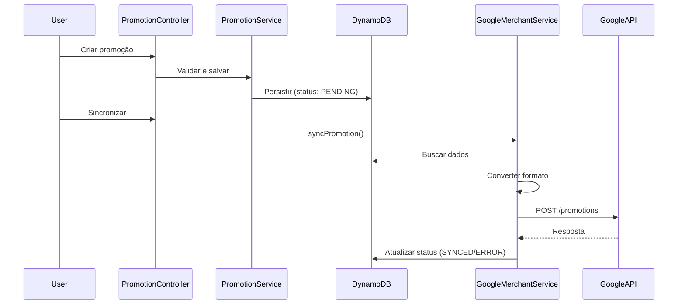

# Módulo de Promoções • Google Merchant

Módulo completo de gestão de promoções com sincronização bilateral com Google Merchant Center via Content API for Shopping v2.1.

## Visão geral técnica

- **Interface**: CRUD completo com filtros avançados, busca em tempo real e exportação (CSV/PDF)
- **Sincronização**: Individual e em massa, com retry automático e logs de erro
- **Armazenamento**: DynamoDB (`ssxml_promotions`) + tokens OAuth2 (`ssxml_google_merchant_tokens`)
- **Integração**: Google Shopping Content API v2.1 via biblioteca oficial PHP

## Arquitetura do módulo

### Controllers

- `PromotionController`: CRUD, sincronização, filtros e exportação
- `OAuth2GoogleController`: Fluxo de autorização e gestão de tokens

### Services

- `GoogleMerchantPromotionService`: Sincronização e conversão de formatos
- `GoogleMerchantTokenService`: Gestão e renovação automática de tokens
- `PromotionService`: Operações DynamoDB (CRUD, filtros)

### Models

- `PromotionForm`: Formulário e validação
- `PromotionLog`: Logs de erro
- Enums: `BuyerIncentiveType`, `PromotionStatus`, `PromotionSyncStatus`, `RedemptionChannel`, `PromotionDestination`

## Fluxo de dados



## Endpoints principais

### CRUD
- `GET /promotions` - Lista com filtros e estatísticas
- `GET /promotions/list-data` - AJAX endpoint para atualização dinâmica
- `POST /promotions/insert` - Criar promoção
- `GET /promotions/view/{id}` - Visualizar detalhes
- `POST /promotions/update/{id}` - Editar promoção
- `POST /promotions/delete/{id}` - Deletar promoção
- `POST /promotions/bulk-delete` - Deletar múltiplas

### Sincronização
- `POST /promotions/sync/{id}` - Sincronizar uma promoção
- `POST /promotions/sync-from-google` - Sincronizar todas pendentes
- `POST /promotions/stop/{id}` - Encerrar promoção

### Exportação
- `GET /promotions/export-csv` - Exportar para CSV (com filtros)
- `GET /promotions/export-pdf` - Exportar para PDF (cliente via pdfmake)

### OAuth2
- `GET /oauth2/google/authorize` - Iniciar fluxo OAuth2
- `GET /oauth2/google/callback` - Processar callback
- `POST /oauth2/google/revoke` - Revogar acesso

## DynamoDB

### Tabela: `ssxml_promotions`

**Chave primária:**
- `client_hash` (String): Hash do cliente
- `promotion_id` (String): ID único da promoção

**Atributos principais:**
```
{
  "client_hash": "abc123...",
  "promotion_id": "PROMO_1733123456_ABC",
  "title": "Black Friday - 30% OFF",
  "start_date": "2025-11-24",
  "end_date": "2025-11-30",
  "redemption_channel": ["ONLINE"],
  "promotion_destinations": ["FREE_LISTINGS", "SHOPPING_ADS"],
  "buyer_incentive": {
    "type": "PERCENTAGE",
    "value": 30
  },
  "sync_status": "SYNCED",
  "status": "active",
  "created_at": "2025-01-19T10:00:00Z",
  "updated_at": "2025-01-19T10:05:00Z",
  "last_synced_at": "2025-01-19T10:05:00Z"
}
```

### Tabela: `ssxml_google_merchant_tokens`

**Chave primária:**
- `client_hash` (String): Hash do cliente
- `merchant_id` (String): ID do Merchant Center

**Atributos:**
```
{
  "client_hash": "abc123...",
  "merchant_id": "123456789",
  "access_token": "ya29.a0...",
  "refresh_token": "1//...",
  "token_expires_at": "2025-01-19T11:00:00Z",
  "expires_in": 3600,
  "status": "active",
  "authorized_at": "2025-01-19T10:00:00Z",
  "updated_at": "2025-01-19T10:00:00Z",
  "email": "user@example.com",
  "account_name": "Merchant Account"
}
```

## Mapeamento de tipos de incentivo

| Tipo interno | Subtipo | couponValueType (Google) | Campos configurados |
|--------------|---------|--------------------------|---------------------|
| `PERCENTAGE` | - | `PERCENT_OFF` | `percentOff` |
| `AMOUNT` | - | `MONEY_OFF` | `moneyOffAmount` |
| `CASHBACK` | `PERCENTAGE` | `PERCENT_OFF` | `percentOff` (usa `cashback_value`) |
| `CASHBACK` | `AMOUNT` | `MONEY_OFF` | `moneyOffAmount` (usa `cashback_value`) |
| `DISCOUNT_INTERVAL` | `PERCENTAGE` | `PERCENT_OFF` | `percentOff` (usa `min_discount_value`) |
| `DISCOUNT_INTERVAL` | `AMOUNT` | `MONEY_OFF` | `moneyOffAmount` (usa `min_discount_value`) |
| `FREE_SHIPPING_STANDARD` | - | `FREE_SHIPPING_STANDARD` | - |
| `FREE_SHIPPING_OVERNIGHT` | - | `FREE_SHIPPING_OVERNIGHT` | - |
| `FREE_SHIPPING_TWO_DAY` | - | `FREE_SHIPPING_TWO_DAY` | - |

## Conversão de formato

### Interno → Google API

`GoogleMerchantPromotionService::convertToGoogleFormat()`

**Principais transformações:**
- `offerType`: Sempre `GENERIC_CODE`
- `genericRedemptionCode`: Gerado como `PROMO-{substr(promotion_id, 0, 8)}`
- `contentLanguage`: `pt`
- `targetCountry`: `BR`
- Valores monetários: Formatados como strings com 2 casas decimais (`"200.00"`)
- Destinos inválidos: Filtrados automaticamente (ex: `GOOGLE_WALLET`)

### Google API → Interno

`GoogleMerchantPromotionService::convertFromGoogleFormat()`

Usado para importação (funcionalidade secundária).

## Filtros avançados

O sistema implementa filtros combinados:

**Filtros DynamoDB (aplicados na query):**
- `status`: Status da promoção (`active`, `archived`, `stopped`)
- `sync_status`: Status de sincronização (`pending`, `synced`, `error`)
- `start_date_from` / `start_date_to`: Período de data de início
- `end_date_from` / `end_date_to`: Período de data de término

**Filtros em memória (aplicados após query):**
- `search`: Busca textual em `title` e `promotion_id` (LIKE case-insensitive)
- `redemption_channel`: Filtro por canal (verifica arrays)
- `promotion_destination`: Filtro por destino (verifica arrays)

## Busca em tempo real (Frontend)

Implementado via AJAX com debounce de 500ms:

```javascript
searchInput.addEventListener('input', function() {
    if (searchTimeout) clearTimeout(searchTimeout);
    searchTimeout = setTimeout(performSearch, 500);
});
```

**Endpoint:** `GET /promotions/list-data`
**Resposta:**
```json
{
  "html": "<table>...</table>",
  "stats": {
    "total": 100,
    "active": 80,
    "synced": 75,
    "error": 5,
    "stopped": 15
  }
}
```

## Exportação

### CSV

**Implementação:** `PromotionController::actionExportCsv()`

- Encoding: UTF-8 com BOM (`\xEF\xBB\xBF`) para Excel
- Campos: ID, Título, Data Início, Data Término, Canal, Destinos, Incentivo, Status Sync, Status
- Respeita filtros ativos

### PDF

**Implementação:** Cliente (JavaScript via pdfmake)

- Orientação: Landscape
- Formato: A4
- Biblioteca: pdfmake v0.1.53 (CDN)
- Fallback: HTML com headers de download

## OAuth2 e renovação de tokens

### Fluxo de autorização

1. `OAuth2GoogleController::actionAuthorize()`: Cria URL de autorização
2. Callback: `OAuth2GoogleController::actionCallback()` troca code por tokens
3. `GoogleMerchantTokenService::saveTokenData()`: Salva no DynamoDB

### Renovação automática

`GoogleMerchantTokenService::hasActiveToken()` verifica e renova:

- Margem de segurança: 10 minutos antes da expiração
- Usa `refresh_token` para obter novo `access_token`
- Atualiza token no DynamoDB automaticamente
- Fallback: Tenta usar token atual se renovação falhar

## Tratamento de erros

### Logs de erro

`PromotionLog::createErrorLog()` persiste erros no DynamoDB:

```php
PromotionLog::createErrorLog([
    'client_hash' => $clientHash,
    'promotion_id' => $promotionId,
    'error_type' => 'sync_error',
    'error_message' => $e->getMessage(),
    'error_trace' => $e->getTraceAsString(),
    'action' => 'sync',
    'merchant_id' => $merchantId
]);
```

### Erros comuns

| Erro | Causa | Solução |
|------|-------|---------|
| `401 Unauthorized` | Token expirado/inválido | Renovação automática ou reautorizar |
| `403 Forbidden` | Sem permissão/escopos | Verificar OAuth2 scopes |
| `404 Not Found` | Promoção não existe | Normal para novas promoções |
| `400 Bad Request` | Validação falhou | Verificar payload e logs |
| `NoSuchKey` | Token não encontrado | Cliente precisa autorizar |

## Validações e limitações

### Validações do formulário

- `promotion_id`: Máx. 50 caracteres, regex: `^[A-Za-z0-9_-]+$`
- `promotion_id_prefix` (cliente): Máx. 20 caracteres, regex: `^[A-Za-z0-9_-]*$`
- `title`: Obrigatório, máx. 255 caracteres
- `start_date` < `end_date`
- Valores monetários: Formato `"xxx.xx"` (string com 2 decimais)

### Limitações da API Google

- `offerType`: Sempre `GENERIC_CODE`
- `promotionDestinationIds`: Apenas `FREE_LISTINGS`, `SHOPPING_ADS`, `LOCAL_INVENTORY_ADS`, `YOUTUBE_SHOPPING`
- Não permite ter benefícios (`percentOff`/`moneyOffAmount`) e `productApplicability` simultaneamente
- Não configurar `shippingServiceNames` com `GENERIC_CODE`

## Configuração por cliente

### Campos do cliente

- `google_merchant_id`: ID do Merchant Center
- `promotion_id_prefix`: Prefixo para geração automática de IDs (opcional)

### Comportamento do `promotion_id_prefix`

**Com prefixo configurado:**
- Campo `promotion_id` oculto no formulário
- ID gerado automaticamente: `{PREFIXO}_{TIMESTAMP}_{RANDOM}`
- Exemplo: `PROMO_1733123456_507f1f77bcf86cd799439011`

**Sem prefixo configurado:**
- Campo `promotion_id` visível e obrigatório
- Usuário pode digitar manualmente ou usar botão "Gerar ID"
- Botão gera: `PROMO_{TIMESTAMP}_{3CARACTERES}`

## Variáveis de ambiente

```php
// config/env-local.php
'DAXGO_ENV_GOOGLE_OAUTH2_CLIENT_ID' => '...apps.googleusercontent.com',
'DAXGO_ENV_GOOGLE_OAUTH2_CLIENT_SECRET' => '...',
'DAXGO_ENV_GOOGLE_OAUTH2_REDIRECT_URI' => 'http://localhost:9000/oauth2/google/callback',
'GOOGLE_MERCHANT_MERCHANT_ID' => '123456789', // Opcional
'GOOGLE_MERCHANT_SANDBOX' => true, // true = sandbox, false = produção
```

## Encerrar promoção

`GoogleMerchantPromotionService::stopPromotion()` encerra promoção:

1. Atualiza `endTime` para agora (UTC)
2. **Tratamento especial:** Se `startTime` no futuro, ajusta para 1 min antes de agora
3. Sincroniza com Google via `promotions->create()` (funciona como upsert)
4. Atualiza status local para `STOPPED`
5. Status no Google: **"Estado final: expirado"**

## Guia completo do usuário

Para instruções detalhadas de uso (não-técnicas), consulte o arquivo `GOOGLE_MERCHANT_PROMOTIONS_GUIDE.md` (1590 linhas) no repositório `feeds-upgrade`.


