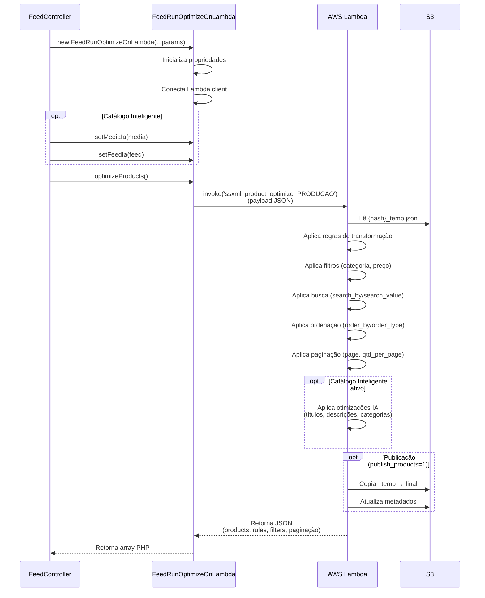

# Componentes

Componentes são classes auxiliares reutilizáveis que encapsulam lógica complexa ou integrações externas no backend Yii2.

:::info Localização
Os componentes ficam em `/components/` e são instanciados sob demanda pelos controllers ou services.
:::

## FeedRunOptimizeOnLambda

**Responsabilidade**: Encapsula a invocação da função Lambda AWS responsável pelo processamento e otimização de feeds de produtos.

:::tip Uso principal
Este componente é instanciado pelo `FeedController::actionGetDataToOptimize()` para delegar o processamento pesado de otimização para a Lambda, mantendo o backend PHP leve e responsivo.
:::

### Propriedades

| Propriedade | Tipo | Descrição |
|-------------|------|-----------|
| `$sClientHash` | `string` | Hash do cliente |
| `$sFeedHash` | `string` | Hash do feed |
| `$sMediaHash` | `string` | Hash da mídia (Google, Facebook, etc.) |
| `$sFile` | `string` | Nome do arquivo no S3 (ex: `temp`, `final`) |
| `$aProducts` | `string` | JSON string de produtos (default: `'[]'`) |
| `$aRules` | `array` | Regras de transformação aplicadas |
| `$aFilters` | `array` | Filtros de produtos (categoria, preço, etc.) |
| `$iQtdPerPage` | `int` | Quantidade de produtos por página (default: `10`) |
| `$iPage` | `int` | Página atual (default: `0`) |
| `$sSearchBy` | `string` | Campo de busca (ex: `title`, `sku`) |
| `$sSearchValue` | `string` | Valor da busca |
| `$sOrderBy` | `string` | Campo de ordenação |
| `$sOrderType` | `string` | Tipo de ordenação (`ASC`, `DESC`) |
| `$sPublishProducts` | `int` | Flag de publicação (`0` = preview, `1` = publicar) |
| `$aTitlesCreated` | `array` | Colunas customizadas criadas pelo usuário |
| `$aTitles` | `array` | Títulos de todas as colunas disponíveis |
| `$Lambda` | `LambdaClient` | Cliente AWS Lambda (privado) |

:::warning Peculiaridade:
Por razões históricas, `$aProducts` é inicializado como **string** `'[]'` em vez de array vazio. Isso é intencional e mantido para compatibilidade com a Lambda.
:::

### Construtor

```php
public function __construct(
    $sClientHash,
    $sFeedHash,
    $sMediaHash,
    $sFile,
    $aProducts = null,
    $aRules = null,
    $aFilters = null,
    $iQtdPerPage = null,
    $iPage = null,
    $sSearchBy = null,
    $sSearchValue = null,
    $sOrderBy = null,
    $sOrderType = null,
    $sPublishProducts = 0,
    $aTitlesCreated = null,
    $aTitles = null
)
```

**Responsabilidades do construtor**:
1. Inicializa todas as propriedades com valores fornecidos ou defaults
2. Remove strings vazias escapadas (`""`) dos parâmetros de busca/ordenação
3. Conecta ao cliente Lambda via `Yii::$app->Lambda->connect()`

### Método: optimizeProducts()

```php
public function optimizeProducts(): array
```

**Responsabilidade**: Invoca a função Lambda AWS [`ssxml_product_optimize_PRODUCAO`](../infra/lambda-functions#ssxml_product_optimize_producao) (ou equivalente no ambiente) com o payload de otimização.

**Payload enviado**:

```json
{
  "client_hash": "abc123...",
  "feed_hash": "def456...",
  "media_hash": "ghi789...",
  "file": "temp",
  "products": "[]",
  "rules": [...],
  "filters": [...],
  "qtd_per_page": 10,
  "page": 0,
  "search_by": "title",
  "search_value": "camiseta",
  "order_by": "price",
  "order_type": "ASC",
  "publish_products": 0,
  "titles_created": [...],
  "titles": [...]
}
```

**Resposta esperada** (estrutura retornada pela Lambda):

```json
{
  "products": [...],           // Array de produtos processados
  "rules": [...],              // Regras aplicadas (atualizadas)
  "filters": [...],            // Filtros aplicados
  "totalPages": 42,            // Total de páginas
  "page": 0,                   // Página atual
  "titles": [...],             // Títulos de colunas
  "titles_created": [...]      // Colunas customizadas
}
```

### Métodos adicionais (Catálogo Inteligente)

```php
public function setMediaIa($mediaIa): void
public function setFeedIa($feedIa): void
```

Estes métodos permitem configurar flags de **Catálogo Inteligente** antes de invocar `optimizeProducts()`. Quando definidos, a Lambda aplica otimizações de IA nos produtos.

**Exemplo de uso**:

```php
$oRunLambda = new FeedRunOptimizeOnLambda(
    $sClientHash,
    $sFeedHash,
    $sMediaHash,
    'temp',
    $aProducts,
    $aRules,
    $aFilters,
    $iQtdPerPage,
    $iPage,
    $sSearchBy,
    $sSearchValue,
    $sOrderBy,
    $sOrderType,
    $sPublishProducts,
    $aTitlesCreated,
    $aTitles
);

// Se catálogo inteligente estiver ativo
if ($feedIa != 'off' && $mediaIa != 'off') {
    $oRunLambda->setMediaIa($mediaIa);
    $oRunLambda->setFeedIa($feedIa);
}

$aDataFromLambda = $oRunLambda->optimizeProducts();
```

### Fluxo de execução

<div style={{textAlign: 'center'}}>



</div>

### Configuração Lambda

A função Lambda invocada é configurada via variáveis de ambiente:

```php title="config/params.php"
return [
    'LAMBDA_FUNCTION_OPTIMIZE' => 'ssxml_product_optimize_PRODUCAO',
    // ou 'ssxml_product_optimize_DESENVOLVIMENTO' em dev
];
```

:::info Ambiente local
Em desenvolvimento local, a Lambda pode ser substituída por LocalStack ou um emulador rodando em `http://host.docker.internal:9555`.
:::

### Performance e limites

- **Timeout**: A Lambda deve ter timeout configurado para processar feeds grandes (recomendado: 5-10 minutos)
- **Memória**: Feeds com milhares de produtos exigem Lambda com 512MB-1GB de RAM
- **Concorrência**: A Lambda é stateless, permitindo múltiplas invocações simultâneas por diferentes usuários

### Tratamento de erros

Se a Lambda falhar ou retornar erro:

```php
try {
    $aDataFromLambda = $oRunLambda->optimizeProducts();
} catch (\Exception $e) {
    Yii::error('Erro ao invocar Lambda: ' . $e->getMessage());
    // Fallback ou mensagem de erro para o usuário
}
```

:::warning Importante
O componente **não faz retry automático**. Se a Lambda falhar, o controller deve tratar o erro e retornar mensagem apropriada ao frontend.
:::

## S3

**Responsabilidade**: Encapsula todas as operações com Amazon S3 (ou MinIO em ambiente local), fornecendo métodos simplificados para manipulação de arquivos e objetos.

### Propriedades

| Propriedade | Tipo | Descrição |
|-------------|------|-----------|
| `$oS3Client` | `S3Client` | Instância do cliente AWS SDK |
| `$bucket` | `string` | Nome do bucket padrão (via `params.php`) |
| `$url_published` | `string` | URL base para arquivos publicados |

### Métodos principais

<details>
<summary><strong>connect()</strong></summary>

**Retorna**: `S3Client`

Conecta ao S3 usando credenciais de `params.php`. Em ambiente local, conecta ao MinIO via endpoint customizado.

```php
$oS3 = Yii::$app->S3->connect();
```

</details>

<details>
<summary><strong>sendFile($sPathFileToSend, $sPathFileS3)</strong></summary>

Envia arquivo local para o S3 com permissões públicas de leitura.

```php
$this->S3->sendFile(
    '/tmp/feed_client123.xml',
    'feeds/client123_feed456.xml'
);
```

</details>

<details>
<summary><strong>checkFileExists($sFilePath)</strong></summary>

**Retorna**: `bool`

Verifica se um objeto existe no S3.

```php
if ($this->S3->checkFileExists('feeds/client_feed.xml')) {
    // Arquivo existe
}
```

</details>

<details>
<summary><strong>getFolderByClientHash($sClientHash)</strong></summary>

**Retorna**: `string`

Converte o hash do cliente em um nome de pasta amigável (sem acentos, espaços em hífens, minúsculas).

```php
$folder = $this->S3->getFolderByClientHash('abc123');
// Retorna: "nome-do-cliente"
```

</details>

:::info Suporte MinIO
Em `YII_ENV == 'local'`, o componente conecta automaticamente ao MinIO (S3-compatible) via `DAXGO_ENV_ENV_LOCAL_S3_ENDPOINT`.
:::

---

## Lambda

**Responsabilidade**: Cliente base para invocação de funções AWS Lambda. Fornece conexão reutilizável e tratamento de ambientes (produção/dev/local).

### Métodos principais

<details>
<summary><strong>connect()</strong></summary>

**Retorna**: `LambdaClient`

Conecta ao AWS Lambda usando credenciais de `params.php`.

```php
$oLambda = Yii::$app->Lambda->connect();
```

</details>

<details>
<summary><strong>getSuffixFunctionName()</strong></summary>

**Retorna**: `string`

Retorna sufixo para nomes de funções Lambda baseado no ambiente:
- **Produção**: `''` (vazio)
- **Desenvolvimento**: `'_dev'`

```php
$suffix = $this->Lambda->getSuffixFunctionName();
$functionName = 'my-function' . $suffix; // 'my-function_dev' em dev
```

</details>

:::tip Uso principal
Este componente é usado como base para todos os outros componentes que invocam Lambdas (`FeedRunOptimizeOnLambda`, `LambdaIA`, `LambdaTiktok`).
:::

---

## Dynamo

**Responsabilidade**: Cliente para AWS DynamoDB. Fornece conexão e métodos utilitários para normalização de dados (remoção/adição de tipos de dados do DynamoDB).

### Métodos principais

<details>
<summary><strong>dbClient()</strong></summary>

**Retorna**: `DynamoDbClient`

Conecta ao DynamoDB usando credenciais de `params.php`.

```php
$oDynamo = Yii::$app->Dynamo->dbClient();
```

</details>

<details>
<summary><strong>removeTypeOfData(&$aData)</strong></summary>

**Retorna**: `array`

Remove os tipos de dados do DynamoDB (`S`, `N`, `BOOL`, etc.) de um array, deixando apenas os valores.

```php
$data = [
    'name' => ['S' => 'João'],
    'age' => ['N' => '30']
];

$normalized = $this->Dynamo->removeTypeOfData($data);
// Resultado: ['name' => 'João', 'age' => '30']
```

</details>

<details>
<summary><strong>addTypeOfData($data)</strong></summary>

**Retorna**: `array`

Adiciona tipos de dados do DynamoDB a um array PHP simples.

```php
$data = [
    'name' => 'João',
    'age' => 30,
    'active' => true
];

$formatted = $this->Dynamo->addTypeOfData($data);
// Resultado: ['name' => ['S' => 'João'], 'age' => ['N' => 30], 'active' => ['B' => true]]
```

</details>

:::info Uso principal
Este componente é usado pelos **Services** que persistem dados no DynamoDB (`PromotionService`, `ShippingService`, `GoogleMerchantTokenService`).
:::

---

## CloudWatch

**Responsabilidade**: Cliente para AWS CloudWatch Logs e Metrics. Registra eventos de acesso ao módulo de otimização de feeds e envia métricas customizadas.

### Métodos principais

<details>
<summary><strong>logFeedOptimizeAccess(array $data)</strong></summary>

**Retorna**: `bool`

Loga evento de acesso à otimização de feed no CloudWatch Logs e envia métrica de uso.

```php
Yii::$app->CloudWatch->logFeedOptimizeAccess([
    'client_hash' => $sClientHash,
    'feed_hash' => $sFeedHash,
    'media_hash' => $sMediaHash,
    'user_id' => Yii::$app->user->id,
    'action' => 'optimize_start',
    'timestamp' => time()
]);
```

</details>

**Estrutura dos logs**:
- **LogGroup**: `/daxgo/feeds/optimize`
- **LogStream**: `{client_hash}_{feed_hash}_{media_hash}`
- **Campos**: `client_hash`, `feed_hash`, `media_hash`, `user_id`, `action`, `timestamp`

:::warning Ambiente local
Em `YII_ENV == 'local'`, os logs são registrados apenas no Yii Logger (`Yii::info`) a menos que `AWS_CLOUDWATCH_LOCAL_ENABLED` esteja habilitado.
:::

---

## Analytics

**Responsabilidade**: Cliente para Google Analytics Data API (GA4). Coleta métricas de performance de produtos (visualizações, conversões, receita).

### Propriedades

| Propriedade | Tipo | Descrição |
|-------------|------|-----------|
| `$analytics` | `BetaAnalyticsDataClient` | Cliente GA4 |
| `$VIEW_ID` | `string` | ID da propriedade GA4 |
| `$dateRange` | `DateRange` | Período de coleta de dados |
| `$dimensions` | `array` | Dimensões da consulta (ex: `itemId`) |
| `$metrics` | `array` | Métricas coletadas (ex: `itemViews`) |

### Métodos principais

<details>
<summary><strong>__construct($account_ga)</strong></summary>

Inicializa o cliente GA4 com credenciais de service account.

```php
$oAnalytics = new Analytics('properties/123456789');
```

**Credenciais**: `components/credentials/service-account-credentials.json`

</details>

<details>
<summary><strong>getAccounts()</strong></summary>

**Retorna**: `array`

Lista todas as contas, propriedades e views do GA4 acessíveis pela service account.

</details>

:::tip Uso principal
Este componente é usado pelo **Service** `ProductsDataAnalytics` para coletar métricas de produtos e persistir no MySQL.
:::

:::warning Atenção
A chave de service account deve ter permissões de **Visualizador** na propriedade GA4 do cliente.
:::

---

## FeedImporter

**Responsabilidade**: Importa feeds XML/CSV de clientes, normaliza os dados e persiste produtos no banco de dados MySQL.

### Propriedades

| Propriedade | Tipo | Descrição |
|-------------|------|-----------|
| `$sClientHash` | `string` | Hash do cliente |
| `$sFeedHash` | `string` | Hash do feed |
| `$sFeedPath` | `string` | Caminho do arquivo local |
| `$oFeed` | `Feed` | Modelo do feed |
| `$oReader` | `SXmlReader` | Leitor XML customizado |
| `$aMapColumns` | `array` | Mapeamento de colunas do feed |
| `$bSaveProducts` | `bool` | Se deve persistir produtos no DB |

### Métodos principais

<details>
<summary><strong>runImport()</strong></summary>

**Retorna**: `string` (`'FINISHED'`, `'FINISHED WITH ERRORS'`, ou `'check_item_wrapper'`)

Executa o processo completo de importação:
1. Valida `item_wrapper` do XML
2. Lê e processa cada produto
3. Normaliza campos baseado no mapeamento
4. Persiste produtos no MySQL
5. Atualiza status de estoque (produtos não enviados)
6. Remove arquivo temporário

```php
$oImporter = new FeedImporter($clientHash, $feedHash, $filePath);
$result = $oImporter->runImport();

if ($result === 'FINISHED') {
    echo 'Importação concluída com sucesso!';
}
```

</details>

<details>
<summary><strong>checkItemWrapper()</strong></summary>

**Retorna**: `bool`

Valida se o XML possui o nó `item_wrapper` correto (ex: `<product>`, `<item>`).

</details>

:::info Fluxo de importação
1. **Download**: O feed é baixado via cron job
2. **Parser**: `FileParser` normaliza encoding e formato
3. **Import**: `FeedImporter` lê XML e persiste produtos
4. **Publicação**: Feed é convertido para JSON e enviado ao S3
:::

---

## FeedSaveProductsPublished

**Responsabilidade**: Persiste no MySQL a lista de produtos publicados após otimização, permitindo rastreamento de histórico de publicações.

### Propriedades

| Propriedade | Tipo | Descrição |
|-------------|------|-----------|
| `$sClientHash` | `string` | Hash do cliente |
| `$sFeedHash` | `string` | Hash do feed |
| `$sMediaHash` | `string` | Hash da mídia |
| `$sFileType` | `string` | Tipo do arquivo (`temp_published`) |

### Métodos principais

<details>
<summary><strong>saveProductsPublished()</strong></summary>

Persiste produtos publicados na tabela `ssxml_product_published`:
1. Verifica se `$sFileType == 'temp_published'` (evita salvar em downloads agendados)
2. Copia `_temp.json` para `.json` no S3
3. Lê produtos do arquivo
4. Persiste em batch no MySQL
5. Marca produtos não enviados como `no_sent`

```php
$oSaver = new FeedSaveProductsPublished($clientHash, $feedHash, $mediaHash, 'temp_published');
$oSaver->saveProductsPublished();
```

</details>

<details>
<summary><strong>copyTempFile()</strong></summary>

Copia `{hash}_temp.json` → `{hash}.json` no S3, confirmando a publicação.

</details>

:::warning Importante
Este componente **só persiste dados** quando o usuário publica manualmente via interface de otimização. Downloads agendados **não disparam** este processo para economizar recursos do banco.
:::

---

## FileParser

**Responsabilidade**: Prepara arquivos de feed (XML/CSV) para importação, garantindo encoding correto, validação de estrutura e limpeza de caracteres especiais.

### Propriedades

| Propriedade | Tipo | Descrição |
|-------------|------|-----------|
| `$sFullFilePath` | `string` | Caminho completo do arquivo |
| `$sFileType` | `string` | Tipo do arquivo (`XML`, `CSV`, `XZ`) |
| `$sInputFileEncoding` | `string` | Encoding detectado |
| `$sItemWrapper` | `string` | Nó wrapper dos itens (ex: `product`) |
| `$aMapColumnsExamples` | `array` | Exemplos de valores por coluna |

### Métodos principais

<details>
<summary><strong>prepareInputFile()</strong></summary>

Prepara o arquivo para importação:
1. Valida existência e tipo
2. Detecta encoding
3. Força conversão para UTF-8
4. Limpa caracteres especiais (para clientes específicos)

```php
$oParser = new FileParser($filePath, $clientHash);
$oParser->prepareInputFile();
```

</details>

<details>
<summary><strong>forceFileEncoding()</strong></summary>

Detecta encoding (UTF-8, ISO-8859-1, Windows-1252) e converte para UTF-8.

</details>

:::info Tratamento especial
Para clientes específicos (ex: Youcom), o parser remove caracteres HTML escapados e normaliza strings mal formatadas antes da importação.
:::

---

## LambdaIA

**Responsabilidade**: Invocação assíncrona de funções Lambda relacionadas ao módulo de **Inteligência Artificial** (categorização, taxonomia, otimização de títulos).

### Métodos principais

<details>
<summary><strong>dispatchGetIaCategories($sClientHash, $productCategory)</strong></summary>

**Retorna**: `array` (`['success' => bool, 'message' => string]`)

Invoca Lambda de orquestração de IA para processar categorias de produtos.

```php
$oLambdaIA = new LambdaIA();
$result = $oLambdaIA->dispatchGetIaCategories($clientHash, 'Eletrônicos');

if ($result['success']) {
    echo 'Lambda invocada com sucesso!';
}
```

**Lambda invocada**: `feeds-dados-IA-CATEGORIA-orquestrador`  
**Tipo de invocação**: `Event` (assíncrona, sem espera de resposta)

</details>

:::tip Uso principal
Este componente é usado durante a **importação de feeds** para processar categorias e gerar sugestões de IA em background, sem bloquear o fluxo principal.
:::

---

## Componentes utilitários

### SXmlReader

**Responsabilidade**: Leitor customizado de arquivos XML para feeds de produtos. Permite leitura iterativa (streaming) de arquivos XML grandes sem carregar tudo em memória.

**Métodos principais**:
- `setItemWrapper($itemWrapper)`: Define o nó wrapper dos produtos (ex: `product`, `item`)
- `readFirstItem()`: Lê o primeiro produto do XML
- `readItem()`: Lê o próximo produto (streaming)
- `checkItemWrapper()`: Valida se o `item_wrapper` está correto

:::info Uso principal
Usado internamente pelo `FeedImporter` para processar feeds XML de qualquer tamanho sem estouro de memória.
:::

### XmlToCsv

**Responsabilidade**: Conversão de feeds XML para formato CSV, útil para exportação e manipulação em planilhas.

**Métodos principais**:
- `exportFeedMediaToCsv($feedHash, $mediaHash)`: Exporta feed de uma mídia específica para CSV
- `exportXmlToCsv($xmlPath, $csvPath, $itemElement)`: Converte XML genérico para CSV

### SQS

**Responsabilidade**: Cliente para AWS SQS (Simple Queue Service). Utilizado para enfileiramento de tarefas assíncronas (ex: processamento de feeds grandes).

**Métodos principais**:
- `connect()`: Conecta ao SQS
- `getQueueUrl()`: Retorna URL da fila configurada

:::warning Ambiente local
Em `YII_ENV == 'local'`, o SQS pode ser desabilitado ou conectar ao LocalStack via `DAXGO_ENV_ENV_LOCAL_SQS_ENDPOINT`.
:::

### LambdaTiktok

**Responsabilidade**: Invocação de Lambdas relacionadas à integração com TikTok Shop (criação/atualização de produtos, sincronização de catálogo).

**Métodos principais**:
- `dispatchGenerateProducts($clientHash)`: Dispara Lambda para gerar lista de produtos no TikTok Shop
- `dispatchCancelProducts($clientHash)`: Dispara Lambda para cancelar produtos no TikTok Shop

**Lambda invocada**: `integracao-tik-tok-PRODUTOS-lista-produtos`

### FeedFileToOptimize

**Responsabilidade**: Prepara o arquivo JSON base para otimização, consolidando dados de produtos publicados, taxonomias e tipos de produto.

**Métodos principais**:
- `createFile($createExtraFile)`: Cria arquivo JSON otimizado no S3
- `setTaxonomy($taxonomy)`: Define taxonomias Google disponíveis
- `setProductType($productType)`: Define tipos de produto

:::info Fluxo de uso
Este componente é invocado **antes** do usuário acessar a interface de otimização, preparando o arquivo `{hash}.json` no S3.
:::

### ProductStudioCampaingProducts

**Responsabilidade**: Gerencia produtos de campanhas do **Product Studio** (módulo de personalização de imagens de produtos).

**Uso**: Integração com módulo externo de edição de imagens via AI.

### ProductStudioProcessImg

**Responsabilidade**: Processa imagens de produtos através do Product Studio, aplicando backgrounds, overlays e otimizações.

**Uso**: Integração com módulo de edição de imagens.

### ShippingRegions

**Responsabilidade**: Gerencia regiões de envio (estados, códigos postais) para cálculo de frete e sincronização com Google Merchant Center.

**Uso**: Suporte ao módulo de frete e envio.

---

:::tip Documentação relacionada
- [Estrutura Yii2](./estrutura-yii2.md) - Controllers e fluxos principais
- [Lambda Functions](/docs/infra/lambda-functions) - Detalhes das funções AWS
- [Processamento de Feeds](/docs/backend/processamento-feeds) - Lógica de otimização
- [Serviços](../arquitetura/servicos.md) - Services que usam estes componentes
:::

