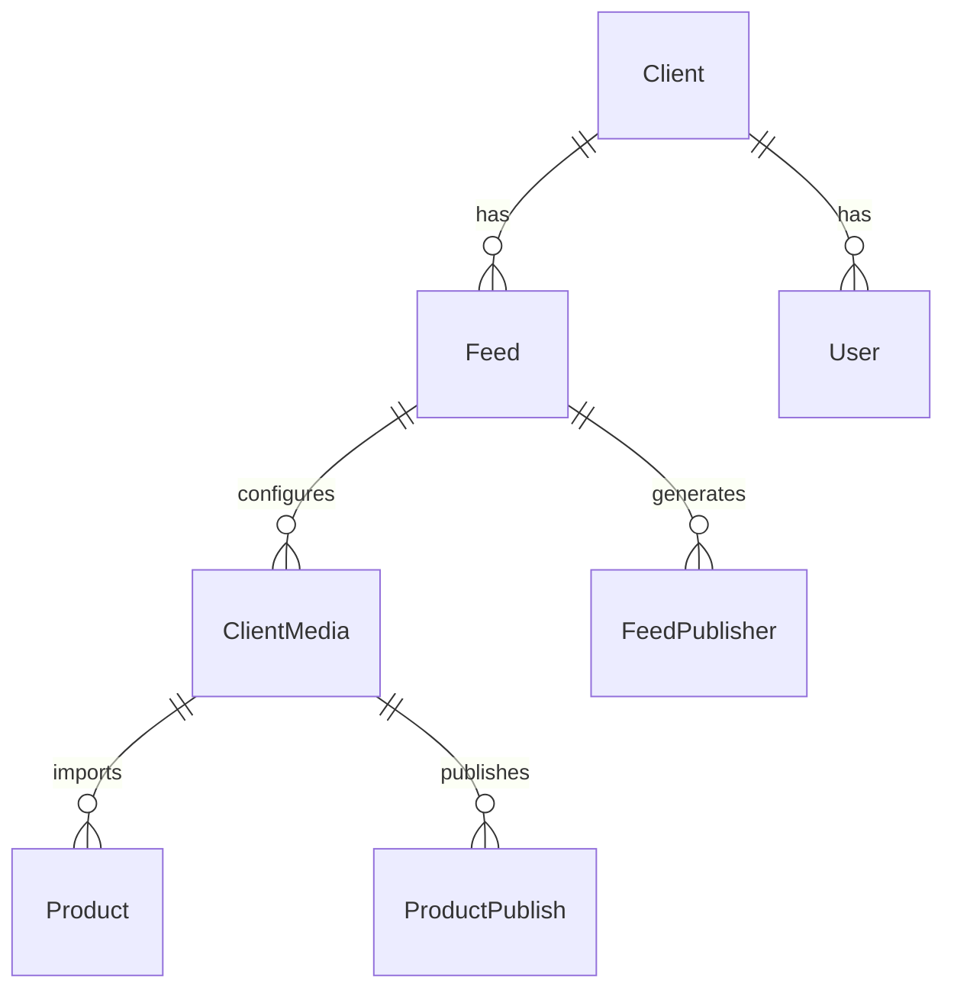

# Modelos de Dados Principais

Entidades core do sistema com relacionamentos e responsabilidades.

## Hierarquia



## Client

**Arquivo:** `models/Client.php`

Representa uma empresa/cliente do sistema.

**Atributos principais:**
- `client_hash`: Hash único
- `name`: Nome do cliente
- `plan_hash`: Plano contratado
- `catalogo_inteligente`: IA habilitada (`S`/`N`)
- `google_merchant_id`: ID do Merchant Center
- `promotion_id_prefix`: Prefixo para promoções
- `status`: Ativo/Inativo

**Relacionamentos:**
- `hasMany` Feed
- `hasMany` User
- `hasOne` Plan

## Feed

**Arquivo:** `models/Feed.php`

Feed de produtos (origem).

**Atributos:**
- `feed_hash`: Hash único
- `client_hash`: Cliente proprietário
- `name`: Nome do feed
- `url`: URL de origem
- `file_type`: Tipo (`xml`, `csv`, `zip`)
- `schedule`: Agendamento
- `status`: Ativo/Inativo

**Métodos:**
```php
public function getByClient($clientHash)
public function import()
public function validateStructure()
```

## ClientMedia

**Arquivo:** `models/ClientMedia.php`

Configuração de mídia (Facebook, Google, TikTok, etc.).

**Atributos:**
- `client_hash`
- `feed_hash`
- `media_hash`
- `feed_hash_media_hash`: Chave composta
- `rule`: Regras aplicadas (JSON)
- `filter`: Filtros aplicados (JSON)
- `fields`: Mapeamento de campos (JSON)
- `new_columns`: Colunas criadas (JSON)
- `google_taxonomy`: Usar taxonomia Google (`1`/`0`)
- `google_sheets_url`: URL do Google Sheets
- `google_sheets_data`: Dados importados (JSON)
- `output_format`: Formato de saída (`xml`, `csv`)
- `url_tag`: Tags de URL (JSON)

**Métodos:**
```php
public function updateUrlFeed()
public function getFields()
public function applyRules($products)
public function applyFilters($products)
```

## Product

**Arquivo:** `models/Product.php`

Produto genérico (modelo interno).

**Métodos utilitários:**
```php
public function removeTagsFromUrl($url, $tags)
public function addUrlTags($product, $tags)
public function validateSku($sku)
```

## ProductPublish

**Arquivo:** `models/ProductPublish.php`

Estado publicado de produtos (customizações).

**Atributos:**
- `client_hash`
- `feed_hash`
- `media_hash`
- `sku`
- `product`: Dados do produto (JSON)
- `manual_set`: Campos editados manualmente (JSON)
- `unpublish`: Campos despublicados (array JSON)
- `status`: Ativo/Inativo

**Métodos:**
```php
public function getByClientFeedMedia($clientHash, $feedHash, $mediaHash)
public function saveCustomization($sku, $field, $value)
```

## FeedPublisher

**Arquivo:** `models/FeedPublisher.php`

Geração de feeds finais.

**Métodos:**
```php
public function publishFeed()
public function generateXml($products)
public function generateCsv($products)
public function getDataProductsByGoogleSheets()
public function updateOldUrlFeed($oldHash, $format = 'xml')
```

## FieldRelationship

**Arquivo:** `models/FieldRelationship.php`

Mapeamento de campos do sistema.

**Atributos:**
- `default_fields`: Campos padrão do sistema

## Media

**Arquivo:** `models/Media.php`

Mídias disponíveis (Facebook, Google, etc.).

**Atributos:**
- `media_hash`
- `name`
- `default_field`: Campos padrão (array)

**Métodos:**
```php
public function getFields($mediaHash)
```

## User

**Arquivo:** `models/User.php`

Usuários do sistema.

**Atributos:**
- `user_hash`
- `name`
- `email`
- `current_client`: Cliente ativo na sessão
- `access_profile_hash`: Perfil de acesso

**Métodos:**
```php
public static function setPermissionsToUser()
public function getClients()
public function hasPermission($permission)
```

## Permission

**Arquivo:** `models/Permission.php`

Sistema de permissões.

**Métodos estáticos:**
```php
public static function check($permission = null)
public static function getModules()
public static function isManager()
```

**Permissões principais:**
- `feed_manage`: Gerenciar feeds
- `feed_insert`: Criar feeds
- `feed_edit`: Editar feeds
- `feed_delete`: Deletar feeds
- `client_manage`: Gerenciar clientes

## Status

**Arquivo:** `models/Status.php`

Enum de status.

**Métodos:**
```php
public static function get($status)
```

**Valores:**
- `active`: Ativo
- `inactive`: Inativo

## Taxonomy

**Arquivo:** `models/Taxonomy.php`

Mapeamento de categorias para Google Taxonomy.

**Métodos:**
```php
public function get($clientHash)
public function map($category)
```

## FeedsInOptimization

**Arquivo:** `models/FeedsInOptimization.php`

Controle de feeds em otimização (evita concorrência).

**Métodos:**
```php
public function checkFeedInOptimization($feedHash, $mediaHash)
public function checkUserIsOptimizing($feedMediaId)
```

## FeedImportHistory

**Arquivo:** `models/FeedImportHistory.php`

Histórico de importações de feed.

**Atributos:**
- `client_hash`
- `feed_hash`
- `imported_at`: Data/hora
- `products_count`: Quantidade importada
- `status`: Sucesso/Erro
- `error_message`: Mensagem de erro

## ProductsLabel

**Arquivo:** `models/ProductsLabel.php`

Custom Labels para produtos.

**Métodos:**
```php
public function getCustomLabels($clientHash, $feedHash, $mediaHash)
public function setLabel($sku, $labelNumber, $value)
```

**Colunas:**
- `custom_label1`
- `custom_label2`
- `custom_label3`
- `custom_label4`

## AccessProfile

**Arquivo:** `models/AccessProfile.php`

Perfis de acesso com permissões.

**Atributos:**
- `access_profile_hash`
- `name`
- `permissions`: Array de permissões

## Plan

**Arquivo:** `models/Plan.php`

Planos de assinatura.

**Atributos:**
- `plan_hash`
- `name`
- `max_feeds`: Limite de feeds
- `max_products`: Limite de produtos
- `features`: Features habilitadas (JSON)


