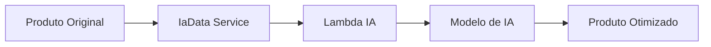

# Catálogo Inteligente (IA)

Otimizações automáticas de produtos usando inteligência artificial.

:::info Powered by OpenRouter
Utiliza a plataforma OpenRouter para acessar múltiplos modelos de IA (GPT-4, Claude, etc) de forma unificada.
:::

## Funcionalidades

### Otimizações disponíveis

1. **Títulos**
   - Adiciona marca automaticamente
   - Inclui atributos relevantes (cor, tamanho)
   - Melhora SEO

2. **Descrições**
   - Expande descrições curtas
   - Adiciona palavras-chave
   - Melhora legibilidade

3. **Categorias**
   - Sugere categoria Google correta
   - Mapeia taxonomia automaticamente

## Models

### `IaFeedMediaOptimizations`

**Arquivo:** `models/IaFeedMediaOptimizations.php`

Configurações de otimizações de IA por feed/mídia.

**Métodos:**
```php
public function verifyFeedOptimizationsExists($clientHash, $feedHash)
public function enableOptimization($field)
public function disableOptimization($field)
```

### `IaOptimizationRules`

**Arquivo:** `models/IaOptimizationRules.php`

Regras customizadas de otimização.

## Service

### `IaData`

**Arquivo:** `services/IaData.php`

Processamento de dados com IA.

**Métodos:**
```php
public function optimizeTitle($product)
public function optimizeDescription($product)
public function suggestCategory($product)
```

## Lambda IA

**Function:** `feed-optimize-ia`

Processa otimizações via Lambda com modelos de IA.

## Configuração

### Habilitar por cliente

```php
// No model Client
$client->catalogo_inteligente = 'S'; // 'N' para desabilitar
```

### Configurar otimizações

```php
$iaOptimizations = new IaFeedMediaOptimizations();
$iaOptimizations->enableOptimization('title');
$iaOptimizations->enableOptimization('description');
$iaOptimizations->enableOptimization('category');
```

## Fluxo



## Métricas

- Taxa de otimização
- Campos otimizados por tipo
- Performance de vendas (antes/depois)


