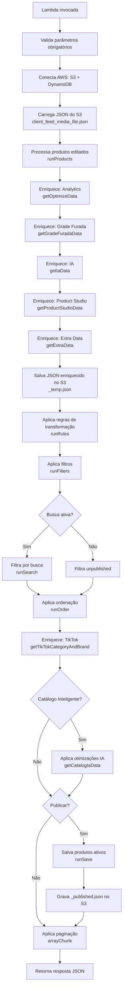

# Funções Lambda AWS

As funções Lambda são componentes serverless responsáveis por processamento pesado, integrações assíncronas e operações que exigem escalabilidade automática.

:::info Ambiente
- **Produção**: Funções AWS Lambda em `us-east-1`
- **Desenvolvimento**: LocalStack ou emulador rodando em `http://host.docker.internal:9555`
:::

## ssxml_product_optimize_PRODUCAO

**Função principal de otimização de feeds**. Processa produtos aplicando regras de transformação, filtros, busca, ordenação e paginação. É invocada pelo componente [`FeedRunOptimizeOnLambda`](../backend/componentes#feedrunoptimizeonlambda).

### Informações gerais

| Propriedade | Valor |
|-------------|-------|
| **Nome** | `ssxml_product_optimize_PRODUCAO` |
| **Runtime** | Node.js (AWS SDK v2) |
| **Timeout** | 5-10 minutos (configurável) |
| **Memória** | 512MB-1GB (recomendado) |
| **Trigger** | Invocação síncrona via SDK PHP |

### Payload de entrada

```json
{
  "client_hash": "abc123...",
  "feed_hash": "def456...",
  "media_hash": "ghi789...",
  "file": "temp",
  "products": "[]",
  "rules": [...],
  "filters": [...],
  "qtd_per_page": 10,
  "page": 0,
  "search_by": "title",
  "search_value": "camiseta",
  "order_by": "price",
  "order_type": "asc",
  "publish_products": 0,
  "titles_created": [...],
  "titles": [...],
  "mediaIa": "facebook",
  "feedIa": "feed_abc123"
}
```

#### Parâmetros obrigatórios

- `client_hash`: Hash do cliente (identificador único)
- `feed_hash`: Hash do feed
- `media_hash`: Hash da mídia (Google, Facebook, TikTok, etc.)
- `products`: Array de produtos (string JSON) - pode ser vazio `"[]"`
- `rules`: Array de regras de transformação
- `filters`: Array de filtros (categoria, preço, estoque)

#### Parâmetros opcionais

- `file`: Nome do arquivo no S3 (default: `temp`)
- `qtd_per_page`: Itens por página (default: `10`)
- `page`: Página atual (default: `0`)
- `search_by`: Campo de busca (ex: `title`, `sku`)
- `search_value`: Valor da busca
- `order_by`: Campo de ordenação (ex: `price`, `title`)
- `order_type`: Tipo de ordenação (`asc`, `desc`)
- `publish_products`: Flag de publicação (`0` = preview, `1` = publicar)
- `titles_created`: Colunas customizadas criadas pelo usuário
- `titles`: Títulos de todas as colunas disponíveis
- `mediaIa`: Mídia para Catálogo Inteligente (ex: `facebook`, `google`, `general`)
- `feedIa`: Feed para Catálogo Inteligente (ex: `feed_abc123`)

### Fluxo de execução

<div style={{textAlign: 'center'}}>



</div>

### Etapas detalhadas

<details>
<summary><strong>1. Validação e conexão AWS</strong></summary>

```javascript
// Valida parâmetros obrigatórios
if (exports.clientHash === undefined) callback('Cliente Hash é obrigatório');
if (exports.feedHash === undefined) callback('Feed Hash é obrigatório');
if (exports.mediaHash === undefined) callback('Mídia Hash é obrigatório');

// Conecta S3 e DynamoDB
connectToAWS();
```

:::warning Credenciais hardcoded
O código atual contém credenciais AWS hardcoded. **Isso deve ser migrado para variáveis de ambiente ou IAM roles** antes de produção.
:::

</details>

<details>
<summary><strong>2. Carregamento do JSON base</strong></summary>

```javascript
let fileName = `${clientHash}_${feedHash}_${mediaHash}_${file}.json`;
var conteudo = await getProductsInS3(fileName);
exports.productsDefault = conteudo.products;
```

**Bucket**: `smartxml`  
**Key**: `json-to-optimize/{client}_{feed}_{media}_temp.json`

</details>

<details>
<summary><strong>3. Processamento de produtos editados</strong></summary>

A função `runProducts()` sincroniza alterações manuais do usuário:
- Status do produto (`active`, `inactive`, `new_active`, `new_inactive`)
- Edições manuais de campos (`ssxml_manual_set`)
- Criação/remoção de colunas customizadas

</details>

<details>
<summary><strong>4. Enriquecimento de dados</strong></summary>

A Lambda busca dados complementares de múltiplas fontes:

#### 4.1. Analytics (getOptimizeData)

**Fonte**: `s3://smartxml/json-to-optimize/{client}_optimize_data.json`

**Campos adicionados**:
- `optimize_conversion_rate`: Taxa de conversão
- `optimize_views`: Visualizações
- `optimize_adds_to_cart`: Adições ao carrinho
- `optimize_checkouts`: Checkouts iniciados
- `optimize_orders`: Pedidos finalizados
- `optimize_values_sum`: Receita total

#### 4.2. Grade Furada (getGradeFuradaData)

**Fonte**: `s3://smartxml-grade-furada/{client}/{client}_{feed}_{media}_grade_furada.json`

**Campos adicionados**:
- `grade_furada`: Indica se o produto tem estoque/grade incompleta

#### 4.3. IA - Dados Gerais (getIaData)

**Fonte**: `s3://smartxml-data-ia/{client}/dataIa.json`

**Campos adicionados**:
- `ia_field_sku`: SKU processado pela IA
- `ia_field_gtin`: GTIN/EAN identificado
- `ia_field_brand`: Marca extraída pela IA
- `ia_field_color`: Cor do produto
- `ia_field_model`: Modelo identificado
- `ia_field_gender`: Gênero (masculino/feminino/unissex)
- `ia_field_voltage`: Voltagem (para eletroeletrônicos)
- `ia_field_category`: Categoria sugerida
- `ia_field_optimized_name`: Nome otimizado pela IA
- `ia_field_taxonomy`: Taxonomia do Google sugerida

#### 4.4. Product Studio (getProductStudioData)

**Fonte**: `s3://product-studio-cdn/processed-campaings/{client}_{feed}_{media}_dataImgCdn.json`

**Campos adicionados**:
- `product_studio_img_cdn`: URL da imagem personalizada gerada

#### 4.5. Extra Data (getExtraData)

**Fonte**: `s3://smartxml/extra-data/{client}/{client}_{feed}_{media}_extra_data.json`

**Campos adicionados**:
- `api_price`: Preço atualizado via API externa

</details>

<details>
<summary><strong>5. Aplicação de regras</strong></summary>

A função `runRules()` aplica transformações nos campos:

| Função | Descrição |
|--------|-----------|
| `replaceSys` | Substitui texto (ex: "P" → "Pequeno") |
| `removeSys` | Remove texto/padrão |
| `cortarSys` | Trunca texto (limita caracteres) |
| `adicionarSys` | Adiciona prefixo/sufixo |
| `adicionarColSys` | Adiciona valor de outra coluna |
| `removerHTMLSys` | Remove tags HTML |
| `descontoSys` | Aplica desconto percentual |
| `mascaraSys` | Aplica máscara (ex: telefone, CEP) |
| `priMSys` | Primeira letra maiúscula |
| `todMSys` | Tudo maiúsculo |
| `todMnSys` | Tudo minúsculo |

**Condições**: Regras podem ter condições (ex: aplicar apenas se `category = Eletrônicos`).

</details>

<details>
<summary><strong>6. Aplicação de filtros</strong></summary>

A função `runFilters()` filtra produtos baseado em condições:

| Código | Condição | Exemplo |
|--------|----------|---------|
| `0` | Igual | `category = "Calçados"` |
| `1` | Diferente | `brand ≠ "Nike"` |
| `2` | Contém | `title contém "feminino"` |
| `3` | Não contém | `description não contém "promoção"` |
| `4` | Maior que | `price > 100` |
| `5` | Menor que | `stock < 10` |

**Comportamento**: Produtos que não passam nos filtros são marcados em `ssxml_unpublish` e não aparecem no feed final.

</details>

<details>
<summary><strong>7. Busca e ordenação</strong></summary>

#### Busca (runSearch)

Suporta:
- **Busca simples**: pesquisa em colunas especificadas ou em todas
- **Busca múltipla**: separador `|` (ex: `"nike|adidas|puma"`)
- **Case-insensitive**: busca em minúsculas

#### Ordenação (runOrder)

- Detecta automaticamente se campo é numérico ou texto
- Suporta `asc` e `desc`
- Usa `lodash.orderBy` para ordenação eficiente

</details>

<details>
<summary><strong>8. Enriquecimento TikTok</strong></summary>

A função `getTikTokCategoryAndBrand()` adiciona:

**DynamoDB**: `ssxml_tik_tok_taxonomy` e `ssxml_tik_tok_brands`

**Campos adicionados**:
- `tik_tok_category_desc`: Categoria TikTok
- `tik_tok_category_id`: ID da categoria TikTok
- `tik_tok_brand_id`: ID da marca TikTok
- `additional_image_1` a `additional_image_7`: Imagens extras

</details>

<details>
<summary><strong>9. Catálogo Inteligente</strong></summary>

Se `feedIa != 'off'` e `mediaIa != 'off'`, aplica otimizações de IA por mídia:

**DynamoDB**: `ssxml_ia_product_optimizations`

**Lógica**:
1. Carrega otimizações do feed específico
2. Combina otimizações `general` + `{mediaHash}` (mídia específica sobrescreve geral)
3. Mescla dados otimizados nos produtos

**Campos dinâmicos** (dependem do feed):
- Títulos otimizados por mídia
- Descrições otimizadas
- Categorias sugeridas
- Atributos customizados

</details>

<details>
<summary><strong>10. Publicação</strong></summary>

Se `publish_products = 1`:

1. Filtra apenas produtos ativos (`ssxml_status = 'active'` ou `'new_active'`)
2. Salva em `{client}_{feed}_{media}_temp_published.json`
3. Atualiza timestamp de publicação no backend

</details>

<details>
<summary><strong>11. Paginação e resposta</strong></summary>

```javascript
var totalPages = runTotalPages(qtd_per_page, exports.productsFiltered);
exports.productsFiltered = arrayChunk(qtd_per_page, page, exports.productsFiltered);

var response = {
  'products': exports.productsFiltered,
  'totalPages': totalPages,
  'rules': exports.rules,
  'filters': exports.filters,
  'page': page,
  'publish_products': publish_products,
  'titles': exports.titles,
  'titles_created': exports.titles_created
};

callback(null, response);
```

</details>

### Performance e otimizações

#### Consultas em lote

A Lambda usa paginação no DynamoDB para evitar timeouts:

```javascript
let items = [];
let ExclusiveStartKey = undefined;

do {
  const result = await exports.DynamoDB.query(params).promise();
  items = items.concat(result.Items);
  ExclusiveStartKey = result.LastEvaluatedKey;
} while (ExclusiveStartKey);
```

#### Cache de dados

- **Imagens TikTok**: usa `Map` para lookup O(1) por SKU
- **Catálogo IA**: indexa por SKU para acesso direto

#### Timeout management

- **Sem limites de memória/tempo no PHP**: `ini_set("memory_limit", -1)`
- **Lambda**: timeout configurado para 5-10 minutos (feeds grandes)

### Variáveis de ambiente

:::warning Migração necessária
Credenciais AWS devem ser movidas para variáveis de ambiente:

```javascript
AWS.config.update({
  accessKeyId: process.env.AWS_ACCESS_KEY_ID,
  secretAccessKey: process.env.AWS_SECRET_ACCESS_KEY,
  region: process.env.AWS_REGION || 'us-east-1'
});
```
:::

### Dependências

- `aws-sdk`: SDK AWS v2
- `lodash.min.js`: Utilitários (ordenação, manipulação de arrays)
- `functions.js`: Funções de transformação customizadas

### Logs e debug

A Lambda usa `console.log()` para logging:
- Erros de busca de arquivos S3
- Status de enriquecimento (Analytics, Grade Furada, IA)
- Processamento de Catálogo Inteligente

**CloudWatch Logs**: `/aws/lambda/ssxml_product_optimize_PRODUCAO`

### Tratamento de erros

A Lambda captura erros em operações críticas:

```javascript
try {
  const data = await exports.S3.getObject({...}).promise();
  // processa dados
} catch (err) {
  console.log("Erro ao buscar o arquivo:", err);
  // continua execução (dados opcionais)
}
```

:::info Resiliência
Enriquecimentos (Analytics, IA, Product Studio) são **opcionais**. Se falharem, a Lambda continua processando com os dados disponíveis.
:::

### Exemplo de invocação (PHP)

```php
$lambda = Yii::$app->Lambda->connect();

$response = $lambda->invoke([
    'FunctionName' => 'ssxml_product_optimize_PRODUCAO',
    'Payload' => json_encode([
        'client_hash' => $clientHash,
        'feed_hash' => $feedHash,
        'media_hash' => $mediaHash,
        'file' => 'temp',
        'products' => '[]',
        'rules' => $rules,
        'filters' => $filters,
        'qtd_per_page' => 10,
        'page' => 0,
        'search_by' => '',
        'search_value' => '',
        'order_by' => 'title',
        'order_type' => 'asc',
        'publish_products' => 0,
        'titles_created' => $titlesCreated,
        'titles' => $titles,
        'mediaIa' => 'facebook',
        'feedIa' => 'feed_abc123'
    ])
]);

$data = json_decode($response['Payload']->getContents(), true);
```

### Melhorias futuras

- [ ] Migrar credenciais AWS para IAM roles ou variáveis de ambiente
- [ ] Adicionar retry automático em caso de falha de S3/DynamoDB
- [ ] Implementar cache Redis para dados de taxonomia/marcas TikTok
- [ ] Métricas customizadas (CloudWatch Metrics) para monitoramento
- [ ] Migrar para AWS SDK v3 (Node.js modular)
- [ ] Adicionar validação de schema no payload (JSON Schema)

---

:::tip Documentação relacionada
- [FeedRunOptimizeOnLambda](../backend/componentes#feedrunoptimizeonlambda) - Componente PHP que invoca esta Lambda
- [Estrutura Yii2](../backend/estrutura-yii2) - Controllers e fluxos
- [Processamento de Feeds](../backend/processamento-feeds) - Lógica de otimização
:::
