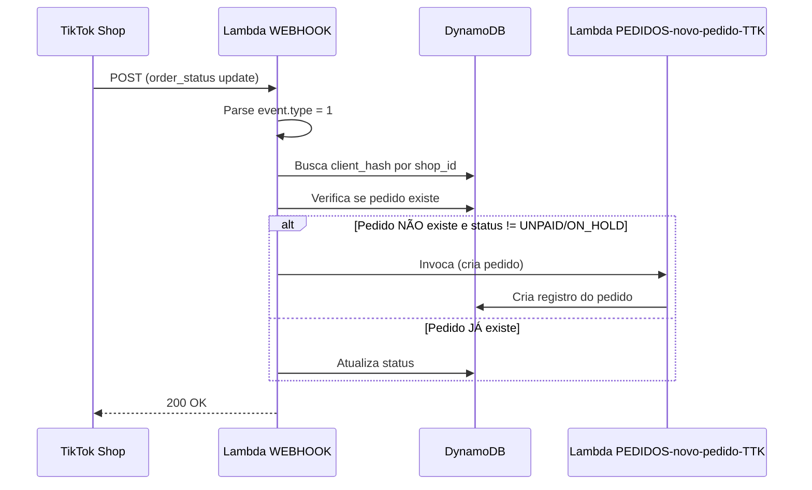
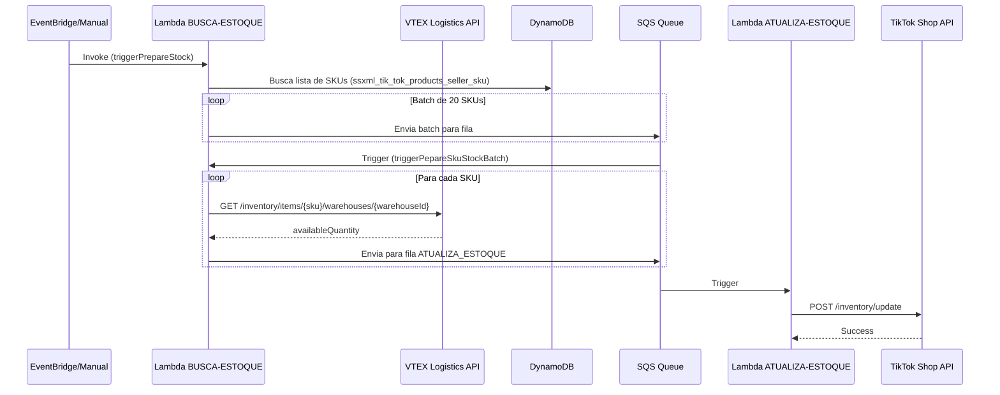
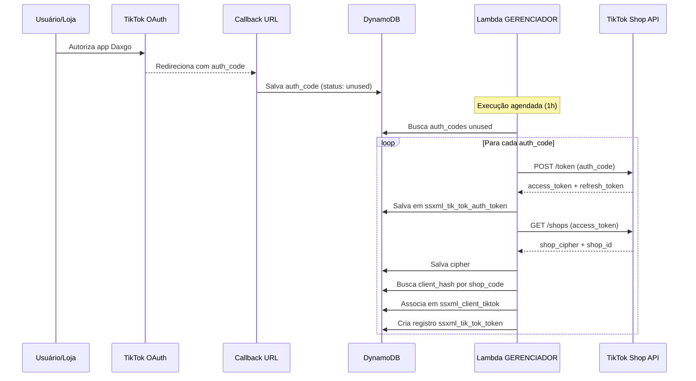
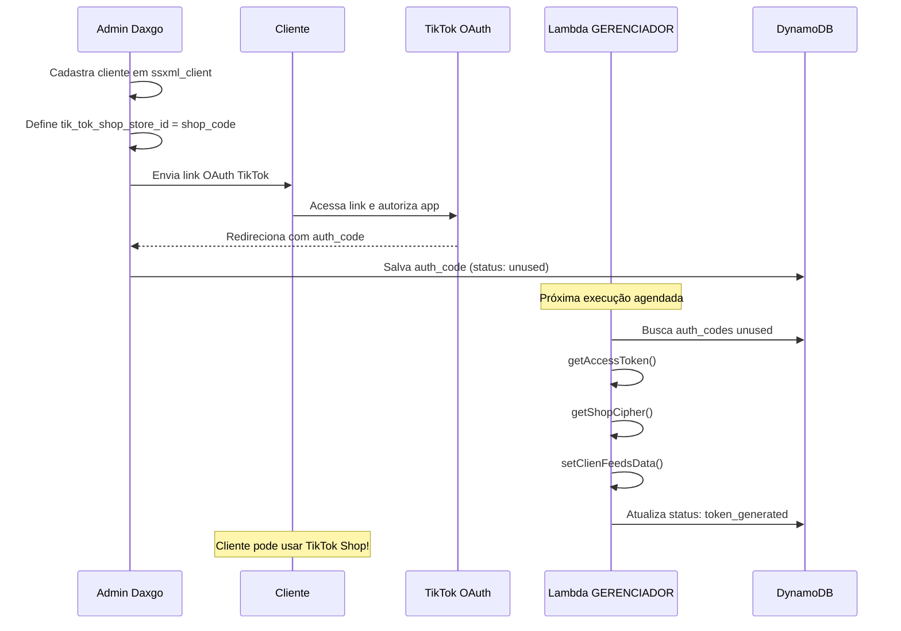
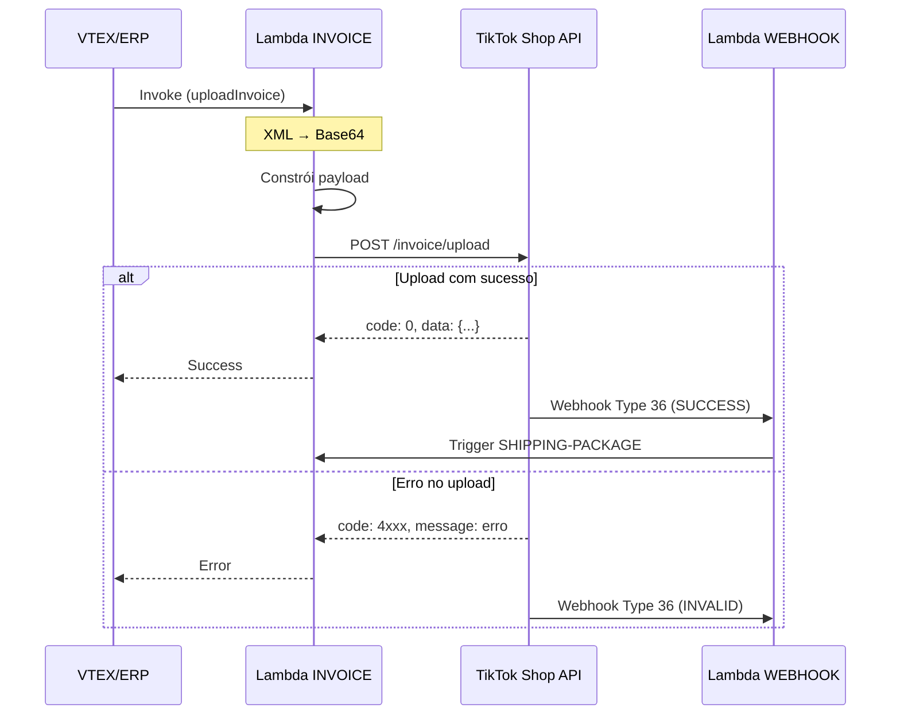
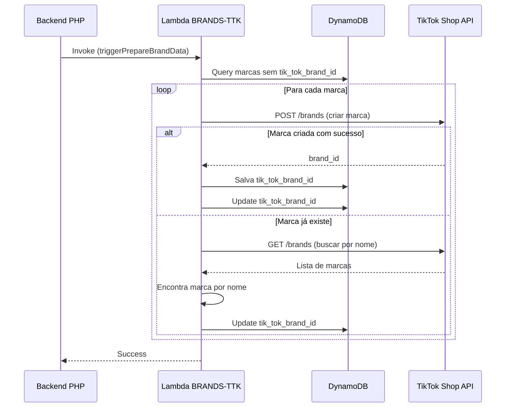

# Integração TikTok Shop

Sincronização de produtos e pedidos com TikTok Shop.

:::info API TikTok Shop
Utiliza a API oficial do TikTok Shop para sincronização bidirecional de produtos, preços, estoque e pedidos.
:::

## Models

### Autenticação
- `TikTokAuthToken`: Tokens de autenticação
- `TikTokToken`: Tokens de acesso

### Sincronização
- `TikTokBrands`: Marcas cadastradas
- `TikTokOrders`: Pedidos importados

### Logs
- `TikTokLogProduct`: Produtos sincronizados
- `TikTokLogPrice`: Alterações de preço
- `TikTokLogStock`: Alterações de estoque
- `TikTokLogOrder`: Processamento de pedidos
- `TikTokLogPriceProduct`: Log detalhado de preços

## Taxonomia

**Model:** `TaxonomyTikTok`

Mapeia categorias internas para categorias TikTok.

## Component

**Arquivo:** `components/LambdaTiktok.php`

### Funções Lambda

O componente LambdaTiktok invoca múltiplas funções Lambda para processamento assíncrono:

<details>
<summary>Ver todas as funções Lambda (16 funções)</summary>

| Função Lambda | Método | Responsabilidade |
|--------------|--------|------------------|
| `integracao-tik-tok-WEBHOOK` | API Gateway (HTTP) | **Recebe webhooks do TikTok Shop** (10 tipos de eventos) |
| `integracao-tik-tok-GERENCIADOR-AUTH-CODES` | EventBridge (1h) | **Gerenciador OAuth2** - converte auth_codes e renova tokens |
| `integracao-tik-tok-ESTOQUE-VTEX-busca-estoque-sku` | SQS/EventBridge | **Busca estoque VTEX** e dispara atualização TikTok |
| `integracao-tik-tok-INVOICE` | Invoke/SQS | **Envia Notas Fiscais (XML)** para TikTok Shop |
| `integracao-tik-tok-BRANDS-TTK` | SQS/Invoke | **Sincroniza marcas** entre DynamoDB e TikTok Shop |
| `integracao-tik-tok-PRODUTOS-lista-produtos` | `dispatchGenerateProducts()` | Prepara e envia lista de produtos para TikTok |
| `integracao-tik-tok-PRODUTOS-compara-xml` | `dispatchUpdateProducts()` | Compara XMLs antigo/novo e atualiza diferenças |
| `integracao-tik-tok-VTEX-PRODUTO-ADDITIONAL-IMAGES-XML` | `dispatchSearchImagesVtex()` | Busca imagens adicionais na VTEX e atualiza TikTok |
| `integracao-tik-tok-BRANDS-VTEX` | `dispatchGenerateBrands()` | Sincroniza marcas da VTEX para DynamoDB |
| `integracao-tik-tok-PRECO-VTEX-monta-lista-sku` | `dispatchPrepareListPrice()` | Prepara lista de SKUs para atualização de preços |
| `integracao-tik-tok-ESTOQUE-VTEX-atualizacao-estoque` | `dispatchPrepareStock()` | Sincroniza estoque VTEX → TikTok |
| `integracao-tik-tok-PEDIDOS-novo-pedido-TTK` | `dispatchSendOrder()` | Processa novo pedido do TikTok |
| `integracao-tik-tok-BUSCA-PEDIDOS-TESTE` | `dispatchGetOrder()` | Busca pedidos do cliente (ambiente de teste) |
| `integracao-tik-tok-ORDERHOOK-MANAGEMENT` | `dispatchGenerateOrderHook()` | Gerencia webhooks de pedidos |
| `integracao-tik-tok-SHIPPING-PACKAGE` | `dispatchPackage()` | Gerencia pacotes de envio e rastreamento |

</details>

:::note Invocação Assíncrona
A maioria das funções usa `InvocationType: 'Event'` para processamento assíncrono sem esperar resposta.
:::

## Webhooks do TikTok Shop

### integracao-tik-tok-WEBHOOK

**Função crítica** que recebe e processa webhooks do TikTok Shop para eventos em tempo real.

#### Informações Gerais

| Propriedade | Valor |
|-------------|-------|
| **Nome** | `integracao-tik-tok-WEBHOOK` |
| **Runtime** | Node.js 20.x |
| **Trigger** | API Gateway (HTTP POST) |
| **Timeout** | 30s |
| **Tipo de Invocação** | Síncrona (resposta para TikTok) |

#### Tipos de Eventos Suportados

A Lambda processa **10 tipos de eventos** do TikTok Shop:

<details>
<summary>📋 Ver todos os tipos de eventos (10 tipos)</summary>

| Type | Evento | Handler | Documentação TikTok |
|------|--------|---------|---------------------|
| **1** | Order Status Update | `orderStatusUpdate()` | [Doc](https://partner.tiktokshop.com/docv2/page/650300b8a57708028b430b4a) |
| **2** | Return Order Status | `returnOrder()` | [Doc](https://partner.tiktokshop.com/docv2/page/65030162bb2a4d028d50cc51) |
| **3** | Cancel Order Status | `cancelOrder()` | [Doc](https://partner.tiktokshop.com/docv2/page/65030150746462028285f657) |
| **4** | Recipient Address Update | `recipientAddress()` | [Doc](https://partner.tiktokshop.com/docv2/page/650301af5a12ff0294ea3bf9) |
| **5** | Package Update | `packageUpdate()` | [Doc](https://partner.tiktokshop.com/docv2/page/650955cabace3e02b73cc886) |
| **6** | Product Status Change | `productStatusChange()` | [Doc](https://partner.tiktokshop.com/docv2/page/650956aff1fd3102b90b6261) |
| **7** | Seller Deauthorization | `SellerDeauthorization()` | [Doc](https://partner.tiktokshop.com/docv2/page/65095746defece02be4d749d) |
| **8** | Auth Expire | `authExpire()` | [Doc](https://partner.tiktokshop.com/docv2/page/6509579c0fcef602bf11312c) |
| **36** | Invoice Status Change | `invoiceStatusChange()` | Status de Nota Fiscal |
| **99** | VTEX Order Created | `vtexOrderCreated()` | **Evento interno Daxgo** |

</details>

:::warning Evento Type 99
O evento **Type 99** é exclusivo da Daxgo (não é do TikTok) e serve para sincronizar pedidos criados na VTEX de volta para o DynamoDB.
:::

#### Fluxo Principal (Type 1: Order Status Update)



#### Exemplos de Payloads

##### Type 1: Order Status Update

```json
{
  "type": 1,
  "tts_notification_id": "7327112393057371910",
  "shop_id": "7496187667563645236",
  "timestamp": 1644412885,
  "data": {
    "order_id": "580192503814523040",
    "order_status": "AWAITING_SHIPMENT",
    "is_on_hold_order": false,
    "update_time": 1644412885
  }
}
```

**Status de Pedido Disponíveis**:
- `UNPAID` - Aguardando pagamento
- `ON_HOLD` - Em espera
- `AWAITING_SHIPMENT` - Aguardando envio
- `AWAITING_COLLECTION` - Aguardando coleta
- `CANCEL` - Cancelado
- `IN_TRANSIT` - Em trânsito
- `DELIVERED` - Entregue
- `COMPLETED` - Concluído

##### Type 36: Invoice Status Change

```json
{
  "type": 36,
  "tts_notification_id": "7327112393057371910",
  "shop_id": "7494049642642441621",
  "timestamp": 1644412885,
  "data": {
    "package_id": "123456",
    "order_ids": ["152523", "532123"],
    "invoice_status": "SUCCESS",
    "invalid_reason": null
  }
}
```

**Comportamento**:
- Se `invoice_status == 'SUCCESS'`: Invoca `integracao-tik-tok-SHIPPING-PACKAGE` para processar envio
- Se `invoice_status == 'INVALID'`: Registra motivo em `invalid_reason`

##### Type 99: VTEX Order Created (Interno Daxgo)

```json
{
  "type": 99,
  "timestamp": 1748289993,
  "data": {
    "client_hash": "680b0418c0a43b6c829bb93659ceb3e5608830fc",
    "order_group_VTEX": "1535000500227",
    "order_id_TTK": "580193227173431456",
    "order_status_vtex": "CREATED"
  }
}
```

**Atualiza no DynamoDB**:
```javascript
{
  client_hash: "...",
  order_id: "580193227173431456",
  vtex_status: "CREATED",
  vtex_order: "1535000500227"
}
```

#### Tabelas DynamoDB Utilizadas

##### ssxml_client_tiktok

**Propósito**: Mapear `shop_id` do TikTok para `client_hash` da Daxgo

```json
{
  "client_hash": "680b0418...",
  "tik_tok_shop_store_id": "7496187667563645236",
  "tik_tok_shop_feed_link": "https://...",
  "tik_tok_shop_warehouse_id": "..."
}
```

##### ssxml_tik_tok_orders

**Propósito**: Armazenar pedidos do TikTok com status e informações VTEX

```json
{
  "client_hash": "680b0418...",
  "order_id": "580192503814523040",
  "status": "AWAITING_SHIPMENT",
  "vtex_status": "CREATED",
  "vtex_order": "1535000500227",
  "created_at": 1644412885,
  "updated_at": 1644412900
}
```

#### Integração com Outras Lambdas

A Lambda WEBHOOK invoca outras funções conforme o evento:

```javascript
// Type 1: Novo pedido (se não existe)
const payload = {
  clientHash: clientHash,
  orderId: orderId,
  type: 'triggerNewOrderInTTK'
};
await lambda.invoke({
  FunctionName: 'integracao-tik-tok-PEDIDOS-novo-pedido-TTK',
  InvocationType: 'Event',
  Payload: JSON.stringify(payload)
}).promise();
```

```javascript
// Type 36: Nota fiscal aprovada
const payload = {
  clientHash: clientHash,
  orderId: orderId,
  packageId: packageId
};
await lambda.invoke({
  FunctionName: 'integracao-tik-tok-SHIPPING-PACKAGE',
  InvocationType: 'Event',
  Payload: JSON.stringify(payload)
}).promise();
```

#### Lógica de Decisão (Type 1: Order Status)

```javascript
async function checkAwsOrder(clientHash, orderId, orderStatus) {
  // Verifica se pedido já existe no DynamoDB
  const existing = await DynamoDB.get({
    TableName: 'ssxml_tik_tok_orders',
    Key: { client_hash: clientHash, order_id: orderId }
  }).promise();

  if (!existing.Item) {
    // Pedido NÃO existe
    if (orderStatus != 'UNPAID' && orderStatus != 'ON_HOLD') {
      // Cria pedido (invoca Lambda)
      await newOrderInTTK(clientHash, orderId);
    }
  } else {
    // Pedido JÁ existe: atualiza status
    await DynamoDB.update({
      TableName: 'ssxml_tik_tok_orders',
      Key: { client_hash: clientHash, order_id: orderId },
      UpdateExpression: 'SET #status = :status',
      ExpressionAttributeValues: { ':status': orderStatus }
    }).promise();
  }
}
```

:::tip Por que ignorar UNPAID e ON_HOLD?
Pedidos com status `UNPAID` ou `ON_HOLD` ainda não foram confirmados/pagos, então não devem ser criados na VTEX. Apenas pedidos confirmados (`AWAITING_SHIPMENT`, etc.) são sincronizados.
:::

#### Configuração do Webhook no TikTok

Para receber webhooks, é necessário configurar a URL no painel do TikTok Shop:

1. Acesse **TikTok Shop Partner Center**
2. Vá em **Settings** → **Webhooks**
3. Configure a URL: `https://api.feeds.daxgo.io/tiktok/webhook` (ou endpoint do API Gateway)
4. Selecione os eventos desejados (types 1-8, 36)
5. Salve e valide a URL

#### Variáveis de Ambiente

```bash
# AWS (Produção)
AWS_ACCESSKEYID=AKIA...
AWS_SECRETACCESSKEY=...
AWS_REGION_CONFIG=us-east-1
AWS_BUCKET=daxgo-feeds-production

# Local (Desenvolvimento)
APP_ENV=local
LOCAL_ACCESSKEYID=minioadmin
LOCAL_SECRETACCESSKEY=minioadmin
LOCAL_REGION=us-east-1
LOCAL_BUCKET=daxgo-feeds
LOCAL_S3BUCKETENDPOINT=true
LOCAL_ENDPOINT=http://localhost:9000
LOCAL_DYNAMODBENDPOINT=http://localhost:8000
```

#### Monitoramento

**Logs importantes no CloudWatch**:

```javascript
console.log("Webhook Recebido: ----------------");
console.log(event); // Payload completo do TikTok
console.log("----------------");
```

**Métricas recomendadas**:
- Taxa de webhooks recebidos por tipo
- Taxa de sucesso/erro por tipo
- Latência de processamento
- Pedidos criados vs atualizados

#### Tratamento de Erros

```javascript
try {
  await eventHandlers[eventType](event);
  return {
    statusCode: 200,
    body: JSON.stringify({ message: 'Success' })
  };
} catch (error) {
  console.error('Erro:', error);
  return {
    statusCode: 500,
    body: JSON.stringify({ 
      message: 'Failed', 
      error: error.message 
    })
  };
}
```

:::warning Importante
O TikTok espera uma resposta `200 OK` em até **5 segundos**. Se a Lambda demorar mais, o TikTok tentará reenviar o webhook (até 3 tentativas). Use invocações assíncronas para processamento pesado.
:::

#### Troubleshooting

| Problema | Causa Provável | Solução |
|----------|----------------|---------|
| Webhook não recebido | URL não configurada no TikTok | Verificar configuração no Partner Center |
| Pedido duplicado | Webhook reenviado (timeout) | Implementar idempotência (verificar se pedido já existe) |
| `shop_id` não encontrado | Cliente não cadastrado no DynamoDB | Verificar tabela `ssxml_client_tiktok` |
| Erro 500 ao processar | Erro na Lambda invocada | Verificar logs da Lambda chamada (PEDIDOS ou SHIPPING) |

#### Eventos Pendentes de Implementação

Os seguintes eventos estão definidos mas **não implementados** (funções vazias):

- ❌ Type 2: `returnOrder()` - Retorno de pedido
- ❌ Type 3: `cancelOrder()` - Cancelamento de pedido
- ❌ Type 4: `recipientAddress()` - Atualização de endereço
- ❌ Type 5: `packageUpdate()` - Atualização de pacote
- ❌ Type 6: `productStatusChange()` - Mudança de status de produto
- ❌ Type 7: `SellerDeauthorization()` - Desautorização do vendedor
- ❌ Type 8: `authExpire()` - Expiração de autenticação

:::info Próximos Passos
Implementar os handlers restantes conforme necessidade do negócio. A estrutura já está preparada para receber esses eventos.
:::

## Lambdas Detalhadas

### integracao-tik-tok-ESTOQUE-VTEX-busca-estoque-sku

**Sincronização de estoque VTEX → TikTok Shop** - busca estoque disponível na VTEX e dispara atualização na TikTok.

#### Informações Gerais

| Propriedade | Valor |
|-------------|-------|
| **Nome** | `integracao-tik-tok-ESTOQUE-VTEX-busca-estoque-sku` |
| **Runtime** | Node.js 20.x (JavaScript) |
| **Trigger** | SQS, Invoke direto ou API Gateway |
| **Timeout** | 300s (5 min) |
| **Memória** | 512 MB |
| **Tipo de Invocação** | Assíncrona (Event) |
| **Repositório** | `integracao-tik-tok-shop-vtex` |

#### Responsabilidade

Gerencia a **sincronização de estoque** entre VTEX e TikTok Shop:
1. Busca lista de SKUs do cliente (VTEX ou DynamoDB)
2. Consulta estoque disponível na VTEX por SKU
3. Envia atualizações para SQS ou invoca Lambda de atualização no TikTok
4. Processa em lote (batch) ou individualmente

#### Fluxo de Sincronização



#### Event Types Suportados

| Type | Handler | Descrição |
|------|---------|-----------|
| `triggerPrepareStock` | `PrepareStock()` | Sincroniza **todos os SKUs** do cliente |
| `triggerPepareSkuStock` | `PepareSkuStock()` | Sincroniza **1 SKU específico** |
| `triggerPepareSkuStockBatch` | `PepareSkuStockBatch()` | Sincroniza **batch de SKUs** |
| `triggerCountStock` | `CountStock()` | Conta estoque (não implementado) |

#### Payloads de Entrada

##### Type 1: triggerPrepareStock (Sincronização Completa)

```json
{
  "type": "triggerPrepareStock",
  "clientHash": "680b0418c0a43b6c829bb93659ceb3e5608830fc"
}
```

**Processo**:
1. Busca todos os SKUs do cliente no DynamoDB (`ssxml_tik_tok_products_seller_sku`)
2. Divide em batches de 20 SKUs
3. Envia cada batch para SQS (`SQS_BUSCA_ESTOQUE`)

##### Type 2: triggerPepareSkuStock (SKU Individual)

```json
{
  "type": "triggerPepareSkuStock",
  "clientHash": "680b0418c0a43b6c829bb93659ceb3e5608830fc",
  "sku": "880408"
}
```

**Processo**:
1. Busca estoque do SKU na VTEX
2. Invoca diretamente `integracao-tik-tok-ESTOQUE-TTK-atualiza-estoque-sku`

##### Type 3: triggerPepareSkuStockBatch (Batch de SKUs)

```json
{
  "type": "triggerPepareSkuStockBatch",
  "clientHash": "680b0418c0a43b6c829bb93659ceb3e5608830fc",
  "sku": ["880408", "880409", "880410", ...]
}
```

**Processo**:
1. Para cada SKU: busca estoque na VTEX
2. Envia cada atualização para SQS (`SQS_ATUALIZA_ESTOQUE`)

#### APIs VTEX Utilizadas

##### 1. GET /api/logistics/pvt/inventory/items/\{sku\}/warehouses/\{warehouseId\}

**Propósito**: Busca estoque disponível de um SKU em um warehouse específico

```javascript
const url = 'https://' + VTEX_ACCOUNT + '.vtexcommercestable.com.br/api/logistics/pvt/inventory/items/' + sku + '/warehouses/' + warehouseId;

const response = await axios.get(url, {
  headers: {
    'X-VTEX-API-AppKey': VTEX_APP_KEY,
    'X-VTEX-API-AppToken': VTEX_APP_TOKEN,
    'Content-Type': 'application/json'
  }
});
```

**Response**:
```json
[
  {
    "skuId": "880408",
    "warehouseId": "1_1",
    "warehouseName": "Estoque Principal",
    "totalQuantity": 1000,
    "reservedQuantity": 50,
    "availableQuantity": 950,
    "isUnlimited": false,
    "timeToRefill": null,
    "dateUtcOnBalanceSystem": null
  }
]
```

**Campos Importantes**:
- `totalQuantity`: Quantidade total no estoque
- `reservedQuantity`: Quantidade reservada (pedidos pendentes)
- `availableQuantity`: **Quantidade disponível** (usado na TikTok)

##### 2. GET /api/catalog_system/pvt/sku/stockkeepingunitids

**Propósito**: Lista todos os SKU IDs do catálogo (paginado)

```javascript
const response = await axios.get(`${vtexCatalogUrl}/stockkeepingunitids`, {
  headers,
  params: {
    page: 1,
    pagesize: 1000  // Máximo: 1000
  }
});
```

**Response**:
```json
[1, 2, 3, 4, 5, 6, 7, 8, 9, 10, ...]
```

:::warning Uso no Código
Esta API **não é mais utilizada** no fluxo principal. A função `getSkuListVtex()` busca SKUs do DynamoDB ao invés da VTEX para economizar recursos.
:::

#### Tabelas DynamoDB

##### ssxml_tik_tok_products_seller_sku

**Propósito**: Armazena mapeamento de SKUs que foram enviados para TikTok

```json
{
  "client_hash": "680b0418c0a43b6c829bb93659ceb3e5608830fc",
  "seller_sku": "880408",
  "product_id": "7123456789012345678",
  "tik_tok_product_id": "9876543210",
  "created_at": "2026-01-28T10:00:00Z"
}
```

**Chaves**:
- **Partition Key**: `client_hash`
- **Sort Key**: `seller_sku`

**Uso**: A função `getSkuListVtex()` busca apenas os SKUs desta tabela (produtos já sincronizados com TikTok), ao invés de buscar todos os SKUs da VTEX.

#### Funções Principais

##### 1. prepareStock()

**Propósito**: Sincroniza estoque de **todos os SKUs** do cliente

```javascript
async function prepareStock(clientHash) {
  await setCredentials(clientHash);
  const AWS = await connectToAWS();
  const SQS = new AWS.SQS();
  
  // Busca SKUs do DynamoDB (apenas produtos já enviados para TikTok)
  const skuList = await getSkuListVtex(clientHash);
  
  // Divide em batches de 20
  const batchSize = 20;
  for (let i = 0; i < skuList.length; i += batchSize) {
    const batch = skuList.slice(i, i + batchSize);
    await sendSqsUpdateInventory(SQS, batch, clientHash);
  }
}
```

**Fluxo**:
1. Busca lista de SKUs do DynamoDB
2. Divide em batches de 20 SKUs
3. Envia cada batch para SQS `SQS_BUSCA_ESTOQUE`
4. SQS aciona novamente esta Lambda com `triggerPepareSkuStockBatch`

##### 2. prepareSkuStock()

**Propósito**: Busca estoque de **1 SKU** e dispara atualização imediata

```javascript
async function prepareSkuStock(clientHash, sku) {
  await setCredentials(clientHash);
  
  console.log("Buscando estoque: " + sku + ' - ' + clientWarehouseId);
  
  // Busca estoque na VTEX
  const stockData = await getInventoryBySku(sku, clientWarehouseId);
  
  const availableQuantity = stockData.availableQuantity;
  
  console.log("availableQuantity ...", availableQuantity);
  
  // Invoca Lambda de atualização na TikTok
  await dispatchStockUpdateBySku(clientHash, sku, availableQuantity);
}
```

**Uso**: Ideal para **atualizações em tempo real** quando um produto é editado ou um pedido é processado.

##### 3. prepareSkuStockBatch()

**Propósito**: Processa batch de SKUs e envia para SQS de atualização

```javascript
async function prepareSkuStockBatch(clientHash, skuList) {
  await setCredentials(clientHash);
  const AWS = await connectToAWS();
  const SQS = new AWS.SQS();
  
  // Para cada SKU do batch
  for (const sku of skuList) {
    // Busca estoque na VTEX
    const stockData = await getInventoryBySku(sku, clientWarehouseId);
    const availableQuantity = stockData.availableQuantity;
    
    // Envia para fila de atualização
    await sendSqsSaveInventory(SQS, clientHash, sku, availableQuantity);
  }
}
```

**Fluxo**:
1. Recebe array de SKUs
2. Para cada SKU: consulta VTEX
3. Envia para SQS `SQS_ATUALIZA_ESTOQUE`
4. SQS aciona `integracao-tik-tok-ESTOQUE-TTK-atualiza-estoque-sku`

##### 4. getSkuListVtex()

**Propósito**: Busca lista de SKUs do DynamoDB (otimizado)

```javascript
async function getSkuListVtex(clientHash) {
  const AWS = await connectToAWS();
  const DynamoDB = new AWS.DynamoDB.DocumentClient();
  
  const params = {
    TableName: 'ssxml_tik_tok_products_seller_sku',
    KeyConditionExpression: 'client_hash = :clientHash',
    ExpressionAttributeValues: {
      ':clientHash': clientHash
    }
  };
  
  let skuList = [];
  let lastEvaluatedKey = null;
  
  // Paginação automática
  do {
    if (lastEvaluatedKey) {
      params.ExclusiveStartKey = lastEvaluatedKey;
    }
    
    const data = await DynamoDB.query(params).promise();
    if (data.Items) {
      skuList = skuList.concat(data.Items.map(item => item.seller_sku));
    }
    lastEvaluatedKey = data.LastEvaluatedKey;
    
  } while (lastEvaluatedKey);
  
  return skuList;
}
```

:::tip Por que DynamoDB e não VTEX?
Buscar do DynamoDB é mais eficiente porque:
- Nem todos os produtos VTEX são enviados para TikTok
- Evita requisições desnecessárias à VTEX API
- Mais rápido e econômico
- Apenas produtos já sincronizados precisam de atualização de estoque
:::

##### 5. getInventoryBySku()

**Propósito**: Consulta estoque na VTEX Logistics API

```javascript
async function getInventoryBySku(sku, warehouseId) {
  const url = vtexInventoryUrl + '/items/' + sku + '/warehouses/' + warehouseId;
  const result = await axios.get(url, { headers });
  const data = result.data[0];
  return data;
}
```

**Retorno**:
```javascript
{
  skuId: "880408",
  warehouseId: "1_1",
  warehouseName: "Estoque Principal",
  totalQuantity: 1000,
  reservedQuantity: 50,
  availableQuantity: 950  // ← Usado na TikTok
}
```

#### Integração com SQS

##### sendSqsUpdateInventory()

**Propósito**: Envia batch de SKUs para fila de busca de estoque

```javascript
async function sendSqsUpdateInventory(SQS, sku, clientHash) {
  const url = process.env.SQS_BUSCA_ESTOQUE;
  
  const payload = {
    clientHash: clientHash,
    sku: sku,  // Array de SKUs
    type: 'triggerPepareSkuStockBatch'
  };
  
  const params = {
    MessageBody: JSON.stringify(payload),
    QueueUrl: url
  };
  
  await SQS.sendMessage(params).promise();
}
```

**Fila**: `SQS_BUSCA_ESTOQUE` → Aciona esta mesma Lambda com `triggerPepareSkuStockBatch`

##### sendSqsSaveInventory()

**Propósito**: Envia atualização de estoque para fila de atualização na TikTok

```javascript
async function sendSqsSaveInventory(SQS, clientHash, sellerSku, availableQuantity) {
  const url = process.env.SQS_ATUALIZA_ESTOQUE;
  
  const payload = {
    clientHash: clientHash,
    sellerSku: sellerSku,
    quantity: availableQuantity,
    warehouseIdTTK: clientWarehouseIdTTK,
    type: 'triggerUpdateInventoryBySellerSku'
  };
  
  const params = {
    MessageBody: JSON.stringify(payload),
    QueueUrl: url
  };
  
  await SQS.sendMessage(params).promise();
}
```

**Fila**: `SQS_ATUALIZA_ESTOQUE` → Aciona `integracao-tik-tok-ESTOQUE-TTK-atualiza-estoque-sku`

#### Integração com Lambda de Atualização

##### dispatchStockUpdateBySku()

**Propósito**: Invoca Lambda que atualiza estoque na TikTok Shop (sem SQS)

```javascript
async function dispatchStockUpdateBySku(clientHash, sellerSku, availableQuantity) {
  const payload = {
    clientHash: clientHash,
    sellerSku: sellerSku,
    quantity: availableQuantity,
    warehouseIdTTK: clientWarehouseIdTTK,
    type: 'triggerUpdateInventoryBySellerSku'
  };
  
  const params = {
    FunctionName: 'integracao-tik-tok-ESTOQUE-TTK-atualiza-estoque-sku',
    InvocationType: 'Event',
    Payload: JSON.stringify(payload)
  };
  
  const AWS = await connectToAWS();
  const lambda = new AWS.Lambda();
  await lambda.invoke(params).promise();
}
```

**Uso**: Atualização imediata (sem fila) para SKU individual.

#### Variáveis de Ambiente

```bash
# VTEX
VTEX_ACCOUNT=minhaloja
VTEX_APP_KEY=vtexappkey-minhaloja-XXXXXX
VTEX_APP_TOKEN=YYYYYYYYYYYYYYYYYY

# Warehouse IDs
VTEX_WAREHOUSE_ID=1_1
TIKTOK_WAREHOUSE_ID=7123456789012345678

# SQS Queues
SQS_BUSCA_ESTOQUE=https://sqs.us-east-1.amazonaws.com/xxx/busca-estoque-sku
SQS_ATUALIZA_ESTOQUE=https://sqs.us-east-1.amazonaws.com/xxx/atualiza-estoque-ttk

# AWS
AWS_ACCESS_KEY_ID=AKIA...
AWS_SECRET_ACCESS_KEY=...
AWS_REGION=us-east-1
```

#### Agendamento Recomendado

**EventBridge Rule**:
```json
{
  "Name": "tiktok-sync-stock-daily",
  "Description": "Sincroniza estoque VTEX → TikTok diariamente",
  "ScheduleExpression": "cron(0 2 * * ? *)",  // 2h da manhã
  "State": "ENABLED",
  "Targets": [
    {
      "Arn": "arn:aws:lambda:us-east-1:xxx:function:integracao-tik-tok-ESTOQUE-VTEX-busca-estoque-sku",
      "Id": "1",
      "Input": "{\"type\":\"triggerPrepareStock\",\"clientHash\":\"680b0418...\"}"
    }
  ]
}
```

#### Cenários de Uso

##### 1. Sincronização Diária Completa

```javascript
// EventBridge dispara às 2h da manhã
{
  "type": "triggerPrepareStock",
  "clientHash": "680b0418c0a43b6c829bb93659ceb3e5608830fc"
}

// Resultado: Todos os SKUs são sincronizados
```

##### 2. Atualização em Tempo Real (Webhook VTEX)

```javascript
// Webhook VTEX quando estoque muda
{
  "type": "triggerPepareSkuStock",
  "clientHash": "680b0418c0a43b6c829bb93659ceb3e5608830fc",
  "sku": "880408"
}

// Resultado: SKU específico atualizado imediatamente
```

##### 3. Sincronização Após Upload de Produtos

```javascript
// Após criar produtos na TikTok
{
  "type": "triggerPepareSkuStockBatch",
  "clientHash": "680b0418c0a43b6c829bb93659ceb3e5608830fc",
  "sku": ["880408", "880409", "880410"]
}

// Resultado: Batch de novos produtos tem estoque sincronizado
```

#### Exemplo de Logs

```
🔍 Buscando estoque: 880408 - 1_1
📋 stockData: {
  skuId: "880408",
  availableQuantity: 950,
  totalQuantity: 1000,
  reservedQuantity: 50
}
📤 Disparando atualização para TikTok...
✅ SQS Message Sent: abc123-def456-ghi789
```

```
📋 Processando batch de 20 SKUs...
🔍 SKU 880408: estoque = 950
🔍 SKU 880409: estoque = 1200
🔍 SKU 880410: estoque = 0
...
✅ Batch completo enviado para SQS
```

#### Monitoramento

**Métricas Recomendadas**:
- Número de SKUs processados por execução
- Tempo médio de consulta por SKU (VTEX API)
- Taxa de erro na consulta VTEX
- Mensagens enviadas para SQS
- Estoque zero detectado (alerta)

**CloudWatch Logs**:
```
[INFO] Iniciando sincronização para client: 680b0418...
[INFO] Total de SKUs encontrados: 1523
[INFO] Dividindo em 77 batches de 20 SKUs
[INFO] Batch 1/77 enviado para SQS
[INFO] Batch 2/77 enviado para SQS
...
[INFO] Sincronização completa: 1523 SKUs processados
```

#### Troubleshooting

| Problema | Causa Provável | Solução |
|----------|----------------|---------|
| VTEX API retorna 401 | Credenciais inválidas | Verificar VTEX_APP_KEY e VTEX_APP_TOKEN |
| VTEX API retorna 429 | Rate limit excedido | Adicionar delay entre requisições |
| SKU não encontrado | SKU não existe na VTEX | Verificar seller_sku no DynamoDB |
| Warehouse ID inválido | ID configurado errado | Verificar VTEX_WAREHOUSE_ID |
| SQS não recebe mensagens | URL errada ou permissões | Verificar SQS_BUSCA_ESTOQUE e IAM |
| Estoque sempre zero | Filtro de warehouse errado | Testar sem filtro de warehouse |

#### Otimizações

**1. Processamento em Paralelo (Futuro)**

```javascript
// Processar 10 SKUs em paralelo
const promises = skuList.slice(0, 10).map(sku => 
  getInventoryBySku(sku, clientWarehouseId)
);
const results = await Promise.all(promises);
```

**2. Cache de Credenciais**

```javascript
// Evitar buscar credenciais a cada SKU
let credentialsCache = null;

async function setCredentialsOnce(clientHash) {
  if (!credentialsCache) {
    credentialsCache = await getCredentials(clientHash);
  }
  return credentialsCache;
}
```

**3. Batch API VTEX (se disponível)**

```javascript
// Consultar múltiplos SKUs em uma requisição
const response = await axios.post(`${vtexInventoryUrl}/batch`, {
  skus: [880408, 880409, 880410],
  warehouseId: clientWarehouseId
});
```

#### Melhorias Futuras

- [ ] Implementar retry automático para falhas da VTEX API
- [ ] Adicionar cache de estoque (5-10 min) para reduzir chamadas
- [ ] Suportar múltiplos warehouses por cliente
- [ ] Implementar webhook VTEX para atualização em tempo real
- [ ] Adicionar dead letter queue (DLQ) para SKUs com erro
- [ ] Criar dashboard de estoque em tempo real
- [ ] Implementar diff de estoque (só atualizar se mudou)
- [ ] Adicionar telemetria (X-Ray) para rastreamento

### integracao-tik-tok-GERENCIADOR-AUTH-CODES

**Gerenciador de OAuth2** para TikTok Shop - converte códigos de autorização em tokens de acesso e gerencia renovação automática.

#### Informações Gerais

| Propriedade | Valor |
|-------------|-------|
| **Nome** | `integracao-tik-tok-GERENCIADOR-AUTH-CODES` |
| **Runtime** | Node.js 20.x (TypeScript) |
| **Trigger** | EventBridge (agendamento) ou Invoke |
| **Frequência** | A cada 1 hora (recomendado) |
| **Timeout** | 120s |
| **Memória** | 512 MB |
| **Tipo de Invocação** | Assíncrona (Event) ou Síncrona (RequestResponse) |

#### Responsabilidade

Gerencia o **ciclo completo de autenticação OAuth2** com a TikTok Shop:
1. Processa códigos de autorização (`auth_code`) gerados no fluxo OAuth2
2. Converte `auth_code` em `access_token` e `refresh_token`
3. Busca `shop_cipher` (identificador criptografado da loja)
4. Associa dados TikTok com `client_hash` da Daxgo
5. Renova automaticamente tokens próximos da expiração

#### Fluxo OAuth2 Completo



#### Tabelas DynamoDB Utilizadas

##### 1. ssxml_tik_tok_auth_token

**Propósito**: Armazena códigos de autorização OAuth2 e seu status de processamento

```json
{
  "auth_code": "ROW_YXV0aF9jb2RlXzEyMzQ1Njc4OTA",
  "status": "unused",  // unused → access → cipher → token_generated
  "cipher": "ROW_oHsaywAAAAB-fwLow-dESMWiA0-dPnKA",
  "shop_id": "BRBRLC3LWLWR",
  "access_token": "...",
  "code": 0,
  "message": "success"
}
```

**Status Possíveis**:
- `unused`: Auth code ainda não processado
- `access`: Access token obtido com sucesso
- `cipher`: Shop cipher obtido
- `error`: Erro no processamento

##### 2. ssxml_tik_tok_token

**Propósito**: Armazena tokens ativos para uso nas APIs (tabela de alta volatilidade)

```json
{
  "client_hash": "680b0418c0a43b6c829bb93659ceb3e5608830fc",
  "access_token": "ROW_YWNjZXNzX3Rva2VuXzEyMzQ1Njc4OTA",
  "access_token_expire_in": 1735689600,  // Unix timestamp
  "refresh_token": "ROW_cmVmcmVzaF90b2tlbl8xMjM0NTY3ODkw",
  "refresh_token_expire_in": 1767225600,  // 365 dias
  "auth_code": "ROW_YXV0aF9jb2RlXzEyMzQ1Njc4OTA"
}
```

**Chave**: `client_hash`

##### 3. ssxml_client_tiktok

**Propósito**: Associa dados TikTok com client_hash da Daxgo (tabela de consolidação)

```json
{
  "client_hash": "680b0418c0a43b6c829bb93659ceb3e5608830fc",
  "status": "token_generated",
  "auth_code": "ROW_YXV0aF9jb2RlXzEyMzQ1Njc4OTA",
  "cipher": "ROW_oHsaywAAAAB-fwLow-dESMWiA0-dPnKA",
  "tik_tok_shop_store_id": "7496187667563645236",
  "tik_tok_shop_store_name": "Minha Loja TikTok",
  "tik_tok_shop_store_code": "BRBRLC3LWLWR",
  "access_token": "ROW_YWNjZXNzX3Rva2VuXzEyMzQ1Njc4OTA"
}
```

**Chave**: `client_hash`

:::info Associação com Daxgo
O `shop_code` (ex: `BRBRLC3LWLWR`) é cadastrado manualmente na tabela `ssxml_client` como `tik_tok_shop_store_id` para criar a associação com o `client_hash` da Daxgo.
:::

##### 4. ssxml_tik_tok_auth_token_logs

**Propósito**: Logs de processamento de auth_codes (troubleshooting)

```json
{
  "auth_code": "ROW_YXV0aF9jb2RlXzEyMzQ1Njc4OTA",
  "type": "getAccessToken",  // ou "getChipher"
  "code": 0,
  "message": "success",
  "data": { /* resposta completa da API */ },
  "created_at": "2026-01-30T10:30:45.123Z"
}
```

#### Funções Principais

##### 1. getListAuthCode()

**Propósito**: Busca auth_codes não processados e inicia conversão

```typescript
async function getListAuthCode() {
  // Busca todos auth_codes com status 'unused'
  const params = {
    TableName: 'ssxml_tik_tok_auth_token',
    FilterExpression: '#s = :statusVal',
    ExpressionAttributeValues: { ':statusVal': 'unused' }
  };
  
  const result = await DynamoDB.scan(params).promise();
  
  // Processa cada auth_code
  for (const item of result.Items || []) {
    await getAccessToken(item.auth_code);
  }
}
```

**Frequência**: Executada a cada 1 hora via EventBridge

##### 2. getAccessToken()

**Propósito**: Converte auth_code em access_token usando TikTok OAuth API

```typescript
async function getAccessToken(auth_code: string) {
  // 1. Solicita access_token
  const { body } = await AccessTokenTool.getAccessToken(
    auth_code,
    app_key,
    app_secret
  );
  
  const response = JSON.parse(body);
  
  // 2. Loga resposta
  await setAuthCodeLog(auth_code, response.code, response.message, response.data);
  
  if (response.code == 0) {
    const { 
      access_token, 
      access_token_expire_in,
      refresh_token, 
      refresh_token_expire_in,
      open_id,
      seller_name 
    } = response.data;
    
    // 3. Atualiza status para 'access'
    await setSuccess(auth_code, access_token, ...);
    
    // 4. Busca shop_cipher
    const clientHash = await getShopCipher(access_token, auth_code);
    
    // 5. Cria registro de token
    await setTikTokToken(clientHash, access_token, ...);
  }
}
```

**API Utilizada**: `AccessTokenTool.getAccessToken()`

**Response da API**:
```json
{
  "code": 0,
  "message": "success",
  "data": {
    "access_token": "ROW_...",
    "access_token_expire_in": 1735689600,
    "refresh_token": "ROW_...",
    "refresh_token_expire_in": 1767225600,
    "open_id": "open_id_1234567890",
    "seller_name": "Minha Loja Ltda",
    "seller_base_region": "BR",
    "user_type": 0
  }
}
```

##### 3. getShopCipher()

**Propósito**: Busca dados da loja (cipher, shop_id, shop_code) usando access_token

```typescript
async function getShopCipher(access_token: string, auth_code: string) {
  // Busca informações das lojas do vendedor
  const { body } = await client.api.AuthorizationV202309Api.ShopsGet(
    access_token,
    'application/json'
  );
  
  const shops = body.data.shops;
  let clientHash = "";
  
  // Processa cada loja (normalmente é apenas 1)
  for (const shop of shops || []) {
    const cipher = shop.cipher;      // ROW_oHsaywAAAAB-fwLow-dESMWiA0-dPnKA
    const shopCode = shop.code;      // BRBRLC3LWLWR
    const shopId = shop.id;          // 7496187667563645236
    const name = shop.name;          // Nome da loja
    
    // Salva cipher na tabela de auth
    await setShopCipher(auth_code, cipher, shopCode);
    
    // Associa com client_hash da Daxgo
    clientHash = await setClienFeedsData(
      shopCode, shopId, cipher, name, access_token, auth_code
    );
  }
  
  return clientHash;
}
```

**API Utilizada**: `AuthorizationV202309Api.ShopsGet()`

**Response da API**:
```json
{
  "code": 0,
  "message": "success",
  "data": {
    "shops": [
      {
        "cipher": "ROW_oHsaywAAAAB-fwLow-dESMWiA0-dPnKA",
        "code": "BRBRLC3LWLWR",
        "id": "7496187667563645236",
        "name": "Minha Loja TikTok",
        "region": "BR",
        "seller_type": "local"
      }
    ]
  }
}
```

##### 4. setClienFeedsData()

**Propósito**: Associa dados TikTok com client_hash da Daxgo

```typescript
async function setClienFeedsData(
  shopCode: string,    // BRBRLC3LWLWR
  shopId: string,      // 7496187667563645236
  cipher: string,
  storeName: string,
  access_token: string,
  auth_code: string
) {
  // 1. Busca client_hash na tabela ssxml_client
  const params = {
    TableName: 'ssxml_client',
    FilterExpression: '#tik_tok_shop_store_id = :tik_tok_shop_store_id',
    ExpressionAttributeValues: { ':tik_tok_shop_store_id': shopCode }
  };
  
  const result = await DynamoDB.scan(params).promise();
  const clientHash = result.Items[0]?.client_hash;
  
  // 2. Cria registro em ssxml_client_tiktok
  if (clientHash) {
    await DynamoDB.put({
      TableName: 'ssxml_client_tiktok',
      Item: {
        client_hash: clientHash,
        status: "unused",
        auth_code,
        cipher,
        tik_tok_shop_store_id: shopId,
        tik_tok_shop_store_name: storeName,
        access_token,
        tik_tok_shop_store_code: shopCode
      }
    }).promise();
  }
  
  return clientHash;
}
```

##### 5. setTikTokToken()

**Propósito**: Cria/atualiza registro de token na tabela de tokens

```typescript
async function setTikTokToken(
  client_hash: string,
  access_token: string,
  access_token_expire_in: string,
  refresh_token: string,
  refresh_token_expire_in: string
) {
  // 1. Salva token na tabela ssxml_tik_tok_token
  await DynamoDB.put({
    TableName: 'ssxml_tik_tok_token',
    Item: {
      client_hash,
      access_token,
      access_token_expire_in,
      refresh_token,
      refresh_token_expire_in
    }
  }).promise();
  
  // 2. Atualiza status em ssxml_client_tiktok
  await DynamoDB.update({
    TableName: 'ssxml_client_tiktok',
    Key: { client_hash },
    UpdateExpression: 'SET #status = :status',
    ExpressionAttributeValues: { ':status': 'token_generated' }
  }).promise();
}
```

#### Renovação Automática de Tokens

##### 6. getListAccessTokenToRenew()

**Propósito**: Busca e renova tokens próximos da expiração (janela de 8 dias)

```typescript
async function getListAccessTokenToRenew() {
  const now = new Date();
  const interval = 8; // dias
  
  // Janela: hoje até hoje + 8 dias
  const begin = new Date(Date.UTC(now.getUTCFullYear(), now.getUTCMonth(), now.getUTCDate()));
  const end = new Date(begin.getTime() + interval * 24 * 60 * 60 * 1000);
  
  const beginTimestamp = Math.floor(begin.getTime() / 1000);
  const endTimestamp = Math.floor(end.getTime() / 1000);
  
  // Busca tokens que expiram nos próximos 8 dias
  const params = {
    TableName: 'ssxml_tik_tok_token',
    FilterExpression: "(access_token_expire_in >= :start AND access_token_expire_in <= :end)",
    ExpressionAttributeValues: {
      ":start": beginTimestamp,
      ":end": endTimestamp
    }
  };
  
  const result = await DynamoDB.scan(params).promise();
  
  // Renova cada token
  for (const item of result.Items || []) {
    await renewAccessToken(item.client_hash, item.refresh_token, item.auth_code);
  }
}
```

**Frequência**: Executada a cada 1 hora via EventBridge

:::tip Janela de Renovação
Tokens são renovados quando faltam **8 dias ou menos** para expirar. Access tokens TikTok duram aproximadamente **30 dias**.
:::

##### 7. renewAccessToken()

**Propósito**: Renova access_token usando refresh_token

```typescript
async function renewAccessToken(
  client_hash: string,
  refresh_token: string,
  auth_code: string
) {
  // 1. Solicita novo access_token
  const { body } = await AccessTokenTool.refreshToken(refresh_token);
  const response = JSON.parse(body);
  
  if (response.code == 0) {
    const {
      access_token,
      access_token_expire_in,
      refresh_token: new_refresh_token,
      refresh_token_expire_in
    } = response.data;
    
    // 2. Atualiza token no DynamoDB
    await DynamoDB.put({
      TableName: 'ssxml_tik_tok_token',
      Item: {
        client_hash,
        access_token,
        access_token_expire_in,
        refresh_token: new_refresh_token,
        refresh_token_expire_in
      }
    }).promise();
  }
}
```

**API Utilizada**: `AccessTokenTool.refreshToken()`

#### Agendamento via EventBridge

**Regra EventBridge Recomendada**:

```json
{
  "Name": "tiktok-auth-code-manager",
  "Description": "Gerencia auth codes e renovação de tokens TikTok",
  "ScheduleExpression": "rate(1 hour)",
  "State": "ENABLED",
  "Targets": [
    {
      "Arn": "arn:aws:lambda:us-east-1:xxx:function:integracao-tik-tok-GERENCIADOR-AUTH-CODES",
      "Id": "1"
    }
  ]
}
```

**Payload do evento**:
```json
{
  "action": "processAuthCodes"  // ou "renewTokens"
}
```

#### Handler da Lambda

```typescript
export const handler = async (event: any) => {
  try {
    const action = event.action || 'processAuthCodes';
    
    switch (action) {
      case 'processAuthCodes':
        // Processa novos auth_codes
        await getListAuthCode();
        break;
        
      case 'renewTokens':
        // Renova tokens próximos da expiração
        await getListAccessTokenToRenew();
        break;
        
      default:
        // Executa ambos por padrão
        await getListAuthCode();
        await getListAccessTokenToRenew();
    }
    
    return {
      statusCode: 200,
      body: JSON.stringify({ message: 'Success' })
    };
  } catch (error) {
    console.error('Erro no gerenciador:', error);
    throw error;
  }
};
```

#### Fluxo de Onboarding de Cliente



#### Exemplo de Logs

```
🔍 Auth code processado: ROW_YXV0aF9jb2RlXzEyMzQ1Njc4OTA
✅ Access token obtido com sucesso
📋 Shop cipher: ROW_oHsaywAAAAB-fwLow-dESMWiA0-dPnKA
📋 Shop ID: 7496187667563645236
📋 Shop Code: BRBRLC3LWLWR
🔗 Client hash encontrado: 680b0418...
✅ Token criado com sucesso na tabela ssxml_tik_tok_token
✅ Status atualizado: token_generated
```

```
🔄 Renovando tokens que expiram nos próximos 8 dias...
✅ Token renovado para client_hash: 680b0418...
📅 Novo access_token expira em: 2026-03-01
📅 Novo refresh_token expira em: 2027-01-30
```

#### Tratamento de Erros

| Erro | Causa | Ação |
|------|-------|------|
| `auth_code invalid` | Código já usado ou expirado | Solicitar nova autorização OAuth |
| `client_hash not found` | shop_code não cadastrado em ssxml_client | Cadastrar tik_tok_shop_store_id |
| `refresh_token expired` | Refresh token expirou (>365 dias) | Solicitar nova autorização OAuth |
| `API rate limit` | Muitas requisições | Aguardar e retry |

#### Monitoramento

**Métricas Recomendadas**:
- Número de auth_codes processados por execução
- Taxa de sucesso na conversão auth_code → token
- Número de tokens renovados por execução
- Tokens próximos da expiração (< 8 dias)
- Erros de API OAuth

**CloudWatch Logs**:
```
[INFO] Processando 3 auth_codes unused
[INFO] Auth code ROW_... convertido com sucesso
[INFO] Client hash: 680b0418... associado
[INFO] Renovando 5 tokens próximos da expiração
[ERROR] Erro ao renovar token: refresh_token expired
```

#### Troubleshooting

| Problema | Solução |
|----------|---------|
| Auth code não processa | Verificar logs em ssxml_tik_tok_auth_token_logs |
| Client hash não encontrado | Verificar tik_tok_shop_store_id em ssxml_client |
| Token não renova | Verificar se refresh_token está válido |
| Cipher não salva | Verificar permissões IAM para DynamoDB |
| Múltiplas lojas retornadas | Processar todas ou filtrar por região |

#### Melhorias Futuras

- [ ] Implementar retry automático para falhas de API
- [ ] Criar dashboard de status de tokens por cliente
- [ ] Alertar admin quando refresh_token está próximo da expiração (< 30 dias)
- [ ] Suportar múltiplas lojas por cliente
- [ ] Implementar webhook para autorização em tempo real
- [ ] Adicionar cache de tokens em memória
- [ ] Criar API para forçar renovação manual

#### Segurança

:::warning Tokens Sensíveis
Os `access_token` e `refresh_token` são credenciais sensíveis que permitem acesso total à loja TikTok. Devem ser:
- Armazenados **apenas no DynamoDB**
- **Nunca** logados ou expostos
- Protegidos por **criptografia em repouso** (KMS)
- Acessíveis apenas por **Lambdas autorizadas**
:::

### integracao-tik-tok-INVOICE

**Envio de Notas Fiscais (XML)** para a TikTok Shop após confirmação de pedido e emissão da NF-e.

#### Informações Gerais

| Propriedade | Valor |
|-------------|-------|
| **Nome** | `integracao-tik-tok-INVOICE` |
| **Runtime** | Node.js 20.x (TypeScript) |
| **Trigger** | Invoke direto ou SQS |
| **Timeout** | 30s |
| **Memória** | 256 MB |
| **Tipo de Invocação** | Assíncrona (Event) |

#### Responsabilidade

Envia a Nota Fiscal Eletrônica (NF-e) em formato XML para a TikTok Shop, cumprindo requisitos legais brasileiros de documentação fiscal para pedidos.

#### Fluxo de Processamento



#### Interface do Payload

```typescript
interface UploadInvoicePayload {
  clientHash: string;    // Hash do cliente
  packageId: string;     // ID do pacote TikTok
  orderId: string;       // ID do pedido TikTok
  invoiceXml: string;    // XML da NF-e (cru, será convertido para base64)
}
```

#### Exemplo de Payload de Entrada

```json
{
  "clientHash": "680b0418c0a43b6c829bb93659ceb3e5608830fc",
  "packageId": "123456789",
  "orderId": "580192503814523040",
  "invoiceXml": "<?xml version=\"1.0\" encoding=\"UTF-8\"?><nfeProc>...</nfeProc>"
}
```

#### Estrutura da API TikTok

**Endpoint**: `POST /fulfillment/202502/invoice/upload`

**Request Body**:
```typescript
{
  "invoices": [
    {
      "packageId": "123456789",
      "orderIds": ["580192503814523040"],
      "fileType": "XML",
      "file": "PD94bWwgdmVyc2lvbj0iMS4wIi..." // Base64 do XML
    }
  ]
}
```

**Response (Sucesso)**:
```json
{
  "code": 0,
  "message": "success",
  "data": {
    "results": [
      {
        "packageId": "123456789",
        "status": "SUCCESS",
        "failReason": null
      }
    ]
  }
}
```

**Response (Erro)**:
```json
{
  "code": 4001,
  "message": "Invalid XML format",
  "data": null
}
```

#### Função Principal: uploadInvoice()

```typescript
async function uploadInvoice(
  payload: UploadInvoicePayload,
  shopCipher?: string
): Promise<any>
```

**Processo**:
1. **Autenticação**: Busca credenciais via `setCredentials(clientHash)`
2. **Conversão**: Converte XML UTF-8 para Base64
3. **Construção**: Monta objeto `Fulfillment202502UploadInvoiceRequestBody`
4. **Envio**: POST para TikTok Shop API
5. **Validação**: Verifica `code === 0`
6. **Retorno**: Dados da resposta ou exceção

#### Conversão XML para Base64

```typescript
const fileBase64 = Buffer.from(invoiceXml, 'utf8').toString('base64');
```

**Características**:
- Encoding: UTF-8 → Base64
- Preserva acentuação e caracteres especiais
- XML completo (incluindo declaração `<?xml...?>`)

#### API Utilizada

**SDK**: `FulfillmentV202502Api` (versão fevereiro/2025)

**Método**: `InvoiceUploadPost()`

**Parâmetros**:
```typescript
await client.api.FulfillmentV202502Api.InvoiceUploadPost(
  xTtsAccessTokenGlobal,  // Token OAuth2
  'application/json',      // Content-Type
  shopCipherGlobal,        // Shop Cipher
  body                     // Request Body
);
```

#### Validação de Resposta

```typescript
if (respBody.code !== 0 || !respBody.data) {
  throw new Error(`Erro no upload: code=${respBody.code} message=${respBody.message}`);
}
```

**Códigos Comuns**:
- `0`: Sucesso
- `4001`: XML inválido
- `4002`: Package ID não encontrado
- `4003`: Order ID não pertence ao package
- `5000`: Erro interno do TikTok

#### Integração com Webhook (Type 36)

Após o upload da NF-e, a TikTok Shop envia um webhook **Type 36** (Invoice Status Change):

**Webhook Payload (Sucesso)**:
```json
{
  "type": 36,
  "shop_id": "7494049642642441621",
  "data": {
    "package_id": "123456789",
    "order_ids": ["580192503814523040"],
    "invoice_status": "SUCCESS",
    "invalid_reason": null
  }
}
```

**Webhook Payload (Erro)**:
```json
{
  "type": 36,
  "shop_id": "7494049642642441621",
  "data": {
    "package_id": "123456789",
    "order_ids": ["580192503814523040"],
    "invoice_status": "INVALID",
    "invalid_reason": "NOT_FOUND"
  }
}
```

:::info Fluxo Completo
1. **INVOICE** envia XML → TikTok processa
2. TikTok valida NF-e (pode levar minutos)
3. TikTok envia **webhook Type 36** com resultado
4. **WEBHOOK** Lambda invoca **SHIPPING-PACKAGE** se `SUCCESS`
:::

#### Invocação via Backend

```php
// Após emissão da NF-e na VTEX/ERP
$lambda = new AWS\Lambda\LambdaClient([...]);

$payload = [
    'clientHash' => $clientHash,
    'packageId' => $packageId,
    'orderId' => $orderId,
    'invoiceXml' => $nfeXmlContent  // XML completo da NF-e
];

$result = $lambda->invoke([
    'FunctionName' => 'integracao-tik-tok-INVOICE',
    'InvocationType' => 'Event',
    'Payload' => json_encode($payload)
]);
```

#### Formato do XML da NF-e

A TikTok Shop aceita o XML completo da NF-e (modelo 55):

```xml
<?xml version="1.0" encoding="UTF-8"?>
<nfeProc versao="4.00" xmlns="http://www.portalfiscal.inf.br/nfe">
  <NFe xmlns="http://www.portalfiscal.inf.br/nfe">
    <infNFe Id="NFe..." versao="4.00">
      <ide>
        <cUF>35</cUF>
        <natOp>Venda</natOp>
        <mod>55</mod>
        <!-- ... -->
      </ide>
      <emit>
        <CNPJ>12345678000195</CNPJ>
        <!-- ... -->
      </emit>
      <dest>
        <CPF>12345678901</CPF>
        <!-- ... -->
      </dest>
      <!-- ... -->
    </infNFe>
  </NFe>
  <protNFe versao="4.00">
    <!-- Protocolo de autorização SEFAZ -->
  </protNFe>
</nfeProc>
```

#### Validações do TikTok

A TikTok Shop valida:
- ✅ **Estrutura XML**: Schema XSD da NF-e 4.00
- ✅ **Protocolo SEFAZ**: Presença de `<protNFe>` com autorização
- ✅ **CNPJ Emissor**: Deve corresponder ao vendedor
- ✅ **CPF/CNPJ Destinatário**: Deve corresponder ao comprador do pedido
- ✅ **Valor Total**: Deve corresponder ao valor do pedido
- ✅ **Chave de Acesso**: Formato válido (44 dígitos)

#### Exemplo de Logs

```
📤 Payload (base64): {
  "invoices": [{
    "packageId": "123456789",
    "orderIds": ["580192503814523040"],
    "fileType": "XML",
    "file": "PD94bWwgdmVyc2lvbj0i..."
  }]
}
✅ uploadInvoice: {
  "results": [{
    "packageId": "123456789",
    "status": "SUCCESS"
  }]
}
```

```
❌ uploadInvoice falhou: 4001 Invalid XML format
```

#### Cenários de Uso

##### Cenário 1: Fluxo Normal

1. Pedido é criado no TikTok → VTEX
2. VTEX emite NF-e via SEFAZ
3. VTEX obtém XML autorizado
4. VTEX invoca **INVOICE** Lambda
5. Lambda envia XML para TikTok
6. TikTok processa e envia webhook Type 36
7. Webhook invoca **SHIPPING-PACKAGE** para gerar etiqueta

##### Cenário 2: NF-e Rejeitada

1. Lambda envia XML incompleto/inválido
2. TikTok retorna erro `4001`
3. Lambda propaga exceção
4. Sistema deve corrigir XML e reenviar

##### Cenário 3: Validação Assíncrona

1. Lambda envia XML válido
2. TikTok retorna sucesso imediato
3. 5-10 minutos depois: TikTok valida com SEFAZ
4. Se inválida: webhook Type 36 com `INVALID`
5. Sistema deve corrigir e reenviar

#### Tratamento de Erros

```typescript
try {
  const result = await uploadInvoice(payload);
  console.log('✅ NF-e enviada com sucesso');
} catch (err: any) {
  const code = err.body?.code;
  const message = err.body?.message;
  
  if (code === 4001) {
    // XML inválido: verificar estrutura
    console.error('XML inválido:', message);
  } else if (code === 4002) {
    // Package não encontrado: verificar ID
    console.error('Package inválido:', message);
  } else if (code === 4003) {
    // Order não pertence ao package
    console.error('Order/Package mismatch:', message);
  } else {
    // Erro genérico
    console.error('Erro ao enviar NF-e:', message);
  }
  
  throw err; // Propaga para retry
}
```

#### Retry e Resiliência

**Estratégia Recomendada**:
- **Retry**: 3 tentativas com backoff exponencial (1s, 2s, 4s)
- **DLQ**: Dead Letter Queue para falhas persistentes
- **Idempotência**: Usar `packageId` + `orderId` como chave única

```typescript
// Exemplo de retry
for (let attempt = 1; attempt <= 3; attempt++) {
  try {
    await uploadInvoice(payload);
    break; // Sucesso
  } catch (err) {
    if (attempt === 3) throw err; // Última tentativa
    await sleep(Math.pow(2, attempt - 1) * 1000);
  }
}
```

#### Monitoramento

**Métricas Recomendadas**:
- Taxa de sucesso de upload (%)
- Latência de resposta da API
- Erros por código (4001, 4002, etc.)
- Tempo médio até webhook Type 36

**CloudWatch Logs**:
```
[INFO] 📤 Payload (base64): {...}
[INFO] ✅ uploadInvoice: {...}
[ERROR] ❌ uploadInvoice falhou: 4001 Invalid XML format
```

**Alarmes**:
- Taxa de erro > 5%
- Latência > 10s
- Webhook Type 36 não recebido em 30min

#### Requisitos Legais (Brasil)

:::warning Compliance Fiscal
A emissão e envio da NF-e é **obrigatória** por lei para vendas online no Brasil. A não entrega pode resultar em:
- Multas fiscais
- Cancelamento do pedido
- Reclamações do consumidor
:::

**Prazo**: NF-e deve ser enviada em **até 24h** após confirmação do pedido.

#### Troubleshooting

| Problema | Causa Provável | Solução |
|----------|----------------|---------|
| Erro 4001: XML inválido | Estrutura XSD incorreta | Validar XML contra schema NF-e 4.00 |
| Erro 4002: Package não encontrado | ID incorreto ou pedido não processado | Verificar status do pedido no TikTok |
| Erro 4003: Order/Package mismatch | Order ID não pertence ao package | Corrigir mapeamento de IDs |
| XML com encoding errado | Acentos quebrados | Garantir UTF-8 antes do base64 |
| Timeout na API | TikTok Shop lento | Aumentar timeout da Lambda |
| Webhook 36 nunca chega | TikTok processando | Aguardar até 30min ou consultar status |

#### Validação Local (Antes do Envio)

```typescript
// Validações recomendadas
function validateNFeXml(xml: string): boolean {
  // 1. Verificar se é XML válido
  const parser = new DOMParser();
  const doc = parser.parseFromString(xml, 'text/xml');
  if (doc.getElementsByTagName('parsererror').length > 0) {
    return false;
  }
  
  // 2. Verificar presença de tags obrigatórias
  const hasNFe = xml.includes('<NFe');
  const hasProtNFe = xml.includes('<protNFe');
  const hasChaveAcesso = /[0-9]{44}/.test(xml);
  
  return hasNFe && hasProtNFe && hasChaveAcesso;
}
```

#### Melhorias Futuras

- [ ] Validação de XML contra XSD antes do envio
- [ ] Compressão do XML (ZIP) para NFs grandes
- [ ] Consulta de status da NF-e após upload
- [ ] Retry automático com backoff
- [ ] Cache de NFs enviadas com sucesso
- [ ] Suporte para NF-e modelo 65 (NFC-e)

#### Documentação da API TikTok

📚 **Referência oficial**: [TikTok Shop Invoice API](https://partner.tiktokshop.com/docv2/page/fulfillment-invoice-upload) (requer login)

### integracao-tik-tok-BRANDS-TTK

**Sincronização de marcas** entre DynamoDB e TikTok Shop, criando automaticamente marcas que ainda não existem na plataforma.

#### Informações Gerais

| Propriedade | Valor |
|-------------|-------|
| **Nome** | `integracao-tik-tok-BRANDS-TTK` |
| **Runtime** | Node.js 20.x (TypeScript) |
| **Trigger** | SQS ou Invoke direto |
| **Timeout** | 60s |
| **Memória** | 512 MB |
| **Tipo de Invocação** | Assíncrona (Event) |

#### Responsabilidade

Garante que todas as marcas cadastradas no DynamoDB (`ssxml_tik_tok_brands`) existam também na TikTok Shop, criando automaticamente as que ainda não possuem `tik_tok_brand_id`.

#### Fluxo de Processamento



#### Event Type

```typescript
{
  "type": "triggerPrepareBrandData",
  "clientHash": "680b0418c0a43b6c829bb93659ceb3e5608830fc"
}
```

#### Tabela DynamoDB: ssxml_tik_tok_brands

**Estrutura da Tabela**:

```json
{
  "client_hash": "680b0418c0a43b6c829bb93659ceb3e5608830fc",
  "brand_name": "Nike",
  "tik_tok_brand_id": "1234567890",
  "brand_id": "internal_brand_id"
}
```

**Chaves**:
- **Partition Key**: `client_hash`
- **Sort Key**: `brand_name`

**Atributos**:
- `client_hash` (string): Hash único do cliente
- `brand_name` (string): Nome da marca
- `tik_tok_brand_id` (string): ID da marca no TikTok Shop (pode estar vazio)
- `brand_id` (string): ID interno da marca

#### Funções Principais

##### 1. prepareBrandData()

**Propósito**: Sincroniza todas as marcas pendentes do cliente

**Processo**:
1. Busca marcas no DynamoDB sem `tik_tok_brand_id` ou com valor vazio
2. Para cada marca:
   - Tenta criar na TikTok Shop via `createCustomBrand()`
   - Se retornar `"This brand name already exists"`:
     - Busca a marca na TikTok Shop por nome
     - Atualiza o `tik_tok_brand_id` no DynamoDB
   - Se criada com sucesso:
     - Salva no DynamoDB com o novo ID

##### 2. getOrCreateBrand()

**Propósito**: Busca ou cria uma marca específica (usada em outros processos)

```typescript
async function getOrCreateBrand(
  clientHash: string, 
  brandName: string, 
  tikTokBrandId?: string
): Promise<{ brand_id: string; brand_name: string }>
```

**Retorno**:
```typescript
{
  "brand_id": "1234567890",
  "brand_name": "Nike"
}
```

**Lógica**:
1. Busca marca na TikTok Shop por nome (case-insensitive)
2. Se encontrada: atualiza DynamoDB e retorna
3. Se não encontrada: cria nova marca e atualiza DynamoDB

##### 3. getBrandList()

**Propósito**: Obtém lista de marcas da TikTok Shop

**Parâmetros**:
```typescript
{
  accessToken: string,
  shopCipher: string,
  pageSize?: number,          // Default: 100
  brandName?: string,          // Filtro por nome
  categoryId?: string,
  isAuthorized?: boolean,
  pageToken?: string,          // Paginação
  categoryVersion?: string,    // Default: 'v1'
  locale?: string,             // Default: 'pt-BR'
  saveToFile?: boolean         // Default: true
}
```

**Retorno**:
```typescript
[
  {
    "id": "1234567890",
    "name": "Nike",
    "status": "ACTIVE"
  },
  ...
]
```

**API Utilizada**: `ProductV202309Api.BrandsGet()`

##### 4. createCustomBrand()

**Propósito**: Cria uma nova marca customizada na TikTok Shop

**Payload**:
```typescript
{
  "name": "Nike"
}
```

**Resposta de Sucesso**:
```typescript
{
  "code": 0,
  "message": "success",
  "data": {
    "id": "1234567890"
  }
}
```

**Resposta de Erro (Marca já existe)**:
```typescript
{
  "code": 4000,
  "message": "This brand name already exists."
}
```

**API Utilizada**: `ProductV202309Api.BrandsPost()`

#### Operações DynamoDB

##### getBrandListWithoutTikTokId()

Busca marcas que ainda não têm ID do TikTok:

```typescript
const params = {
  TableName: 'ssxml_tik_tok_brands',
  KeyConditionExpression: 'client_hash = :clientHash',
  FilterExpression: 'attribute_not_exists(tik_tok_brand_id) OR tik_tok_brand_id = :empty',
  ExpressionAttributeValues: {
    ':clientHash': clientHash,
    ':empty': ''
  }
};
```

##### updateBrandTikTokIdInDynamo()

Atualiza o ID da marca TikTok no DynamoDB:

```typescript
const params = {
  TableName: 'ssxml_tik_tok_brands',
  Key: {
    client_hash: clientHash,
    brand_name: brandName
  },
  UpdateExpression: 'SET tik_tok_brand_id = :id',
  ExpressionAttributeValues: {
    ':id': tikTokBrandId
  },
  ReturnValues: 'ALL_NEW'
};
```

##### saveBrandToDynamo()

Cria novo registro de marca:

```typescript
const params = {
  TableName: 'ssxml_tik_tok_brands',
  Item: {
    client_hash: clientHash,
    brand_name: brandName,
    tik_tok_brand_id: brandId
  }
};
```

#### Invocação via PHP

```php
// Via componente LambdaTiktok
$lambdaTiktok = new LambdaTiktok();
$result = $lambdaTiktok->dispatchGenerateBrands($clientHash);
```

**Payload enviado**:
```php
[
    'type' => 'triggerPrepareBrandData',
    'clientHash' => $clientHash
]
```

#### Exemplo de Logs

```
🔍 Buscando marca "Nike" pelo nome na TikTok Shop...
🔎 150 marcas encontradas.
✔ Marca "Nike" já existe na TikTok com ID: 1234567890
✔ tik_tok_brand_id atualizado no DynamoDB: 1234567890
```

```
➕ Marca "Adidas" não existe na TikTok. Criando nova...
✅ Marca personalizada criada com sucesso: { "code": 0, "data": { "id": "9876543210" } }
✔ tik_tok_brand_id atualizado no DynamoDB: 9876543210
✔ Marca "Adidas" criada com sucesso na TikTok Shop com ID: 9876543210
```

#### Cenários de Uso

##### Cenário 1: Sincronização Inicial

Quando um cliente é configurado pela primeira vez:
1. Marcas são importadas do feed/VTEX para DynamoDB
2. Lambda é invocada para criar todas as marcas na TikTok Shop
3. IDs são armazenados no DynamoDB para uso futuro

##### Cenário 2: Nova Marca Adicionada

Quando um produto com nova marca é importado:
1. Marca é salva no DynamoDB sem `tik_tok_brand_id`
2. Lambda é invocada (manualmente ou via scheduler)
3. Marca é criada na TikTok Shop
4. ID é atualizado no DynamoDB

##### Cenário 3: Marca já Existe no TikTok

Se tentar criar uma marca que já existe:
1. TikTok retorna erro "This brand name already exists"
2. Lambda busca todas as marcas por nome
3. Encontra a marca correspondente (case-insensitive)
4. Atualiza apenas o `tik_tok_brand_id` no DynamoDB

#### Tratamento de Erros

```typescript
try {
  const result = await createCustomBrand({ accessToken, name: brandName });
  const created = result?.data || {};
  const message = result?.message;
  
  if (message == 'This brand name already exists.') {
    // Busca marca existente e atualiza ID
    const brandInTTK = await getBrandList({ 
      brandName, 
      saveToFile: false 
    });
    // ... lógica de match por nome
  } else {
    // Marca criada com sucesso
    await saveBrandToDynamo(clientHash, brandName, created.id);
  }
} catch (error) {
  console.error('❌ Erro ao criar marca:', error?.response?.body || error);
  throw error;
}
```

#### Considerações Importantes

:::warning Case-Insensitive
A comparação de nomes de marcas é **case-insensitive** (`toLowerCase()`). "NIKE", "Nike" e "nike" são consideradas a mesma marca.
:::

:::tip Otimização
A Lambda busca **todas as marcas sem ID** de uma vez e processa em lote, reduzindo o número de invocações necessárias.
:::

:::info API TikTok
A Lambda usa a API `ProductV202309Api` (versão setembro/2023) do TikTok Shop SDK.
:::

#### Monitoramento

**Métricas Recomendadas**:
- Número de marcas criadas vs já existentes
- Taxa de sucesso de criação
- Tempo de processamento por marca
- Erros de API (rate limiting, validação)

**CloudWatch Logs**:
```
[INFO] 🔍 Buscando marca "..."
[INFO] ✔ Marca "..." já existe com ID: ...
[INFO] ➕ Marca "..." não existe. Criando nova...
[INFO] ✔ Marca "..." criada com sucesso
[ERROR] ❌ Erro ao criar marca: ...
```

#### Troubleshooting

| Problema | Causa Provável | Solução |
|----------|----------------|---------|
| Marca não encontrada após criação | Nome com caracteres especiais | Verificar encoding e normalização |
| Duplicação de marcas | Match case-sensitive falhou | Lambda já usa case-insensitive, verificar espaços extras |
| Erro de rate limit | Muitas requisições simultâneas | Adicionar delay entre criações |
| `tik_tok_brand_id` não atualiza | Erro silencioso no DynamoDB | Verificar logs e permissões IAM |

#### Melhorias Futuras

- [ ] Adicionar retry automático para falhas de API
- [ ] Implementar cache de marcas em memória
- [ ] Adicionar validação de caracteres especiais
- [ ] Suportar paginação na busca de marcas pendentes
- [ ] Implementar dead letter queue (DLQ) para falhas

## Configuração

### Variáveis de ambiente

```php
'TIKTOK_APP_KEY' => 'app_key_xxxx',
'TIKTOK_APP_SECRET' => 'app_secret_xxxx',
'TIKTOK_OAUTH_REDIRECT_URI' => 'https://feeds.daxgo.io/tiktok/callback',
```

## Fluxo de sincronização

### 1. Sincronização de Produtos

```php title="Gerar lista de produtos"
$lambdaTiktok = new LambdaTiktok();
$result = $lambdaTiktok->dispatchGenerateProducts($clientHash);
// Invoca: integracao-tik-tok-PRODUTOS-lista-produtos
```

**Payload**:
```php
[
    'type' => 'triggerPrepareProductList',
    'client_hash' => $clientHash,
    'url' => $client->tik_tok_shop_feed_link,
    'warehouse_id' => $client->tik_tok_shop_warehouse_id
]
```

### 2. Atualização de Produtos (Comparação de XML)

```php title="Detectar alterações"
$lambdaTiktok->dispatchUpdateProducts($clientHash, $oldXml, $newXml);
// Invoca: integracao-tik-tok-PRODUTOS-compara-xml
```

**Processo**:
1. Compara XML antigo vs novo
2. Identifica produtos alterados, novos e removidos
3. Envia apenas as diferenças para TikTok

### 3. Sincronização de Estoque

```php title="Atualizar estoque"
$lambdaTiktok->dispatchPrepareStock($clientHash);
// Invoca: integracao-tik-tok-ESTOQUE-VTEX-atualizacao-estoque
```

### 4. Sincronização de Preços

```php title="Atualizar preços"
$lambdaTiktok->dispatchPrepareListPrice($clientHash);
// Invoca: integracao-tik-tok-PRECO-VTEX-monta-lista-sku
```

### 5. Processamento de Pedidos

```php title="Novo pedido"
$lambdaTiktok->dispatchSendOrder($clientHash, $orderId);
// Invoca: integracao-tik-tok-PEDIDOS-novo-pedido-TTK
```

:::tip Sandbox
Use `dispatchSendProductSandbox()` para testar envio de produtos na loja sandbox do Daxgo antes de enviar para o cliente.
:::

## Endpoints TikTok API

- `/product/list`: Listar produtos
- `/product/upload`: Criar/atualizar produtos
- `/order/list`: Listar pedidos
- `/logistics/tracking`: Rastreamento


